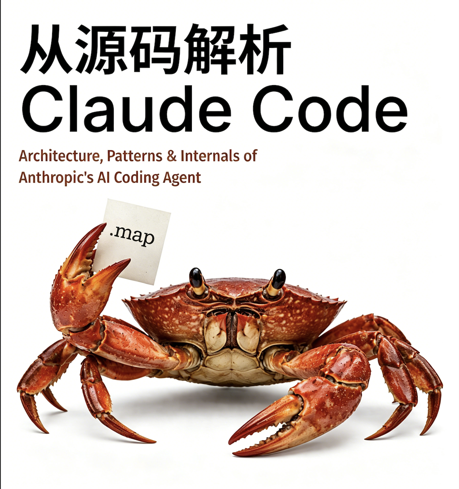

# Claude Code 源码剖析

**Anthropic AI 编程智能体的架构、模式与内部原理**

  
    
  <a href="https://claude-code-from-source.com"><strong>在线阅读：claude-code-from-source.com</strong></a>

---

> **本仓库纯属教育用途。** 不包含任何 Claude Code 的源代码——一行都没有。所有代码块均为原创伪代码，用于说明架构模式。目标是帮助工程师理解生产级 AI 智能体的构建方式，而非复制或再分发专有软件。

---

当 Anthropic 将 Claude Code 发布到 npm 时，`.js.map` 源映射文件中的 `sourcesContent` 字段包含了完整的原始 TypeScript 代码。本书是研究该架构的成果，将模式、权衡与设计决策提炼成任何工程师都能学习的技术叙述。

**18 章，分为 7 个部分。** 相当于印刷版约 192 页。

每一章都有层次分明的深度：面向技术领导者的叙述流、面向实现者的深入章节，以及**"应用"**结尾部分，提炼可转移的模式供你在自己的系统中使用。图表使用 [Mermaid](https://mermaid.js.org/) 绘制，可在 GitHub 上原生渲染。

---

## 目标读者

- **构建智能体系统的高级工程师**——借鉴模式、理解权衡、在自己的技术栈中实现
- **评估架构的技术领导者**——无需阅读每个代码块即可理解叙述主线
- **任何对生产级 AI 工具实际工作原理感到好奇的人**

---

## 目录

### 第一部分：基础
*在智能体思考之前，进程必须先存在。*

| # | 章节 | 你将学到什么 |
|---|---------|-------------------|
| 1 | [AI 智能体的架构](./book-cn/ch01-architecture.md) | 6 个关键抽象、数据流、权限系统、构建系统 |
| 2 | [快速启动——引导流水线](./book-cn/ch02-bootstrap.md) | 5 阶段初始化、模块级 I/O 并行、信任边界 |
| 3 | [状态——双层架构](./book-cn/ch03-state.md) | 引导单例、AppState 存储、粘性锁存器、成本追踪 |
| 4 | [与 Claude 对话——API 层](./book-cn/ch04-api-layer.md) | 多提供商客户端、提示缓存、流式传输、错误恢复 |

### 第二部分：核心循环
*智能体的心跳：流式传输、执行、观察、重复。*

| # | 章节 | 你将学到什么 |
|---|---------|-------------------|
| 5 | [智能体循环](./book-cn/ch05-agent-loop.md) | query.ts 深度解析、4 层压缩、错误恢复、token 预算 |
| 6 | [工具——从定义到执行](./book-cn/ch06-tools.md) | 工具接口、14 步流水线、权限系统 |
| 7 | [并发工具执行](./book-cn/ch07-concurrency.md) | 分区算法、流式执行器、推测执行 |

### 第三部分：多智能体编排
*一个智能体很强大。多个智能体协同工作则具有变革性。*

| # | 章节 | 你将学到什么 |
|---|---------|-------------------|
| 8 | [生成子智能体](./book-cn/ch08-sub-agents.md) | AgentTool、15 步 runAgent 生命周期、内置智能体类型 |
| 9 | [Fork 智能体与提示缓存](./book-cn/ch09-fork-agents.md) | 字节相同前缀技巧、缓存共享、成本优化 |
| 10 | [任务、协调与集群](./book-cn/ch10-coordination.md) | 任务状态机、协调器模式、集群消息传递 |

### 第四部分：持久化与智能
*没有记忆的智能体会永远重复同样的错误。*

| # | 章节 | 你将学到什么 |
|---|---------|-------------------|
| 11 | [记忆——跨会话学习](./book-cn/ch11-memory.md) | 基于文件的记忆、4 类型分类法、LLM 召回、时效性 |
| 12 | [扩展性——技能与钩子](./book-cn/ch12-extensibility.md) | 两阶段技能加载、生命周期钩子、快照安全 |

### 第五部分：界面
*用户看到的一切都要经过这一层。*

| # | 章节 | 你将学到什么 |
|---|---------|-------------------|
| 13 | [终端 UI](./book-cn/ch13-terminal-ui.md) | 定制 Ink 分支、渲染流水线、双缓冲、内存池 |
| 14 | [输入与交互](./book-cn/ch14-input-interaction.md) | 按键解析、键绑定、和弦支持、vim 模式 |

### 第六部分：连接性
*智能体超越本地主机。*

| # | 章节 | 你将学到什么 |
|---|---------|-------------------|
| 15 | [MCP——通用工具协议](./book-cn/ch15-mcp.md) | 8 种传输方式、MCP 的 OAuth、工具包装 |
| 16 | [远程控制与云执行](./book-cn/ch16-remote.md) | Bridge v1/v2、CCR、上游代理 |

### 第七部分：性能工程
*让所有东西快到人类察觉不到机械运作。*

| # | 章节 | 你将学到什么 |
|---|---------|-------------------|
| 17 | [性能——每毫秒和每个 Token 都重要](./book-cn/ch17-performance.md) | 启动、上下文窗口、提示缓存、渲染、搜索 |
| 18 | [结语——我们学到了什么](./book-cn/ch18-epilogue.md) | 5 个架构赌注、可转移的内容、智能体的未来方向 |

---

## 让系统运转的 10 个模式

如果你没时间读其他内容，读这 10 个：

1. **异步生成器作为智能体循环**——生成消息、类型化的 Terminal 返回、自然背压和取消
2. **推测性工具执行**——在模型流式传输期间启动只读工具，在响应完成之前
3. **并发安全批处理**——按安全性分区工具、并行运行读取、串行化写入
4. **Fork 智能体用于缓存共享**——并行子智能体共享字节相同的提示前缀，节省约 95% 输入 token
5. **4 层上下文压缩**——snip、microcompact、collapse、autocompact——每一层都比上一层更轻量
6. **基于文件的记忆与 LLM 召回**——Sonnet 侧查询选择相关记忆，而非关键词匹配
7. **两阶段技能加载**——启动时仅加载 frontmatter，调用时加载完整内容
8. **用于缓存稳定性的粘性锁存器**——一旦发送 beta 头，会话期间不再取消设置
9. **槽位预留**——默认 8K 输出上限，命中时升级到 64K（在 99% 请求中节省上下文）
10. **钩子配置快照**——在启动时冻结以防止运行时注入攻击

---

## 本书是如何制作的

源码从 npm 源映射中提取。36 个 AI 智能体分四个阶段分析了近两千个 TypeScript 文件：

1. **探索**：6 个并行智能体读取源码树中的每个文件
2. **分析**：12 个智能体撰写了 494KB 的原始技术文档
3. **写作**：15 个智能体从头重写成叙述性章节
4. **审阅与修订**：3 个编辑审阅者产生了 900 行反馈；3 个修订智能体应用了所有修复

整个过程——从源码提取到最终修订版书籍——耗时约 6 小时。

---

## 免责声明

**本仓库不包含任何来自 Claude Code 的源代码。** 所有代码块均为原创伪代码，使用不同的变量名，用于说明架构模式。不包含专有提示文本、内部常量或精确函数实现。本项目纯属教育用途——帮助工程师理解生产级 AI 编程智能体背后的设计模式。

这是一项独立分析。Claude Code 是 Anthropic 的产品。本书与 Anthropic 无关联、未获认可或赞助。
