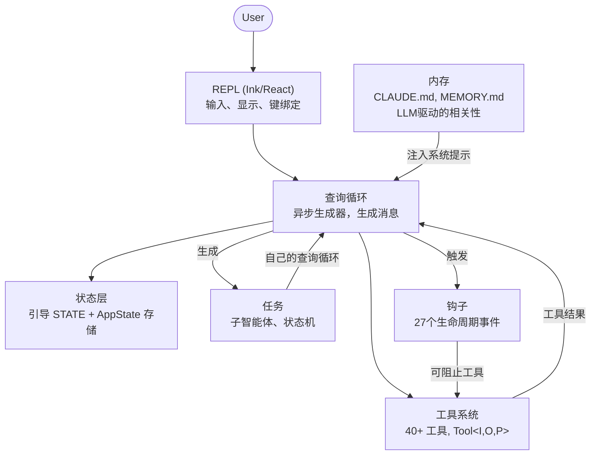
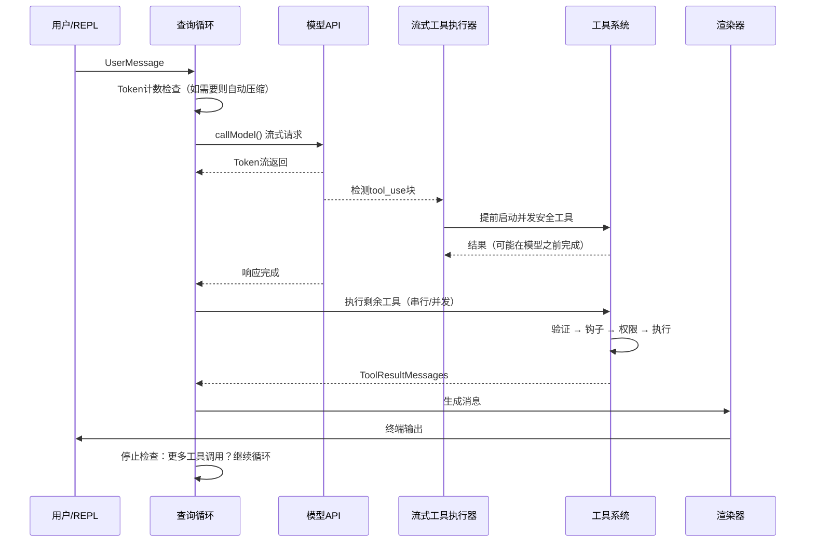
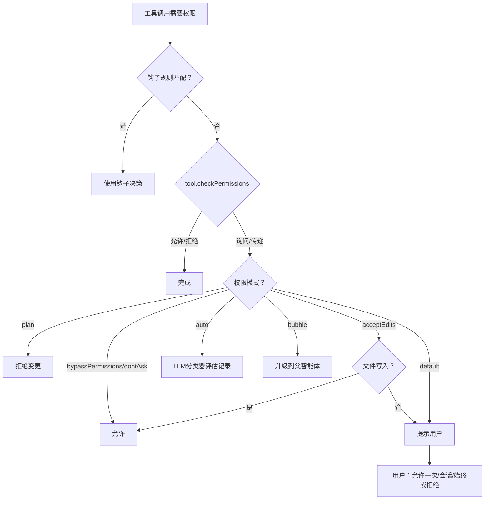
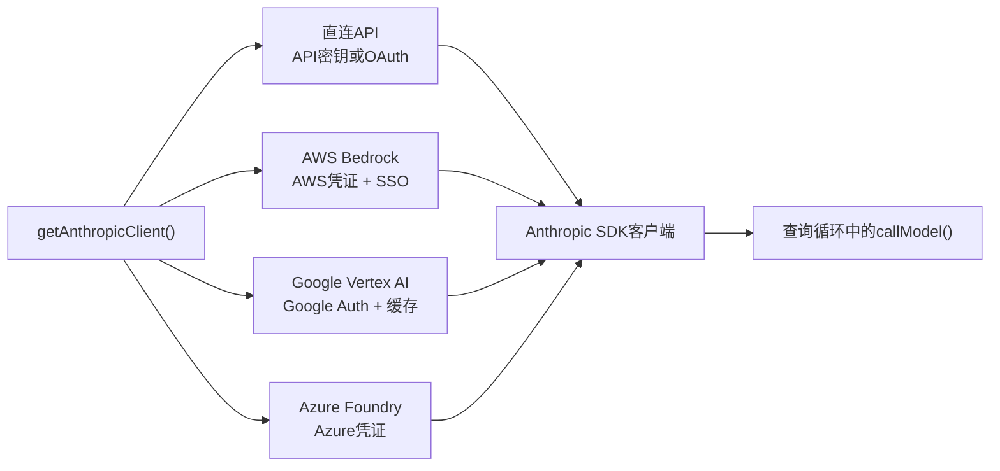
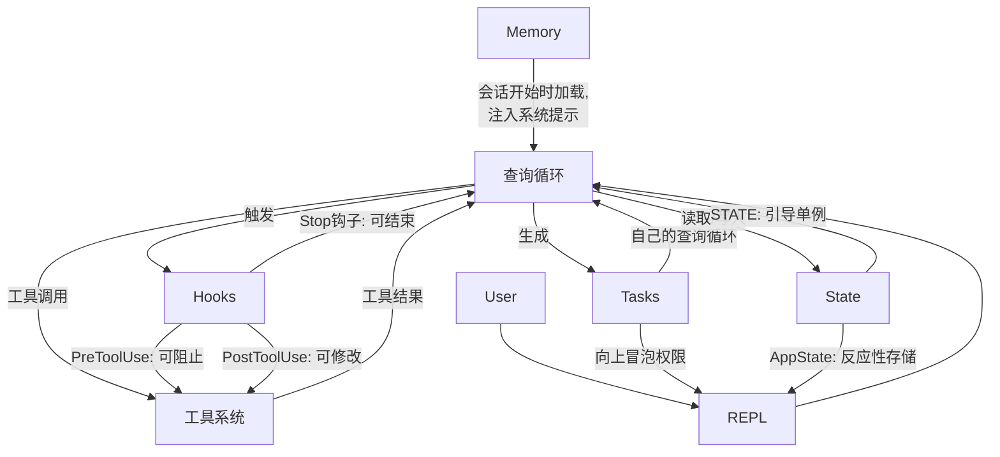

# 第1章：AI智能体的架构

## 你正在面对什么

传统的CLI是一个函数。它接收参数，执行工作，然后退出。`grep`不会决定同时运行`sed`。`curl`不会打开文件并根据下载内容修补它。契约很简单：一个命令，一个动作，确定性输出。

智能CLI打破了该契约的每个部分。它接收自然语言提示，决定使用哪些工具，按情况要求的顺序执行它们，评估结果，并循环直到任务完成或用户停止。"程序"不是固定的指令序列——它是围绕语言模型的循环，在运行时生成自己的指令序列。工具调用是副作用。模型的推理是控制流。

Claude Code是Anthropic对这一想法的生产实现：一个近两千文件的TypeScript单体，将终端变成由Claude驱动的完整开发环境。它已发布给数十万开发者，这意味着每个架构决策都带来真实世界的后果。本章给你心智模型。六个抽象定义了整个系统。一条数据流连接它们。一旦你内化从按键到最终输出的黄金路径，后续每一章都是对该路径某一段的放大。

以下内容是一种回顾性分解——这六个抽象并非在白板上预先设计。它们从向大量用户群发布生产智能体的压力中涌现。按它们实际的样子理解，而非按它们被计划的样子，为本书的其余部分设定正确的期望。

---

## 六个关键抽象

Claude Code建立在六个核心抽象之上。其他所有内容——400多个工具文件、分叉的终端渲染器、vim模拟、成本追踪器——都是为了支持这六个。



以下是每个抽象的作用及其存在原因。

**1. 查询循环**（`query.ts`，约1,700行）。一个异步生成器，是整个系统的心跳。它流式传输模型响应，收集工具调用，执行它们，将结果附加到消息历史，并循环。每次交互——REPL、SDK、子智能体、无头`--print`——都流经这个单一函数。它生成UI消费的`Message`对象。其返回类型是一个称为`Terminal`的判别联合，精确编码循环停止的原因：正常完成、用户中止、token预算耗尽、停止钩子干预、达到最大回合数或不可恢复错误。生成器模式——而非回调或事件发射器——提供自然的背压、干净的取消和类型化的终止状态。第5章全面覆盖循环的内部机制。

**2. 工具系统**（`Tool.ts`、`tools.ts`、`services/tools/`）。工具是智能体在世界上能做的任何事情：读取文件、运行shell命令、编辑代码、搜索网络。这种目的的简单性隐藏了重要的机制。每个工具实现一个丰富的接口，涵盖身份、模式、执行、权限和渲染。工具不仅仅是函数——它们携带自己的权限逻辑、并发声明、进度报告和UI渲染。系统将工具调用分区为并发和串行批次，流式执行器在模型甚至完成响应之前就开始并发安全工具。第6章覆盖完整的工具接口和执行管道。

**3. 任务**（`Task.ts`、`tasks/`）。任务是后台工作单元——主要是子智能体。它们遵循状态机：`pending -> running -> completed | failed | killed`。`AgentTool`生成具有自己消息历史、工具集和权限模式的新`query()`生成器。任务赋予Claude Code递归能力：智能体可以委托给子智能体，子智能体可以进一步委托。

**4. 状态**（两层）。系统在两个级别维护状态。可变单例（`STATE`）持有约80个会话级基础设施字段：工作目录、模型配置、成本追踪、遥测计数器、会话ID。它在启动时设置一次并直接变异——无反应性。最小反应性存储（34行，Zustand风格）驱动UI：消息、输入模式、工具批准、进度指示器。分离是故意的：基础设施状态很少变化且不需要触发重新渲染；UI状态不断变化且必须。第3章深入探讨两层架构。

**5. 内存**（`memdir/`）。智能体跨会话的持久上下文。三层：项目级（仓库中的`CLAUDE.md`文件）、用户级（`~/.claude/MEMORY.md`）和团队级（通过符号链接共享）。在会话开始时，系统扫描所有内存文件，解析frontmatter，LLM选择哪些内存与当前对话相关。内存是Claude Code如何"记住"你的代码库约定、架构决策和调试历史的方式。

**6. 钩子**（`hooks/`、`utils/hooks/`）。用户定义的生命周期拦截器，在4种执行类型的27个不同事件触发：shell命令、单次LLM提示、多轮智能体会话和HTTP webhook。钩子可以阻止工具执行、修改输入、注入额外上下文或使整个查询循环短路。权限系统本身部分通过钩子实现——`PreToolUse`钩子可以在交互式权限提示触发之前拒绝工具调用。

---

## 黄金路径：从按键到输出

追踪单个请求通过系统。用户输入"为登录函数添加错误处理"并按Enter。



关于此流有三点需要注意。

首先，查询循环是生成器，而非回调链。REPL通过`for await`从中拉取消息，这意味着背压是自然的——如果UI跟不上，生成器暂停。这是相对于事件发射器或可观察流的深思熟虑的选择。

其次，工具执行与模型流式传输重叠。`StreamingToolExecutor`不等待模型完成才开始并发安全工具。`Read`调用可以在模型仍在生成其余响应时完成并返回结果。这是推测执行——如果模型的最终输出使工具调用无效（罕见但可能），结果将被丢弃。

第三，整个循环是可重入的。当模型进行工具调用时，结果被附加到消息历史，循环用更新的上下文再次调用模型。没有单独的"工具结果处理"阶段——它都是一个循环。模型通过简单地不再生成更多工具调用来决定何时完成。

---

## 权限系统

Claude Code在你的机器上运行任意shell命令。它编辑你的文件。它可以生成子进程、发起网络请求和修改你的git历史。没有权限系统，这是安全灾难。

系统定义七种权限模式，按从最多到最少许可排序：

| 模式 | 行为 |
|------|------|
| `bypassPermissions` | 允许所有。无检查。仅限内部/测试。 |
| `dontAsk` | 全部允许，但仍记录。无用户提示。 |
| `auto` | 记录分类器（LLM）决定允许/拒绝。 |
| `acceptEdits` | 文件编辑自动批准；所有其他变更提示。 |
| `default` | 标准交互模式。用户批准每个动作。 |
| `plan` | 只读。所有变更被阻止。 |
| `bubble` | 将决策升级到父智能体（子智能体模式）。 |

当工具调用需要权限时，解析遵循严格链：



`auto`模式值得特别注意。它运行单独的轻量级LLM调用，根据对话记录对工具调用进行分类。分类器看到工具输入的紧凑表示，并决定动作是否与用户要求的内容一致。这是让Claude Code半自主工作的模式——批准常规操作，同时标记任何看起来偏离用户意图的内容。

子智能体默认为`bubble`模式，意味着它们不能批准自己的危险动作。权限请求向上传播到父智能体或最终到用户。这防止子智能体静默运行用户从未见过的破坏性命令。

---

## 多提供商架构

Claude Code通过四种不同的基础设施路径与Claude对话，所有路径对系统的其余部分透明。



关键洞察是Anthropic SDK为每个云提供商提供包装类，呈现与直连API客户端相同的接口。`getAnthropicClient()`工厂读取环境变量和配置以确定使用哪个提供商，构造适当的客户端，并返回它。从那时起，`callModel()`和每个其他消费者将其视为通用Anthropic客户端。

提供商选择在启动时确定并存储在`STATE`中。查询循环从不检查哪个提供商处于活动状态。这意味着从直连API切换到Bedrock是配置更改，而非代码更改——智能体循环、工具系统和权限模型完全与提供商无关。

---

## 构建系统

Claude Code既作为内部Anthropic工具又作为公共npm包发布。同一代码库为两者服务，编译时功能标志控制包含什么。

```typescript
// 由功能标志保护的条件导入
const reactiveCompact = feature('REACTIVE_COMPACT')
  ? require('./services/compact/reactiveCompact.js')
  : null
```

`feature()`函数来自`bun:bundle`，Bun的内置打包器API。在构建时，每个功能标志解析为布尔字面量。然后打包器的死代码消除在标志为false时完全剥离`require()`调用——模块从不加载，从不包含在包中，从不发布。

模式是一致的：顶层`feature()`守卫包装`require()`调用。使用`require()`而非`import`特别是因为当守卫为false时，动态`require()`可以被打包器完全消除，而动态`import()`不能（它返回打包器必须保留的Promise）。

有一个值得注意的反讽。早期npm版本发布的源映射包含`sourcesContent`——完整的原始TypeScript源代码，包括仅内部代码路径。功能标志成功剥离了运行时代码，但将源代码留在了映射中。这就是Claude Code源代码如何变得公开可读的。

---

## 各部件如何连接

六个抽象形成依赖图：



内存作为系统提示的一部分送入查询循环。查询循环驱动工具执行。工具结果作为消息反馈到查询循环。任务是具有隔离消息历史的递归查询循环。钩子在定义点拦截查询循环。状态被所有内容读取和写入，反应性存储桥接到UI。

查询循环和工具系统之间的循环依赖是系统的定义特征。模型生成工具调用。工具执行并产生结果。结果被附加到消息历史。模型看到结果并决定下一步做什么。这个循环持续直到模型停止生成工具调用或外部约束（token预算、最大回合数、用户中止）终止它。

以下是它们如何连接到后续章节：从输入到输出的黄金路径是贯穿全书的线索。第2章追踪系统如何引导到可以执行此路径的点。第3章解释路径读取和写入的两层状态架构。第4章覆盖查询循环调用的API层。后续每章放大你刚刚端到端看到的某一段路径。

---

## 应用

如果你正在构建智能体系统——任何LLM在运行时决定采取什么动作的系统——这里是从Claude Code架构转移的模式。

**生成器循环模式。** 使用异步生成器作为智能体循环，而非回调或事件发射器。生成器给你自然背压（消费者按自己的节奏拉取）、干净取消（生成器上的`.return()`）和终止状态的类型化返回值。它解决的问题：在基于回调的智能体循环中，很难知道循环何时"完成"以及为什么完成。生成器使终止成为类型系统的头等公民。

**自描述工具接口。** 每个工具应声明自己的并发安全性、权限要求和渲染行为。不要将此逻辑放在"了解"每个工具的中央编排器中。它解决的问题：中央编排器成为每次添加工具时都必须更新的上帝对象。自描述工具线性扩展——添加工具N+1需要对现有代码零更改。

**分离基础设施状态与反应性状态。** 并非所有状态都需要触发UI更新。会话配置、成本追踪和遥测属于普通可变对象。消息历史、进度指示器和批准队列属于反应性存储。它解决的问题：使所有内容反应性增加订阅开销和复杂性，用于在启动时更改一次并被读取一千次的状态。两层匹配两种访问模式。

**权限模式，而非权限检查。** 定义一小组命名模式（plan、default、auto、bypass），并通过模式解析每个权限决策。不要在工具实现中分散`if (isAllowed)`检查。它解决的问题：不一致的权限执行。当每个工具都经过相同的基于模式的解析链时，你可以通过知道哪个模式处于活动状态来推理系统的安全态势。

**通过任务实现递归智能体架构。** 子智能体应该是具有自己消息历史的相同智能体循环的新实例，而非特殊情况的代码路径。权限升级通过`bubble`模式向上流动。它解决的问题：与主智能体循环分离的子智能体逻辑，导致行为和错误处理中的细微差异。如果子智能体是相同的循环，它继承所有相同的保证。
