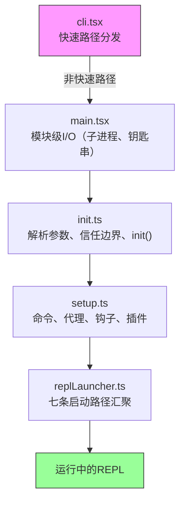
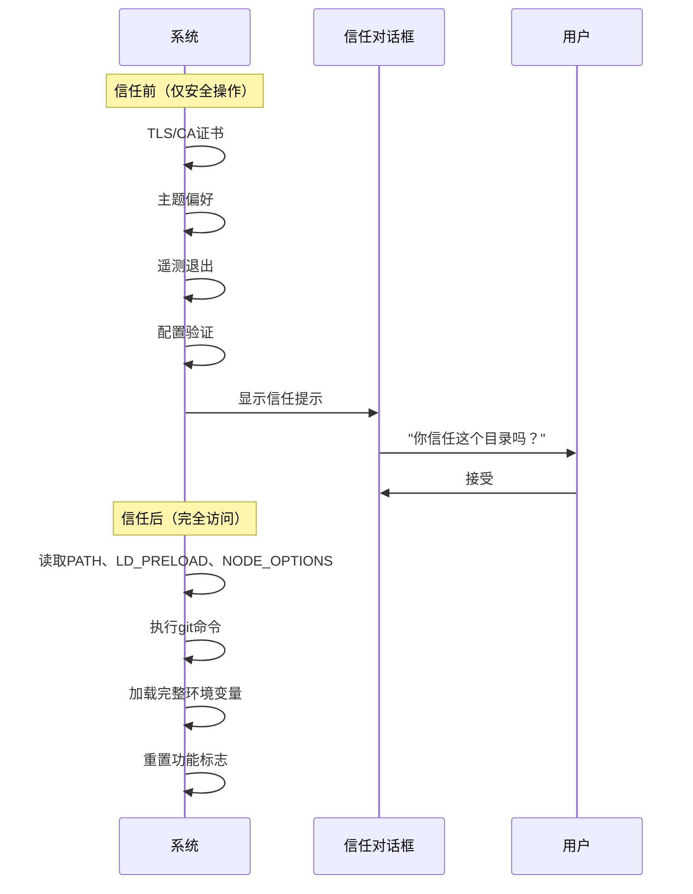

# 第2章：快速启动——引导流程

如果第1章为你呈现了Claude Code的架构全景，那么本章将展示它如何进入工作状态。六大抽象组件——查询循环、工具系统、状态层、钩子、内存——都必须在用户看到光标之前完成初始化。完成这一切的预算时间：300毫秒。

300毫秒是人类感知工具响应为"即时"的阈值。超过这个值，CLI就会显得迟缓。严重超时，开发者就会停止使用它。本章的所有内容都是为了守住这条底线。

引导流程必须完成四项任务：验证环境、建立安全边界、配置通信层、渲染UI。它必须在300毫秒内完成全部四项。其架构洞见在于：这四项任务可以部分重叠、精心排序、积极裁剪，以适应一个看似不可能完成的预算。

关于方法论的一点说明：本章中的时间戳是近似值，源自代码库自身的性能检查点。它们代表现代硬件上的典型热启动时间。冷启动会更慢。绝对数值不如相对结构重要：哪些操作重叠、哪些阻塞、哪些被延迟。

---

## 流程的形状

启动流程分布在五个文件中，按顺序执行。每个文件缩小系统下一步需要处理的范围：



每个文件在将控制权传递给下一个之前，只做必要的最少工作。`cli.tsx`尝试在加载任何重量级内容之前退出。`main.tsx`在导入求值期间将慢速操作作为副作用触发。`init.ts`解析配置并建立信任边界。`setup.ts`注册能力。`replLauncher.ts`选择正确的入口点并启动UI。

三种并行策略使其快速：

1. **模块级子进程分发。** 在导入求值期间作为副作用启动钥匙串和MDM读取。子进程在剩余的~135毫秒静态导入加载期间运行。
2. **setup中的Promise并行。** 套接字绑定、钩子快照、命令加载和代理定义加载全部并发运行。
3. **渲染后延迟预取。** 用户在输入第一条消息之前不需要的一切——git状态、模型能力、AWS凭证——都在提示符可见后运行。

第四种策略不那么显眼但同样重要：**动态导入延迟模块求值**。代码库在至少十几个地方使用`await import('./module.js')`来避免加载直到需要的代码。OpenTelemetry（400KB + 700KB gRPC）仅在遥测初始化时加载。React组件仅在渲染时加载。每个动态导入以冷路径延迟（首次使用触发模块求值）换取热路径速度（启动不为其可能永远不会使用的模块付费）。

---

## 阶段0：快速路径分发（cli.tsx）

进程进入的第一个文件`cli.tsx`只有一个任务：确定是否需要完整的引导流程。许多调用——`claude --version`、`claude --help`、`claude mcp list`——只需要一个特定答案，仅此而已。加载React、初始化遥测、读取钥匙串、设置工具系统都将是纯粹的浪费。

模式是：检查`argv`，动态导入你需要的处理程序，在系统其余部分加载之前退出。

```typescript
// 快速路径模式的伪代码
if (args.length === 1 && args[0] === '--version') {
  const { printVersion } = await import('./commands/version.js')
  await printVersion()
  process.exit(0)
}
```

大约有十几个快速路径涵盖版本、帮助、配置、MCP服务器管理和更新检查。具体细节不重要——模式才重要。每条路径动态导入恰好一个模块，调用一个函数，然后退出。代码库的其余部分永远不会加载。

这是整个引导过程中反复出现的一个原则的首次实例：**通过更多了解意图来减少工作**。argv数组揭示了用户的意图。如果意图是狭窄的，执行路径也应该是狭窄的。

如果没有快速路径匹配，`cli.tsx`会回退到完整的`main.tsx`导入，真正的启动开始。

---

## 阶段1：模块级I/O（main.tsx）

当`main.tsx`被导入时，其模块级副作用在求值期间触发——在文件中任何函数被调用之前。这是整个引导过程中最关键的性能技术：

```typescript
// 这些在导入时运行，而非调用时
const mdmPromise = startMDMSubprocess()
const keychainPromise = readKeychainCredentials()
```

当JavaScript引擎求值`main.tsx`的其余部分及其传递导入（~138毫秒的模块求值）时，这两个Promise已经在运行中。MDM（移动设备管理）子进程检查组织安全策略。钥匙串读取获取存储的凭证。两者都是I/O密集型操作，否则会在关键路径上串行执行。

洞见：模块求值不是空闲时间——它是你可以与I/O重叠的时间。当`main.tsx`的导出函数首次被调用时，这些Promise通常已经解析完成。

这种技术需要抑制ESLint的top-level-await和module-scope副作用规则。代码库有一个针对`process.env`访问模式的自定义ESLint规则，允许在模块作用域进行受控的副作用，同时防止其他地方出现不受控的副作用。

---

## 阶段2：解析与信任（init.ts）

`init()`函数是记忆化的——多次调用是安全的，并返回相同的结果。这很重要，因为多个入口点（REPL、打印模式、SDK模式）可能各自调用`init()`，而记忆化保证它恰好运行一次。

该函数通过Commander解析命令行参数，从多个来源加载配置（全局设置、项目设置、环境变量），然后到达流程中最重要的边界。

### 信任边界

在信任边界之前，系统以受限模式运行。之后，完整的能力才可用。边界存在是因为Claude Code读取环境变量——而环境变量可能被投毒。



信任边界不是关于用户信任Claude Code。而是关于Claude Code信任*环境*。恶意的`.bashrc`可以设置`LD_PRELOAD`将代码注入每个子进程。信任对话框确保用户明确同意在可能由他人配置的目录中操作。

系统有十种不同的信任敏感操作。在用户接受信任对话框之前，只运行安全操作：TLS证书配置、主题偏好、遥测退出。信任后，系统读取潜在危险的环境变量（PATH、LD_PRELOAD、NODE_OPTIONS），执行git命令，并应用完整的环境配置。

### preAction钩子

Commander的`preAction`钩子是关键架构。Commander*不执行任何操作*地解析命令结构（标志、子命令、位置参数）。`preAction`钩子在对匹配的命令处理程序运行之前触发：

```typescript
program.hook('preAction', async (thisCommand) => {
  await init(thisCommand)
})
```

这种分离意味着快速路径命令（在`cli.tsx`中Commander加载之前处理）从不支付`init()`成本。只有需要完整环境的命令才会触发初始化。

---

## 阶段3：设置（setup.ts）

`init()`完成后，`setup()`注册系统需要的所有能力：

```mermaid
gantt
    title 阶段3：并行设置
    dateFormat X
    axisFormat %Lms

    section 串行
    命令注册   :0, 5
    section 并行
    代理定义      :5, 15
    钩子注册      :5, 12
    插件初始化  :5, 20
    MCP服务器连接 :5, 25
```



命令、代理、钩子和插件在可能的情况下并行注册。设置阶段是系统从"我知道我的配置"过渡到"我拥有我的所有能力"的地方。设置之后，每个工具都已注册，每个钩子都已连接，系统已准备好处理用户输入。

设置还处理安全钩子快照。钩子配置从磁盘读取一次，冻结为不可变快照，并在会话的其余部分使用。之后对磁盘上钩子配置文件的修改被忽略。这防止攻击者在会话开始后修改钩子规则——冻结的快照是权限决策的唯一真实来源。

---

## 阶段4：启动（replLauncher.ts）

七条不同的代码路径汇聚到`replLauncher.ts`：交互式REPL、打印模式（`--print`）、SDK模式、恢复（`--resume`）、继续（`--continue`）、管道模式和headless。启动器检查`init()`产生的配置，并分派到正确的入口点。

两个示例说明了范围：

**交互式REPL**——标准情况。启动器挂载React/Ink组件树，启动终端渲染器，进入事件循环。用户看到提示符并可以开始输入。

**打印模式**（`--print`）——来自argv的单个提示。启动器创建一个没有React树的无头查询循环，运行到完成，将输出流式传输到stdout，然后退出。相同的代理循环，不同的呈现方式。

重要细节：所有七条路径最终都调用`query()`——与第1章相同的代理循环。启动路径决定*如何*呈现循环（交互式终端、单次运行、SDK协议），而非*它做什么*。这种汇聚使架构可测试且可预测：无论用户如何调用Claude Code，核心行为都是相同的。

---

## 启动时间线

以下是完整流程在时间上的样子：

```mermaid
gantt
    title 启动时间线（~240ms）
    dateFormat X
    axisFormat %Lms

    section 阶段0
    快速路径检查          :0, 5

    section 阶段1
    模块求值        :5, 143
    MDM子进程（并行） :8, 60
    钥匙串读取（并行）  :8, 50

    section 阶段2
    Commander解析          :143, 146
    init()                   :146, 160
    信任边界           :160, 175

    section 阶段3
    setup() + 并行注册 :175, 210

    section 阶段4
    启动路径选择    :210, 215
    首次渲染             :215, 240
```



关键路径贯穿模块求值（最长的单阶段，~138ms），然后是Commander解析、init和setup。并行I/O操作（MDM、钥匙串）与模块求值重叠，通常在需要之前就已经解析完成。

### 性能预算

| 阶段 | 时间 | 发生了什么 |
|-------|------|-------------|
| 快速路径检查 | ~5ms | 检查argv，如果可能就提前退出 |
| 模块求值 | ~138ms | 导入树，触发并行I/O |
| Commander解析 | ~3ms | 解析标志和子命令 |
| init() | ~14ms | 配置解析、信任边界 |
| setup() | ~35ms | 命令、代理、钩子、插件 |
| 启动 + 首次渲染 | ~25ms | 选择路径、挂载React、首次绘制 |
| **总计** | **~240ms** | 低于300ms预算 |

在现代机器上总计约240ms——在300ms预算下有60ms的余量。冷启动（重启后首次运行，操作系统缓存为空）可以将模块求值推到200ms以上，使总计接近限制。

---

## 迁移系统

简要说明init期间运行的一个子系统：模式迁移。Claude Code将配置和会话数据存储在本地文件和目录中。当版本之间格式发生变化时，迁移在启动时自动运行。

每个迁移是一个带有版本号的函数。系统检查当前模式版本与最高迁移版本，按顺序运行待处理的迁移，并更新版本。迁移是幂等的且快速（操作小型本地文件，而非数据库）。整个迁移过程通常在5ms内完成。如果迁移失败，它会记录错误并继续——对于本地配置，可用性胜过严格一致性。

---

## 启动教会我们什么关于系统设计

引导流程是缩小范围的研究。每个阶段减少可能性的空间：

- 阶段0将"任何CLI调用"缩小到"需要完整引导"
- 阶段1将"所有内容必须加载"缩小到"与I/O并行加载"
- 阶段2将"未知环境"缩小到"受信任、已配置的环境"
- 阶段3将"无能力"缩小到"完全注册"
- 阶段4将"七种可能模式"缩小到"一种具体启动路径"

当REPL渲染时，每个决定都已经做出。查询循环接收一个完全配置的环境，对其所处模式、可用工具、适用权限没有任何歧义。300ms预算不仅是一个性能目标——它是一个强制函数，防止引导变成延迟初始化系统，其中决定被推迟并分散在整个代码库中。

---

## 应用此模式

**将I/O与初始化重叠。** 在模块求值时启动慢速操作（子进程生成、凭证读取、网络检查），在需要之前。JavaScript引擎反正在做同步工作——利用那段时间进行并行I/O。模式：`const promise = startSlowThing()`在文件顶部，`await promise`在使用点。

**尽早缩小范围。** 引导流程的五个文件形成一个漏斗：每个阶段消除后续阶段不需要做的工作。快速路径分发是最戏剧性的例子，但原则适用于任何地方。如果你能在解析时确定某条代码路径是不必要的，就跳过它。

**显式建立信任边界。** 如果你的应用程序从它无法控制的环境中读取（环境变量、配置文件、shell设置），在"用户同意前安全读取"和"仅同意后才读取"之间划一条清晰的线。信任边界防止一类攻击，其中恶意环境在用户有机会评估它之前毒害应用程序。

**记忆化你的init函数。** 使初始化幂等——调用两次产生相同的结果。这消除了多个入口点可能各自触发初始化时的排序错误。记忆化模式很简单，但消除了一整类双重初始化错误。

**在让出之前捕获早期输入。** 在事件驱动系统中，初始化期间到达的用户输入可能会丢失。Claude Code在任何异步工作开始之前从argv捕获初始提示，确保如果初始化耗时超过预期，`claude "fix the bug"`不会丢弃提示。
