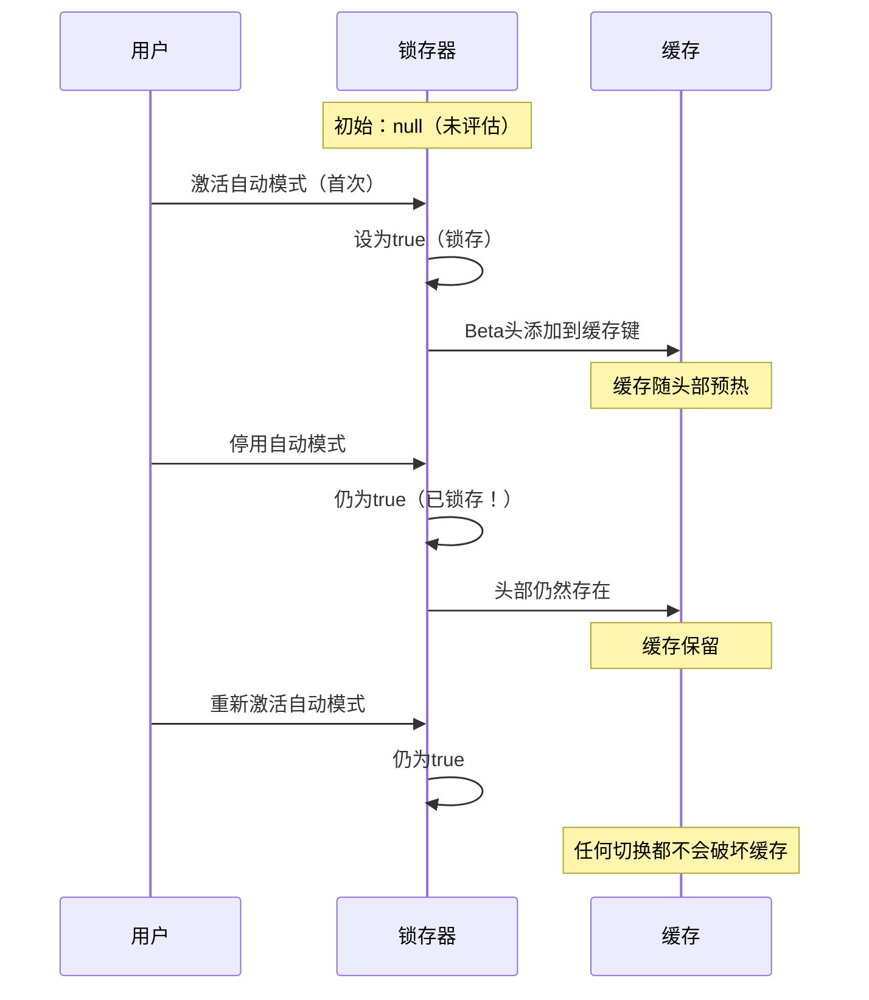
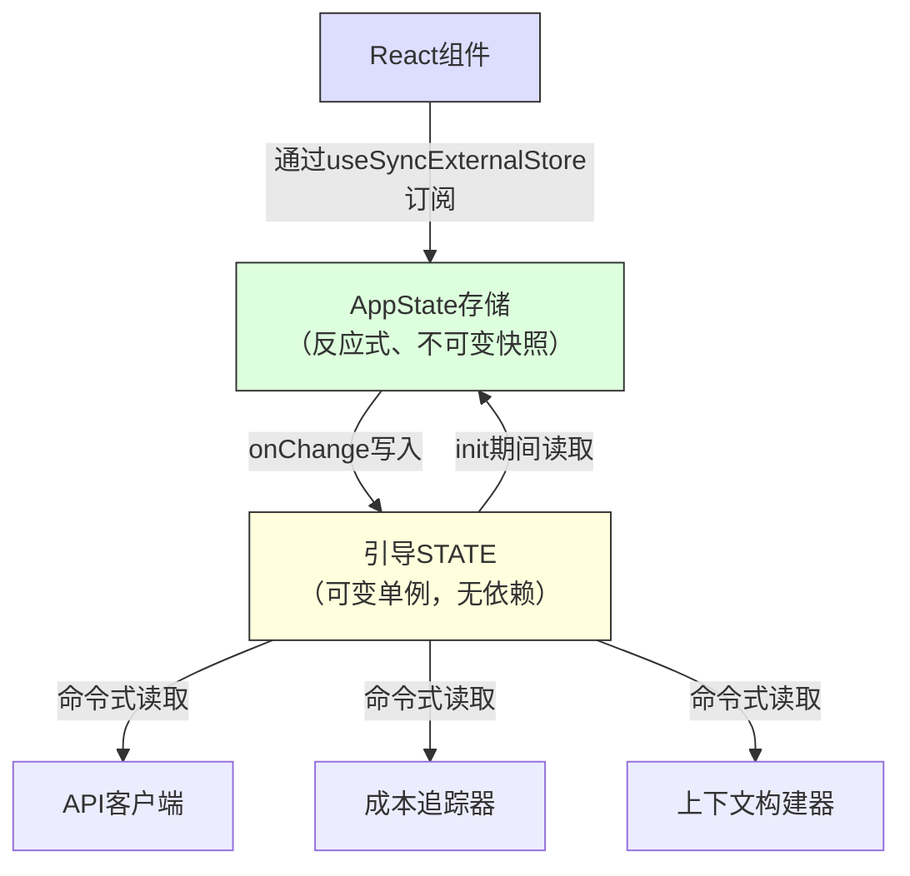

# 第3章：状态——双层架构

第2章追踪了从进程开始到首次渲染的引导流程。到最后，系统拥有了一个完全配置的环境。但配置了什么？会话ID在哪里？当前模型是什么？消息历史？成本追踪器？权限模式？状态住在哪里，为什么住在那里？

每个长期运行的应用程序最终都会面临这个问题。对于简单的CLI工具，答案是微不足道的——`main()`中的几个变量。但Claude Code不是一个简单的CLI工具。它是一个通过Ink渲染的React应用程序，进程生命周期跨越数小时，插件系统在任意时间加载，API层必须从缓存上下文构建提示，成本追踪器在进程重启后仍然存活，还有数十个基础设施模块需要读写共享数据而不相互导入。

天真的方法——单一全局存储——立即失败。如果成本追踪器更新驱动React重新渲染的同一个存储，每次API调用都会触发完整的组件树协调。基础设施模块（引导、上下文构建、成本追踪、遥测）无法导入React。它们在React挂载之前运行。它们在React卸载之后运行。它们在根本没有组件树的上下文中运行。将所有内容放入React感知存储会在整个导入图中创建循环依赖。

Claude Code通过双层架构解决这个问题：用于基础设施状态的可变进程单例，和用于UI状态的最小反应式存储。本章解释两个层级、连接它们的副作用系统，以及依赖此基础的支持子系统。每个后续章节都假设你理解状态住在哪里以及为什么住在那里。

---

## 3.1 引导状态——进程单例

### 为什么使用可变单例

引导状态模块（`bootstrap/state.ts`）是一个在进程启动时创建一次的可变对象：

```typescript
const STATE: State = getInitialState()
```

这一行上方的注释写道：`尤其在这里`。类型定义上方两行：`不要在这里添加更多状态——对全局状态要谨慎`。这些注释的语气像是工程师们从惨痛的教训中学到了无管制全局对象的代价。

可变单例在这里是正确的选择，有三个原因。首先，引导状态必须在任何框架初始化之前可用——在React挂载之前、在存储创建之前、在插件加载之前。模块作用域初始化是保证导入时可用的唯一机制。其次，数据本质上是进程作用域的：会话ID、遥测计数器、成本累加器、缓存路径。没有有意义的"先前状态"可以对比，没有订阅者需要通知，没有撤销历史。第三，该模块必须是导入依赖图中的叶子。如果它导入React、存储或任何服务模块，它会破坏第2章描述的引导序列中的循环。通过仅依赖工具类型和`node:crypto`，它可以从任何地方导入。

### 约80个字段

`State`类型包含大约80个字段。一个抽样揭示了广度：

**标识和路径**——`originalCwd`、`projectRoot`、`cwd`、`sessionId`、`parentSessionId`。`originalCwd`通过`realpathSync`解析并在进程启动时进行NFC规范化。它永远不会改变。

**成本和指标**——`totalCostUSD`、`totalAPIDuration`、`totalLinesAdded`、`totalLinesRemoved`。这些在整个会话中单调累加，并在退出时持久化到磁盘。

**遥测**——`meter`、`sessionCounter`、`costCounter`、`tokenCounter`。OpenTelemetry句柄，全部可为空（在遥测初始化之前为null）。

**模型配置**——`mainLoopModelOverride`、`initialMainLoopModel`。当用户在会话中更改模型时设置覆盖。

**会话标志**——`isInteractive`、`kairosActive`、`sessionTrustAccepted`、`hasExitedPlanMode`。布尔值，在会话持续期间控制行为。

**缓存优化**——`promptCache1hAllowlist`、`promptCache1hEligible`、`systemPromptSectionCache`、`cachedClaudeMdContent`。这些存在是为了防止冗余计算和提示缓存破坏。

### Getter/Setter模式

`STATE`对象从不导出。所有访问都通过大约100个单独的getter和setter函数：

```typescript
// 伪代码——说明模式
export function getProjectRoot(): string {
  return STATE.projectRoot
}

export function setProjectRoot(dir: string): void {
  STATE.projectRoot = dir.normalize('NFC')  // 每个路径setter上的NFC规范化
}
```

这种模式强制执行封装、每个路径setter上的NFC规范化（防止macOS上的Unicode不匹配）、类型缩小和引导隔离。代价是冗长——80个字段对应100个函数。但在一个随意突变可能破坏50,000令牌提示缓存的代码库中，明确性胜出。

### 信号模式

引导无法导入监听器（它是DAG叶子），所以它使用一个名为`createSignal`的最小发布/订阅原语。`sessionSwitched`信号恰好有一个消费者：`concurrentSessions.ts`，它保持PID文件同步。信号暴露为`onSessionSwitch = sessionSwitched.subscribe`，让调用者注册自己而不需要引导知道他们是谁。

### 五个粘性锁存器

引导状态中最微妙的字段是五个遵循相同模式的布尔锁存器：一旦某个功能在会话期间首次激活，相应的标志就会在会话的其余部分保持`true`。它们都存在一个原因：提示缓存保留。



Claude的API支持服务器端提示缓存。当连续请求共享相同的系统提示前缀时，服务器重用缓存的计算。但缓存键包括HTTP头和请求体字段。如果beta头出现在请求N中但不在请求N+1中，缓存就会被破坏——即使提示内容相同。对于超过50,000令牌的系统提示，缓存未命中是昂贵的。

五个锁存器：

| 锁存器 | 它防止什么 |
|-------|-----------------|
| `afkModeHeaderLatched` | Shift+Tab自动模式切换翻转AFK beta头开/关 |
| `fastModeHeaderLatched` | 快速模式冷却进入/退出翻转快速模式头 |
| `cacheEditingHeaderLatched` | 远程功能标志更改破坏每个活动用户的缓存 |
| `thinkingClearLatched` | 在确认的缓存未命中（>1h空闲）上触发。防止重新启用思考块破坏新鲜预热的缓存 |
| `pendingPostCompaction` | 遥测的一次性标志：区分压缩引起的缓存未命中与TTL过期未命中 |

所有五个都使用三态类型：`boolean | null`。`null`初始值表示"尚未评估。"`true`表示"锁存开启。"一旦设为`true`，它们永远不会回到`null`或`false`。这是锁存器的定义属性。

实现模式：

```typescript
function shouldSendBetaHeader(featureCurrentlyActive: boolean): boolean {
  const latched = getAfkModeHeaderLatched()
  if (latched === true) return true       // 已经锁存——总是发送
  if (featureCurrentlyActive) {
    setAfkModeHeaderLatched(true)          // 首次激活——锁存它
    return true
  }
  return false                             // 从未激活——不发送
}
```

为什么不总是发送所有beta头？因为头是缓存键的一部分。发送无法识别的头会创建不同的缓存命名空间。锁存器确保你只在实际需要时才进入缓存命名空间，然后留在那里。

---

## 3.2 AppState——反应式存储

### 34行实现

UI状态存储位于`state/store.ts`：

存储实现大约30行：一个覆盖`state`变量的闭包，一个`Object.is`相等性检查以防止虚假更新，同步监听器通知，以及用于副作用的`onChange`回调。骨架看起来像这样：

```typescript
// 伪代码——说明模式
function makeStore(initial, onTransition) {
  let current = initial
  const subs = new Set()
  return {
    read:      () => current,
    update:    (fn) => { /* Object.is守卫，然后通知 */ },
    subscribe: (cb) => { subs.add(cb); return () => subs.delete(cb) },
  }
}
```

三十四行。没有中间件，没有devtools，没有时间旅行调试，没有动作类型。只是一个覆盖可变变量的闭包，一个监听器Set，和一个`Object.is`相等性检查。这是没有库的Zustand。

值得审视的设计决策：

**更新函数模式。** 没有`setState(newValue)`——只有`setState((prev) => next)`。每个突变接收当前状态并必须产生下一个状态，消除来自并发突变的陈旧状态错误。

**`Object.is`相等性检查。** 如果更新器返回相同的引用，突变是无操作。没有监听器触发。没有副作用运行。对性能至关重要——传播和设置而不改变值的组件不会产生重新渲染。

**`onChange`在监听器之前触发。** 可选的`onChange`回调接收新旧状态，并在任何订阅者被通知之前同步触发。这用于副作用（第3.4节），必须在UI重新渲染之前完成。

**没有中间件，没有devtools。** 这不是疏忽。当你的存储恰好需要三个操作（get、set、subscribe），一个`Object.is`相等性检查，和一个同步`onChange`钩子时，你拥有的34行代码比一个依赖更好。你控制确切的语义。你可以在三十秒内阅读整个实现。

### AppState类型

`AppState`类型（~452行）是UI渲染所需一切的形状。它包装在`DeepImmutable<>`中用于大多数字段，对包含函数类型的字段有显式排除：

```typescript
export type AppState = DeepImmutable<{
  settings: SettingsJson
  verbose: boolean
  // ... 还有约150个字段
}> & {
  tasks: { [taskId: string]: TaskState }  // 包含中止控制器
  agentNameRegistry: Map<string, AgentId>
}
```

交集类型让大多数字段深度不可变，同时豁免持有函数、Maps和可变引用的字段。完全不可变性是默认值，在类型系统会与运行时语义对抗的地方有外科手术式的逃生舱口。

### React集成

存储通过`useSyncExternalStore`与React集成：

```typescript
// 标准React模式——带选择器的useSyncExternalStore
export function useAppState<T>(selector: (state: AppState) => T): T {
  const store = useContext(AppStoreContext)
  return useSyncExternalStore(
    store.subscribe,
    () => selector(store.getState()),
  )
}
```

选择器必须返回现有的子对象引用（而非新构造的对象），`Object.is`比较才能防止不必要的重新渲染。如果你写`useAppState(s => ({ a: s.a, b: s.b }))`，每次渲染产生一个新的对象引用，组件在每次状态变化时重新渲染。这是Zustand用户面临的相同约束——更便宜的比较，但选择器作者必须理解引用身份。

---

## 3.3 两个层级如何关联

两个层级通过显式、狭窄的接口通信。



引导状态在初始化期间流入AppState：`getDefaultAppState()`从磁盘读取设置（引导帮助定位），检查功能标志（引导评估），并设置初始模型（引导从CLI参数和设置解析）。

AppState通过副作用流回引导状态：当用户更改模型时，`onChangeAppState`调用引导中的`setMainLoopModelOverride()`。当设置更改时，引导中的凭证缓存被清除。

但两个层级从不共享引用。导入引导状态的模块不需要知道React。读取AppState的组件不需要知道进程单例。

一个具体例子澄清了数据流。当用户输入`/model claude-sonnet-4`时：

1. 命令处理程序调用`store.setState(prev => ({ ...prev, mainLoopModel: 'claude-sonnet-4' }))`
2. 存储的`Object.is`检查检测到变化
3. `onChangeAppState`触发，检测到模型变化，调用`setMainLoopModelOverride()`（更新引导）和`updateSettingsForSource()`（持久化到磁盘）
4. 所有存储订阅者触发——React组件重新渲染以显示新模型名称
5. 下一次API调用从引导状态的`getMainLoopModelOverride()`读取模型

步骤1-4是同步的。步骤5中的API客户端可能几秒后运行。但它从引导状态（在步骤3中更新）读取，而非从AppState。这是双层交接：UI存储是用户选择的真实来源，但引导状态是API客户端使用的真实来源。

DAG属性——引导不依赖任何内容，AppState依赖引导进行初始化，React依赖AppState——由ESLint规则强制执行，防止`bootstrap/state.ts`导入其允许集之外的模块。

---

## 3.4 副作用：onChangeAppState

`onChange`回调是两个层级同步的地方。每次`setState`调用都会触发`onChangeAppState`，它接收先前和新状态并决定触发哪些外部效果。

**权限模式同步**是主要用例。在这个集中处理程序之前，权限模式仅由8+个突变路径中的2个同步到远程会话（CCR）。其他六个——Shift+Tab循环、对话框选项、斜杠命令、回退、桥接回调——都在不通知CCR的情况下突变AppState。外部元数据逐渐失去同步。

修复：停止在突变站点分散通知，而是在一个地方挂钩差异。源代码中的注释列出了每个被破坏的突变路径，并指出"上面分散的调用点需要零更改。"这是集中式副作用的架构优势——覆盖是结构性的，而非手动的。

**模型变化**保持引导状态与UI渲染的内容同步。**设置变化**清除凭证缓存并重新应用环境变量。**详细切换**和**扩展视图**被持久化到全局配置。

该模式——在可区分状态转换上的集中式副作用——本质上是Observer模式应用于状态差异的粒度而非单个事件。它比分散的事件发射扩展得更好，因为副作用的数量增长速度远慢于突变站点的数量。

---

## 3.5 上下文构建

`context.ts`中的三个记忆化异步函数构建每个对话前置的系统提示上下文。每个每会话计算一次，而非每轮。

`getGitStatus`并行运行五个git命令（`Promise.all`），生成一个包含当前分支、默认分支、最近提交和工作树状态的块。`--no-optional-locks`标志防止git获取写锁，这可能干扰另一个终端中的并发git操作。

`getUserContext`加载CLAUDE.md内容并通过`setCachedClaudeMdContent`将其缓存在引导状态中。这个缓存打破了一个循环依赖：自动模式分类器需要CLAUDE.md内容，但CLAUDE.md加载通过文件系统，文件系统通过权限，权限调用分类器。通过缓存在引导状态（DAG叶子）中，循环被打破。

所有三个上下文函数都使用Lodash的`memoize`（计算一次，永远缓存）而非基于TTL的缓存。理由是：如果git状态每5分钟重新计算，变化会破坏服务器端提示缓存。系统提示甚至告诉模型："这是对话开始时的git状态。注意这个状态是时间快照。"

---

## 3.6 成本追踪

每个API响应都流经`addToTotalSessionCost`，它累加每模型使用量、更新引导状态、报告给OpenTelemetry，并递归处理顾问工具使用（响应中的嵌套模型调用）。

成本状态通过保存和恢复到项目配置文件在进程重启后存活。会话ID用作守卫——只有当持久化的会话ID与正在恢复的会话匹配时，成本才会恢复。

直方图使用水库采样（算法R）在保持有界内存的同时准确表示分布。1,024条目水库产生p50、p95和p99百分位数。为什么不使用简单的运行平均值？因为平均值隐藏分布形状。95%的API调用耗时200ms、5%耗时10秒的会话，与所有调用都耗时690ms的会话具有相同的平均值，但用户体验截然不同。

---

## 3.7 我们学到了什么

代码库已从简单CLI增长到拥有~450行状态类型定义、~80个进程状态字段、副作用系统、多个持久化边界和缓存优化锁存器的系统。这些都不是预先设计的。粘性锁存器是在缓存破坏成为可测量的成本问题时添加的。`onChange`处理程序是在8个权限同步路径中的6个被发现损坏时集中化的。CLAUDE.md缓存是在出现循环依赖时添加的。

这是复杂应用程序中状态的自然增长模式。双层架构提供了足够的结构来包含增长——新的引导字段不影响React渲染，新的AppState字段不创建导入循环——同时保持足够的灵活性来适应原始设计中未预料的模式。

---

## 3.8 状态架构总结

| 属性 | 引导状态 | AppState |
|---|---|---|
| **位置** | 模块作用域单例 | React上下文 |
| **可变性** | 通过setter可变 | 通过updater的不可变快照 |
| **订阅者** | 特定事件的信号（发布/订阅） | React的`useSyncExternalStore` |
| **可用性** | 导入时（React之前） | Provider挂载后 |
| **持久化** | 进程退出处理程序 | 通过onChange到磁盘 |
| **相等性** | N/A（命令式读取） | `Object.is`引用检查 |
| **依赖** | DAG叶子（不导入任何内容） | 从整个代码库导入类型 |
| **测试重置** | `resetStateForTests()` | 创建新存储实例 |
| **主要消费者** | API客户端、成本追踪器、上下文构建器 | React组件、副作用 |

---

## 应用此模式

**按访问模式而非领域分离状态。** 会话ID属于单例，不是因为它在抽象上是"基础设施"，而是因为它必须在React挂载之前可读，且可写而不通知订阅者。权限模式属于反应式存储，因为更改它必须触发重新渲染和副作用。让访问模式驱动层级，架构自然跟随。

**粘性锁存器模式。** 任何与缓存（提示缓存、CDN、查询缓存）交互的系统都面临相同的问题：会话中更改缓存键的功能切换会导致失效。一旦功能被激活，其缓存键贡献在会话期间保持激活。三态类型（`boolean | null`，表示"未评估/开启/永不关闭"）使意图自文档化。当缓存不受你控制时特别有价值。

**在状态差异上集中副作用。** 当多个代码路径可以更改相同状态时，不要在突变站点分散通知。挂钩存储的`onChange`回调并检测哪些字段更改。覆盖变为结构性的（任何突变触发效果）而非手动的（每个突变站点必须记住通知）。

**优先选择你拥有的34行而非你不拥有的库。** 当你的需求恰好是get、set、subscribe和更改回调时，最小实现让你完全控制语义。在状态管理错误可能花费真金白银的系统中，这种透明度有价值。关键洞见是识别你何时*不需要*库。

**有意使用进程退出作为持久化边界。** 多个子系统在进程退出时持久化状态。权衡是明确的：非优雅终止（SIGKILL、OOM）丢失累积的数据。这是可接受的，因为数据是诊断性的而非事务性的，并且在每次状态变化时写入磁盘对于每会话递增数百次的计数器来说太昂贵了。

---

本章建立的双层架构——用于基础设施的引导单例、用于UI的反应式存储、连接它们的副作用——是每个后续章节构建的基础。对话循环（第4章）从记忆化构建器读取上下文。工具系统（第5章）从AppState检查权限。代理系统（第8章）在AppState中创建任务条目，同时在引导状态中追踪成本。理解状态住在哪里以及为什么住在那里，是理解任何这些系统如何工作的先决条件。

有些字段跨越边界。主循环模型存在于两个层级中：AppState中的`mainLoopModel`（用于UI渲染）和引导状态中的`mainLoopModelOverride`（用于API客户端消费）。`onChangeAppState`处理程序保持它们同步。这种重复是双层拆分的代价。但替代方案——让API客户端导入React存储，或让React组件从进程单例读取——会违反保持架构健全的依赖方向。少量受控的重复，通过集中式同步点桥接，优于纠缠的依赖图。
