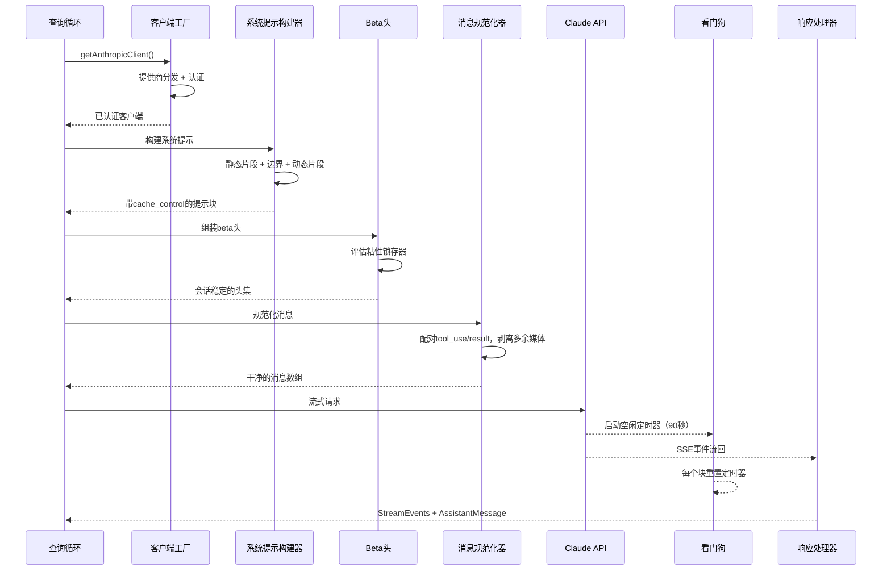
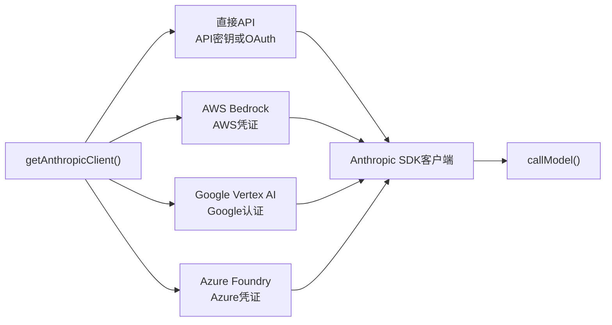
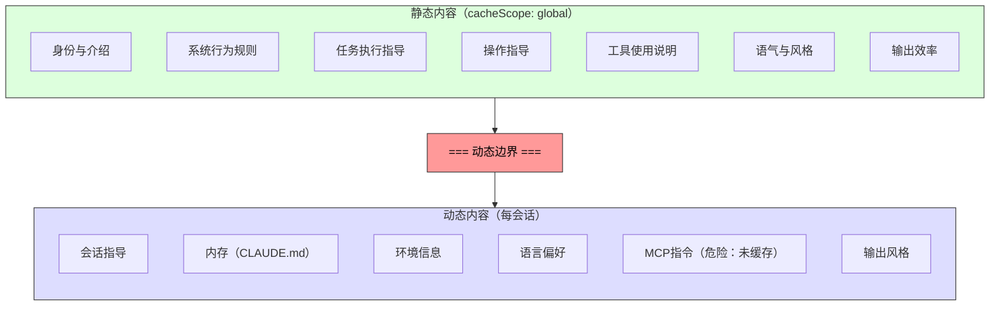

# 第4章：与Claude对话——API层

第3章确立了状态的存储位置以及两个层级如何通信。现在我们追踪当这些状态被投入使用时会发生什么：系统需要与语言模型对话。Claude Code中的一切——引导序列、状态系统、权限框架——都服务于这一刻。

这一层处理的故障模式比系统任何其他部分都多。它必须通过单一透明接口路由四个云提供商。它必须在字节级别上了解服务器提示缓存如何工作的情况下构建系统提示，因为单个放错位置的片段可能破坏一个价值50,000+令牌的缓存。它必须流式传输响应并进行主动故障检测，因为TCP连接会静默死亡。它必须维护会话稳定的不可变条件，以便功能标志的中途更改不会导致不可见的性能悬崖。

让我们追踪单个API调用从开始到结束。

---

## 多提供商客户端工厂

`getAnthropicClient()`函数是所有模型通信的单一工厂。它返回为部署目标提供商配置的Anthropic SDK客户端：

分发完全由环境变量驱动，按固定优先级顺序评估。所有四个提供商特定的SDK类都通过`as unknown as Anthropic`强制转换为`Anthropic`。源代码中的评论非常诚实："我们总是在返回类型上撒谎。"这种故意的类型擦除意味着每个消费者看到统一的接口。代码库的其余部分从不分支于提供商。

每个提供商SDK都是动态导入的——`AnthropicBedrock`、`AnthropicFoundry`、`AnthropicVertex`是带有自己依赖树的重量级模块。动态导入确保未使用的提供商永远不会加载。

提供商选择在启动时确定并存储在引导`STATE`中。查询循环从不检查哪个提供商处于活动状态。从直接API切换到Bedrock是配置更改，而非代码更改。

### buildFetch包装器

每个出站fetch都会被包装以注入`x-client-request-id`头——每个请求生成一个UUID。当请求超时时，服务器永远不会为响应分配请求ID。没有客户端ID，API团队无法将超时与服务器端日志关联。这个头桥接了那个缺口。它只发送给第一方Anthropic端点——第三方提供商可能会拒绝未知头。

---

## 系统提示构建

系统提示是整个系统中最缓存敏感的工件。Claude的API提供服务器端提示缓存：跨请求相同的提示前缀可以被缓存，节省延迟和成本。一个200K令牌的对话可能有50-70K令牌与前一轮相同。破坏该缓存会强制服务器重新处理所有内容。

### 动态边界标记

提示构建为字符串片段数组，带有关键分界线：

边界之前的所有内容在跨会话、用户和组织中是相同的——它获得最高级别的服务器端缓存。之后的内容包含用户特定内容，降级为每会话缓存。

片段的命名约定故意响亮。添加新片段需要在`systemPromptSection`（安全、已缓存）和`DANGEROUS_uncachedSystemPromptSection`（破坏缓存，需要原因字符串）之间选择。`_reason`参数在运行时未使用，但充当强制文档——每个破坏缓存的片段都在源代码中携带其理由。

### 2^N问题

`prompts.ts`中的评论解释了为什么条件片段必须放在边界之后：

> 这里的每个条件都是一个运行时位，否则会将Blake2b前缀哈希变体乘以2^N。

边界之前的每个布尔条件都会使唯一全局缓存条目数量翻倍。三个条件创建8个变体；五个创建32个。静态片段故意是无条件的。编译时功能标志（由打包器解析）在边界之前是可接受的。运行时检查（这是Haiku吗？用户有自动模式吗？）必须放在之后。

这是直到你违反它才可见的约束类型。一位善意的工程师在边界之前添加一个用户设置门控的片段，可能默默地碎片化全局缓存并使舰队的提示处理成本翻倍。

---

## 流式传输

### 原始SSE而非SDK抽象

流式实现使用原始`Stream<BetaRawMessageStreamEvent>`而非SDK的更高级`BetaMessageStream`。原因：`BetaMessageStream`在每个`input_json_delta`事件上调用`partialParse()`。对于具有大型JSON输入的工具调用（具有数百行的文件编辑），这会从开头重新解析增长的JSON字符串——O(n^2)行为。Claude Code自己处理工具输入累积，所以部分解析是纯浪费。

### 空闲看门狗

TCP连接可能在无通知的情况下死亡。服务器可能崩溃，负载均衡器可能静默丢弃连接，或者公司代理可能超时。SDK的请求超时只覆盖初始fetch——一旦HTTP 200到达，超时即满足。如果流式主体停止，没有任何东西捕获它。

看门狗：一个在每次接收到的块上重置的`setTimeout`。如果90秒内没有块到达，流被中止，系统回退到非流式重试。在45秒标记处触发警告。当看门狗触发时，它用客户端请求ID记录事件以供关联。

### 非流式回退

当流式传输在响应中途失败（网络错误、停滞、截断）时，系统回退到同步`messages.create()`调用。这处理代理返回HTTP 200但带有非SSE主体，或截断SSE流的代理故障。

当流式工具执行处于活动状态时，回退可以被禁用，因为回退会重新执行整个请求并可能运行工具两次。

---

## 提示缓存系统

### 三层

提示缓存在三个级别运行：

**短暂缓存**（默认）：每会话缓存，服务器定义的TTL（~5分钟）。所有用户都获得这个。

**1小时TTL**：符合条件的用户获得扩展缓存。资格由订阅状态确定，并在引导状态中锁存——来自第3章的`promptCache1hEligible`粘性锁存确保中途超额翻转不会更改TTL。

**全局范围**：系统提示缓存条目获得跨会话、跨组织共享。提示的静态部分对所有Claude Code用户都是相同的，所以单个缓存副本服务所有人。当存在MCP工具时禁用全局范围，因为MCP工具定义是用户特定的，会将缓存碎片化数百万个唯一前缀。

### 粘性锁存器实战

第3章的五个粘性锁存器在这里、在请求构建期间被评估。每个锁存器以`null`开始，一旦设为`true`，在会话的其余部分保持`true`。锁存块上方的评论很精确："动态beta头的粘性开启锁存器。一旦首次发送，每个头在会话的其余部分持续发送，因此中途切换不会更改服务器端缓存键并破坏~50-70K令牌。"

关于锁存器模式、五个特定锁存器以及为什么always-send-all-headers不是正确解决方案的完整解释，请参见第3章第3.1节。

---

## queryModel生成器

`queryModel()`函数是一个异步生成器（~700行），编排整个API调用生命周期。它产生`StreamEvent`、`AssistantMessage`和`SystemAPIErrorMessage`对象。

请求组装遵循精心排序的序列：

1. **终止开关检查**——最昂贵模型层的安全阀
2. **Beta头组装**——模型特定，应用粘性锁存器
3. **工具模式构建**——通过`Promise.all()`并行，延迟工具排除直到被发现
4. **消息规范化**——修复孤立的tool_use/tool_result不匹配，剥离多余媒体，移除陈旧块
5. **系统提示块构建**——在动态边界处分割，分配缓存范围
6. **重试包装流式**——处理529（过载）、模型回退、思考降级、OAuth刷新

### 输出令牌上限

默认输出上限是8,000令牌，而非典型的32K或64K。生产数据显示p99输出是4,911令牌——标准限制过度预留8-16倍。当响应命中上限（<1%请求）时，它获得一次干净的64K重试。这在舰队规模上节省显著成本。

### 错误处理和重试

`withRetry()`函数本身是一个异步生成器，产生`SystemAPIErrorMessage`事件以便UI可以显示重试状态。重试策略：

- **529（过载）**：等待并重试，可选降级快速模式
- **模型回退**：主模型失败，尝试回退（例如，Opus到Sonnet）
- **思考降级**：上下文窗口溢出触发减少的思考预算
- **OAuth 401**：刷新令牌并重试一次

生成器模式意味着重试进度（"服务器过载，5秒后重试..."）作为事件流的自然部分出现，而非作为旁通道通知。

---

## 应用此模式

**将提示缓存视为架构约束，而非功能开关。** 大多数LLM应用程序"打开"缓存。Claude Code将其视为塑造提示排序、片段记忆化、头锁存和配置管理的设计约束。结构良好的提示（50K令牌缓存命中）和结构不良的提示（每轮完全重新处理）之间的差异是系统中最大的成本杠杆。

**对昂贵的逃生舱口使用DANGEROUS命名约定。** 当代码库有一个容易被意外违反的不变条件时，用响亮的前缀命名逃生舱口做三件事：使违反在代码审查中可见，强制文档（需要的原因参数），并对安全默认值产生心理摩擦。这推广到缓存之外的任何具有不可见成本的操作。

**用看门狗而非仅超时构建流式传输。** SDK的请求超时在HTTP 200时满足，但响应主体可能随时停止到达。一个在每次块上重置的`setTimeout`捕获这个。非流式回退处理代理故障模式（HTTP 200但带有非SSE主体、中流截断），这些比你预期的在公司环境中更常见。

**使重试策略基于产生而非基于异常。** 通过使重试包装器成为产生状态事件的异步生成器，调用者将重试进度显示为事件流的自然部分。模型回退模式（Opus失败，尝试Sonnet）对生产弹性特别有用。

**将快速路径与完整流程分离。** 并非每个API调用都需要工具搜索、顾问集成、思考预算和流式基础设施。Claude Code的`queryHaiku()`函数为内部操作（压缩、分类）提供精简路径，跳过所有代理关注。具有简化接口的单独函数防止意外复杂性泄漏。

---

## 展望未来

API层位于后续一切的基础。第5章将展示查询循环如何使用流式响应驱动工具执行——包括工具如何在模型完成响应之前开始执行。第6章将解释压缩系统如何在对话接近上下文限制时保留缓存效率。第7章将展示每个代理线程如何获得自己的消息数组和请求链。

所有这些系统都继承这里建立的约束：缓存稳定性作为架构不变条件、通过客户端工厂的提供商透明性、通过锁存器系统的会话稳定配置。API层不仅发送请求——它定义每个其他系统操作的规则。
