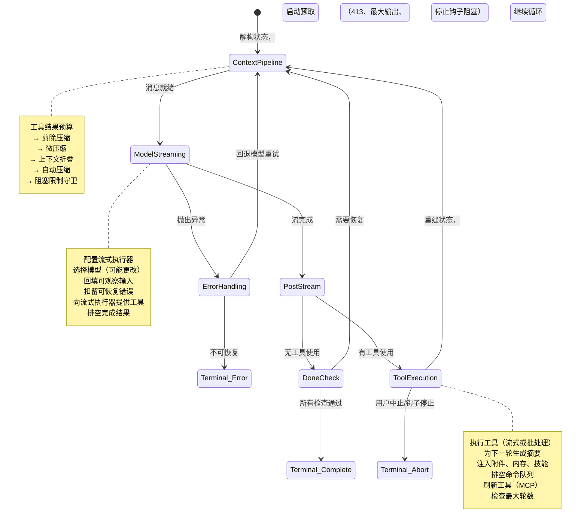
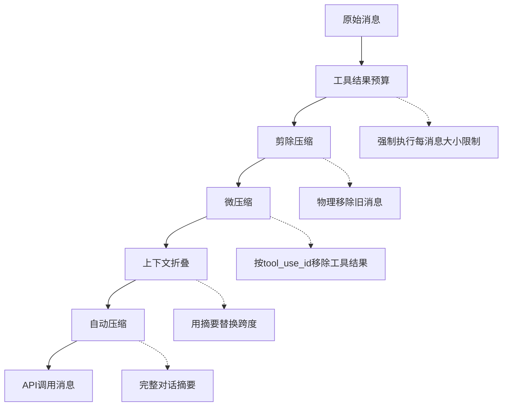
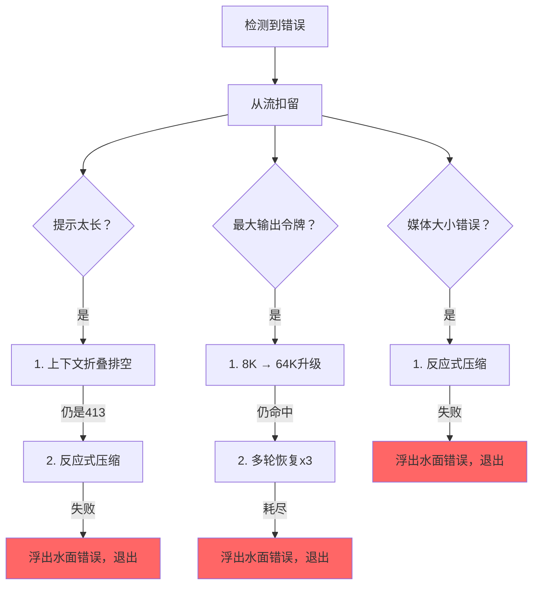

# 第5章：代理循环

## 跳动的心脏

第4章展示了API层如何将配置转换为流式HTTP请求——如何构建客户端、如何组装系统提示、响应如何作为服务器发送事件到达。那一层处理与模型对话的*机制*。但单个API调用不是代理。代理是一个循环：调用模型、执行工具、反馈结果、再次调用模型，直到工作完成。

每个系统都有一个重心。在数据库中，它是存储引擎。在编译器中，它是中间表示。在Claude Code中，它是`query.ts`——一个包含1,730行的单一文件，其中的异步生成器运行每次交互，从REPL中的第一次按键到无头`--print`调用的最后一次工具调用。

这并非夸张。恰好有一条代码路径与模型对话、执行工具、管理上下文、从错误恢复并决定何时停止。那条代码路径就是`query()`函数。REPL调用它。SDK调用它。子代理调用它。无头运行器调用它。如果你在使用Claude Code，你就在`query()`内部。

这个文件很密集，但它不像纠缠的继承层次结构那样复杂。它像潜艇一样复杂：单一船体带有许多冗余系统，每个系统都是因为海洋找到了入侵方式而添加的。每个`if`分支都有一个故事。每个被扣留的错误消息都代表一个真实的错误，其中SDK消费者在恢复中途断开连接。每个断路器阈值都是针对在无限循环中每天消耗数千次API调用的真实会话进行调整的。

本章从头到尾追踪整个循环。到最后，你将理解不仅发生了什么，而且每个机制存在的原因以及没有它什么会崩溃。

---

## 为什么是异步生成器

第一个架构问题：为什么代理循环是生成器而非基于回调的事件发射器？

```typescript
// 简化——展示概念，非确切类型
async function* agentLoop(params: LoopParams): AsyncGenerator<Message | Event, TerminalReason>
```

实际签名产生几种消息和事件类型，并返回编码循环为何停止的判别联合。

三个原因，按重要性排序。

**背压。** 事件发射器无论消费者是否准备好都会触发。生成器仅在消费者调用`.next()`时才产生。当REPL的React渲染器忙于绘制前一帧时，生成器自然暂停。当SDK消费者正在处理工具结果时，生成器等待。没有缓冲区溢出，没有消息丢失，没有"快生产者/慢消费者"问题。

**返回值语义。** 生成器的返回类型是`Terminal`——一个判别联合，精确编码循环为何停止。是正常完成？用户中止？令牌预算耗尽？停止钩子干预？最大轮数限制？不可恢复的模型错误？有10个不同的终止状态。调用者不需要订阅"end"事件并希望负载包含原因。他们从`for await...of`或`yield*`获得类型化的返回值。

**通过`yield*`的可组合性。** 外部`query()`函数用`yield*`委托给`queryLoop()`，透明地转发每个产生的值和最终返回。`handleStopHooks()`等子生成器使用相同模式。这创建了责任链，无需回调、无需Promise包装Promise、无需事件转发样板。

这个选择有代价——JavaScript中的异步生成器不能"倒带"或分叉。但代理循环不需要任一。它是严格向前移动的状态机。

还有一个微妙之处：`function*`语法使函数*惰性*。主体直到第一次`.next()`调用才执行。这意味着`query()`立即返回——所有重量级初始化（配置快照、内存预取、预算追踪器）仅在消费者开始拉取值时发生。在REPL中，这意味着React渲染管道在循环的第一行运行之前就已经设置好了。

---

## 调用者提供什么

在追踪循环之前，了解输入内容会有帮助：

```typescript
// 简化——说明关键字段
type LoopParams = {
  messages: Message[]
  prompt: SystemPrompt
  permissionCheck: CanUseToolFn
  context: ToolUseContext
  source: QuerySource         // 'repl'、'sdk'、'agent:xyz'、'compact'等
  maxTurns?: number
  budget?: { total: number }  // API级任务预算
  deps?: LoopDeps             // 为测试注入
}
```

值得注意的字段：

- **`querySource`**：一个字符串判别式如`'repl_main_thread'`、`'sdk'`、`'agent:xyz'`、`'compact'`或`'session_memory'`。许多条件分支于此。压缩代理使用`querySource: 'compact'`，因此阻塞限制守卫不会死锁（压缩代理需要运行以*减少*令牌数）。

- **`taskBudget`**：API级任务预算（`output_config.task_budget`）。与`+500k`自动继续令牌预算功能不同。`total`是整个代理轮次的预算；`remaining`每轮从累积API使用量计算并跨压缩边界调整。

- **`deps`**：可选依赖注入。默认为`productionDeps()`。这是测试交换假模型调用、假压缩和确定性UUID的接缝。

- **`canUseTool`**：一个返回给定工具是否允许的函数。这是权限层——它检查信任设置、钩子决策和当前权限模式。

---

## 双层入口点

公共API是真实循环的薄包装：

外部函数包装内部循环，追踪轮次期间消耗的哪些排队命令。内部循环完成后，消耗的命令被标记为`'completed'`。如果循环抛出或生成器通过`.return()`关闭，完成通知永远不会触发——失败的轮次不应将命令标记为成功处理。轮次期间排队的命令（通过`/`斜杠命令或任务通知）在循环内被标记为`'started'`，在包装器中被标记为`'completed'`。如果循环抛出或生成器通过`.return()`关闭，完成通知永远不会触发。这是故意的——失败的轮次不应将命令标记为成功处理。

---

## 状态对象

循环在单个类型化对象中携带其状态：

```typescript
// 简化——说明关键字段
type LoopState = {
  messages: Message[]
  context: ToolUseContext
  turnCount: number
  transition: Continue | undefined
  // ... 加上恢复计数器、压缩追踪、待处理摘要等
}
```

十个字段。每个都有其位置：

| 字段 | 存在原因 |
|-------|---------------|
| `messages` | 对话历史，每轮增长 |
| `toolUseContext` | 可变上下文：工具、中止控制器、代理状态、选项 |
| `autoCompactTracking` | 追踪压缩状态：轮次计数器、轮次ID、连续失败、已压缩标志 |
| `maxOutputTokensRecoveryCount` | 输出令牌限制的多轮恢复尝试次数（最多3次） |
| `hasAttemptedReactiveCompact` | 防止无限反应式压缩循环的一次性守卫 |
| `maxOutputTokensOverride` | 升级期间设为64K，之后清除 |
| `pendingToolUseSummary` | 上一轮Haiku摘要的Promise，在当前流式传输期间解析 |
| `stopHookActive` | 阻止在阻塞重试后重新运行停止钩子 |
| `turnCount` | 单调计数器，对照`maxTurns`检查 |
| `transition` | 上一轮为何继续——首次迭代时为`undefined` |

### 可变循环中的不可变转换

这是循环中每个`continue`语句出现的模式：

```typescript
const next: State = {
  messages: [...messagesForQuery, ...assistantMessages, ...toolResults],
  toolUseContext: toolUseContextWithQueryTracking,
  autoCompactTracking: tracking,
  turnCount: nextTurnCount,
  maxOutputTokensRecoveryCount: 0,
  hasAttemptedReactiveCompact: false,
  pendingToolUseSummary: nextPendingToolUseSummary,
  maxOutputTokensOverride: undefined,
  stopHookActive,
  transition: { reason: 'next_turn' },
}
state = next
```

每个continue站点构建一个完整的新`State`对象。不是`state.messages = newMessages`。不是`state.turnCount++`。完全重建。好处是每个转换都是自文档化的。你可以在任何`continue`站点阅读并看到哪些字段更改、哪些被保留。新状态上的`transition`字段记录循环为何继续——测试断言于此以验证正确的恢复路径触发。

---

## 循环体

以下是单次迭代的完整执行流程，压缩为其骨架：



这就是整个循环。Claude Code中的每个功能——从内存到子代理到错误恢复——都输入或消耗自这个单一迭代结构。

---

## 上下文管理：四层压缩

每次API调用之前，消息历史通过最多四个上下文管理阶段。它们按特定顺序运行，该顺序很重要。



### 第0层：工具结果预算

在任何压缩之前，`applyToolResultBudget()`对工具结果强制执行每消息大小限制。没有有限`maxResultSizeChars`的工具被豁免。

### 第1层：剪除压缩

最轻的操作。剪除从数组中物理移除旧消息，产生一个边界消息以向UI发出移除信号。它报告释放了多少令牌，该数字被引入自动压缩的阈值检查。

### 第2层：微压缩

微压缩移除不再需要的工具结果，由`tool_use_id`标识。对于缓存微压缩（编辑API缓存），边界消息延迟到API响应之后。原因：客户端令牌估计不可靠。API响应中的实际`cache_deleted_input_tokens`告诉你真正释放了什么。

### 第3层：上下文折叠

上下文折叠用摘要替换对话跨度。它在自动压缩之前运行，顺序是故意的：如果折叠将上下文减少到自动压缩阈值以下，自动压缩变为无操作。这保留粒度上下文，仅在必要时回退到单一整体摘要。

### 第4层：自动压缩

最重的操作：它分叉整个Claude会话来摘要历史。实现有一个断路器——3次连续失败后，它停止尝试。这防止了生产中观察到的噩梦场景：卡在上下文限制上的会话每天消耗250K API调用，陷入无限压缩-失败-重试循环。

### 自动压缩阈值

阈值派生自模型的上下文窗口：

```
effectiveContextWindow = contextWindow - min(modelMaxOutput, 20000)

阈值（相对于effectiveContextWindow）：
  自动压缩触发：      effectiveWindow - 13,000
  阻塞限制（硬）：   effectiveWindow - 3,000
```

| 常量 | 值 | 目的 |
|----------|-------|---------|
| `AUTOCOMPACT_BUFFER_TOKENS` | 13,000 | 有效窗口下方自动压缩触发器的余量 |
| `MANUAL_COMPACT_BUFFER_TOKENS` | 3,000 | 保留空间以便`/compact`仍然有效 |
| `MAX_CONSECUTIVE_AUTOCOMPACT_FAILURES` | 3 | 断路器阈值 |

13,000令牌余量意味着自动压缩在硬限制之前很久就触发。自动压缩阈值和阻塞限制之间的差距是反应式压缩操作的地方——如果主动自动压缩失败或被禁用，反应式压缩捕获413错误并按需压缩。

### 令牌计数

规范函数`tokenCountWithEstimation`将权威API报告的令牌计数（来自最近响应）与响应后添加消息的粗略估计相结合。近似是保守的——它倾向于高估，这意味着自动压缩稍微提前而非稍微滞后触发。

---

## 模型流式传输

### callModel()循环

API调用发生在`while(attemptWithFallback)`循环内，支持模型回退：

```typescript
let attemptWithFallback = true
while (attemptWithFallback) {
  attemptWithFallback = false
  try {
    for await (const message of deps.callModel({ messages, systemPrompt, tools, signal })) {
      // 处理每个流式消息
    }
  } catch (innerError) {
    if (innerError instanceof FallbackTriggeredError && fallbackModel) {
      currentModel = fallbackModel
      attemptWithFallback = true
      continue
    }
    throw innerError
  }
}
```

启用时，`StreamingToolExecutor`在`tool_use`块到达流式传输期间立即开始执行工具——而非在完整响应完成后。工具如何编排成并发批次是第7章的主题。

### 扣留模式

这是文件中最重要的模式之一。可恢复错误从产生流中被抑制：

```typescript
let withheld = false
if (contextCollapse?.isWithheldPromptTooLong(message)) withheld = true
if (reactiveCompact?.isWithheldPromptTooLong(message)) withheld = true
if (isWithheldMaxOutputTokens(message)) withheld = true
if (!withheld) yield yieldMessage
```

为什么扣留？因为SDK消费者——Cowork、桌面应用——在带有`error`字段的任何消息上终止会话。如果你产生一个提示太长错误，然后通过反应式压缩成功恢复，消费者已经断开连接。恢复循环继续运行，但没有人监听。所以错误被扣留，推送到`assistantMessages`以便下游恢复检查可以找到它。如果所有恢复路径都失败，被扣留的消息最终被浮出水面。

### 模型回退

当捕获到`FallbackTriggeredError`（主模型需求高）时，循环切换模型并重试。但思考签名是模型绑定的——将受保护的思考块从一个模型重播到不同的回退模型会导致400错误。代码在重试前剥离签名块。失败尝试的所有孤立助手消息都被标记为墓碑，以便UI移除它们。

---

## 错误恢复：升级阶梯

`query.ts`中的错误恢复不是单一策略。它是当上一个失败时触发的越来越激进的干预阶梯。



### 死亡螺旋守卫

最危险的故障模式是无限循环。代码有多个守卫：

1. **`hasAttemptedReactiveCompact`**：一次性标志。反应式压缩每种错误类型触发一次。
2. **`MAX_OUTPUT_TOKENS_RECOVERY_LIMIT = 3`**：多轮恢复尝试的硬上限。
3. **自动压缩断路器**：3次连续失败后，自动压缩完全停止尝试。
4. **错误响应无停止钩子**：当最后一条消息是API错误时，代码在到达停止钩子之前显式返回。评论解释："错误 -> 钩子阻塞 -> 重试 -> 错误 -> ...（钩子每轮循环注入更多令牌）。"
5. **停止钩子重试间保留`hasAttemptedReactiveCompact`**：当停止钩子返回阻塞错误并强制重试时，反应式压缩守卫被保留。评论记录了错误："在这里重置为false导致无限循环，消耗数千次API调用。"

每个这些守卫都是因为有人在生产中遇到故障模式而添加的。

---

## 工作示例："修复auth.ts中的错误"

为了使循环具体化，让我们追踪一个真实交互的三轮。

**用户输入：** `修复src/auth/validate.ts中的空指针错误`

**第1轮：模型读取文件。**

循环进入。上下文管理运行（不需要压缩——对话很短）。模型流式响应："让我看看文件。"它发出单个`tool_use`块：`Read({ file_path: "src/auth/validate.ts" })`。流式执行器看到一个并发安全工具并立即启动它。当模型完成其响应文本时，文件内容已经在内存中。

流后处理：模型使用了工具，所以我们进入工具使用路径。读取结果（带行号的文件内容）被推送到`toolResults`。Haiku摘要Promise在后台启动。状态用新消息、`transition: { reason: 'next_turn' }`重建，循环继续。

**第2轮：模型编辑文件。**

上下文管理再次运行（仍在阈值以下）。模型流式："我在第42行看到错误——`userId`可能为空。"它发出`Edit({ file_path: "src/auth/validate.ts", old_string: "const user = getUser(userId)", new_string: "if (!userId) return { error: 'unauthorized' }\nconst user = getUser(userId)" })`。

编辑不是并发安全的，所以流式执行器将其排队直到响应完成。然后14步执行管道触发：Zod验证通过，输入回填扩展路径，PreToolUse钩子检查权限（用户批准），编辑被应用。第1轮的待处理Haiku摘要在流式传输期间解析——其结果作为`ToolUseSummaryMessage`产生。状态被重建，循环继续。

**第3轮：模型声明完成。**

模型流式："我通过添加守卫子句修复了空指针错误。"没有`tool_use`块。我们进入"完成"路径。提示太长恢复？不需要。最大输出令牌？没有。停止钩子运行——没有阻塞错误。令牌预算检查通过。循环返回`{ reason: 'completed' }`。

总计：三次API调用，两次工具执行，一次用户权限提示。循环处理了流式工具执行、与API调用重叠的Haiku摘要化，以及完整的权限管道——全部通过相同的`while(true)`结构。

---

## 令牌预算

用户可以为轮次请求令牌预算（例如`+500k`）。预算系统决定模型完成响应后是继续还是停止。

`checkTokenBudget`用三条规则做出二进制继续/停止决策：

1. **子代理总是停止。** 预算仅是顶级概念。
2. **90%完成阈值。** 如果`turnTokens < budget * 0.9`，继续。
3. **收益递减检测。** 3+次继续后，如果当前和前一个增量都低于500令牌，提前停止。模型每轮继续产生的输出越来越少。

当决策是"继续"时，注入一条提示消息告诉模型剩余多少预算。

---

## 停止钩子：强制模型继续工作

停止钩子在模型完成而未请求任何工具使用时运行——它认为自己完成了。钩子评估它是否*实际上*完成了。

管道运行模板作业分类，触发后台任务（提示建议、内存提取），然后执行适当的停止钩子。当停止钩子返回阻塞错误——"你说完成了，但linter发现3个错误"——错误被附加到消息历史，循环以`stopHookActive: true`继续。这个标志阻止在重试时重新运行相同的钩子。

当停止钩子发出`preventContinuation`信号时，循环立即以`{ reason: 'stop_hook_prevented' }`退出。

---

## 状态转换：完整目录

循环的每次退出都是两种类型之一：`Terminal`（循环返回）或`Continue`（循环迭代）。

### 终止状态（10个原因）

| 原因 | 触发条件 |
|--------|---------|
| `blocking_limit` | 令牌数在硬限制，自动压缩关闭 |
| `image_error` | ImageSizeError、ImageResizeError或不可恢复的媒体错误 |
| `model_error` | 不可恢复的API/模型异常 |
| `aborted_streaming` | 模型流式传输期间用户中止 |
| `prompt_too_long` | 所有恢复耗尽后被扣留的413 |
| `completed` | 正常完成（无工具使用，或预算耗尽，或API错误） |
| `stop_hook_prevented` | 停止钩子显式阻止继续 |
| `aborted_tools` | 工具执行期间用户中止 |
| `hook_stopped` | PreToolUse钩子停止继续 |
| `max_turns` | 达到`maxTurns`限制 |

### 继续状态（7个原因）

| 原因 | 触发条件 |
|--------|---------|
| `collapse_drain_retry` | 上下文折叠在413上排空暂存折叠 |
| `reactive_compact_retry` | 413或媒体错误后反应式压缩成功 |
| `max_output_tokens_escalate` | 命中8K上限，升级到64K |
| `max_output_tokens_recovery` | 64K仍命中，多轮恢复（最多3次尝试） |
| `stop_hook_blocking` | 停止钩子返回阻塞错误，必须重试 |
| `token_budget_continuation` | 令牌预算未耗尽，注入提示消息 |
| `next_turn` | 正常工具使用继续 |

---

## 孤立工具结果：协议安全网

API协议要求每个`tool_use`块后跟一个`tool_result`。函数`yieldMissingToolResultBlocks`为模型发出但从未获得相应结果的每个`tool_use`块创建错误`tool_result`消息。没有这个安全网，流式传输期间的崩溃会留下孤立的`tool_use`块，导致下一次API调用出现协议错误。

它在三个地方触发：外部错误处理程序（模型崩溃）、回退处理程序（流中模型切换）和中止处理程序（用户中断）。每条路径有不同的错误消息，但机制相同。

---

## 中止处理：两条路径

中止可能发生在两个点：流式传输期间和工具执行期间。每个都有不同的行为。

**流式传输期间中止**：流式执行器（如果活动）排空剩余结果，为排队工具生成合成`tool_results`。没有执行器，`yieldMissingToolResultBlocks`填补空白。`signal.reason`检查区分硬中止（Ctrl+C）和提交中断（用户输入了新消息）——提交中断跳过中断消息，因为排队的用户消息已经提供上下文。

**工具执行期间中止**：类似逻辑，`toolUse: true`参数在中断消息上向UI发出工具正在进行的信号。

---

## 思考规则

Claude的思考/redacted_thinking块有三条不可违反的规则：

1. 包含思考块的消息必须是`max_thinking_length > 0`的查询的一部分
2. 思考块不能是消息中的最后一块
3. 思考块必须在助手轨迹的持续时间内保留

违反任何一条都会产生不透明的API错误。代码在几个地方处理它们：回退处理程序剥离签名块（它们是模型绑定的），压缩管道保留受保护的尾部，微压缩层从不触碰思考块。

---

## 依赖注入

`QueryDeps`类型故意狭窄——四个依赖，不是四十个：

四个注入依赖：模型调用器、压缩器、微压缩器和UUID生成器。测试将`deps`传入循环参数以直接注入假。对类型定义使用`typeof fn`自动保持签名同步。与可变`State`和可注入`QueryDeps`一起，不可变`QueryConfig`在`query()`入口快照一次——功能标志、会话状态和环境变量捕获一次且不再重新读取。三方分离（可变状态、不可变配置、可注入依赖）使循环可测试，并使最终重构为纯`step(state, event, config)`reducer变得简单。

---

## 应用此模式：构建你自己的代理循环

**使用生成器，而非回调。** 背压是免费的。返回值语义是免费的。通过`yield*`的可组合性是免费的。代理循环严格向前移动——你从不需要倒带或分叉。

**使状态转换显式。** 在每个`continue`站点重建完整状态对象。冗长是特性——它防止部分更新错误并使每个转换自文档化。

**扣留可恢复错误。** 如果你的消费者在错误上断开连接，在知道恢复失败之前不要产生错误。推送到内部缓冲区，尝试恢复，仅在耗尽时浮出水面。

**分层你的上下文管理。** 轻操作优先（移除），重操作最后（摘要化）。这尽可能保留粒度上下文，仅在必要时回退到整体摘要。

**为每次重试添加断路器。** `query.ts`中的每个恢复机制都有显式限制：3次自动压缩失败、3次最大输出恢复尝试、1次反应式压缩尝试。没有这些限制，第一个触发重试-失败循环的生产会话会一夜之间烧掉你的API预算。

如果你从零开始，最小代理循环骨架：

```
async function* agentLoop(params) {
  let state = initState(params)
  while (true) {
    const context = compressIfNeeded(state.messages)
    const response = await callModel(context)
    if (response.error) {
      if (canRecover(response.error, state)) { state = recoverState(state); continue }
      return { reason: 'error' }
    }
    if (!response.toolCalls.length) return { reason: 'completed' }
    const results = await executeTools(response.toolCalls)
    state = { ...state, messages: [...context, response.message, ...results] }
  }
}
```

Claude Code循环中的每个功能都是这些步骤之一的详细阐述。四层压缩详细阐述步骤3（压缩）。扣留模式详细阐述模型调用。升级阶梯详细阐述错误恢复。停止钩子详细阐述"无工具使用"退出。从这个骨架开始。仅当你遇到它解决的问题时才添加每个详细阐述。

---

## 总结

代理循环是单个`while(true)`的1,730行，做所有事情。它流式传输模型响应、并发执行工具、通过四层压缩上下文、从五类错误中恢复、用收益递减检测追踪令牌预算、运行可以强制模型回去工作的停止钩子、管理内存和技能的预取管道，并产生精确说明它为何停止的类型化判别联合。

它是系统中最重要的文件，因为它是唯一触及每个其他子系统的文件。上下文管道输入它。工具系统从它输出。错误恢复围绕它。钩子拦截它。状态层通过它持久化。UI从它渲染。

如果你理解`query()`，你就理解Claude Code。其他一切都是外围。
