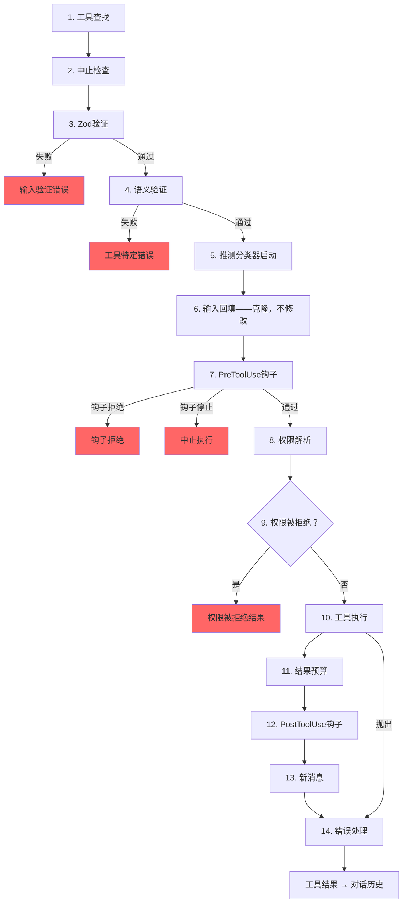

# 第6章：工具——从定义到执行

## 神经系统

第5章展示了agent循环——那个`while(true)`循环，它流式传输模型响应、收集工具调用并将结果反馈回去。循环是心跳。但如果没有将"模型想要运行`git status`"转化为实际shell命令的神经系统，心跳毫无意义——这个神经系统需要权限检查、结果预算和错误处理。

工具系统就是这个神经系统。它涵盖40多个工具实现、一个带有功能标志门控的集中式注册表、一个14步执行管道、一个具有七种模式的权限解析器，以及一个在模型完成响应之前就开始启动工具的流式执行器。

Claude Code中的每个工具调用——每次文件读取、每个shell命令、每次grep、每个子agent调度——都流经同一个管道。一致性是关键：无论工具是内置的Bash执行器还是第三方MCP服务器，它都获得相同的验证、相同的权限检查、相同的结果预算、相同的错误分类。

`Tool`接口大约有45个成员。这听起来令人不知所措，但只有五个对于理解系统工作原理至关重要：

1. **`call()`** —— 执行工具
2. **`inputSchema`** —— 验证和解析输入
3. **`isConcurrencySafe()`** —— 是否可以并行运行？
4. **`checkPermissions()`** —— 是否允许？
5. **`validateInput()`** —— 输入在语义上是否合理？

其他所有内容——12个渲染方法、分析钩子、搜索提示——都用于支持UI和遥测层。从五个开始，其余内容就会各就各位。

---

## 工具接口

### 三个类型参数

每个工具都参数化为三个类型：

```typescript
Tool<Input extends AnyObject, Output, P extends ToolProgressData>
```

`Input`是一个Zod对象模式，具有双重作用：它生成发送给API的JSON Schema（因此模型知道要提供什么参数），并通过`safeParse`在运行时验证模型的响应。`Output`是工具结果的TypeScript类型。`P`是工具运行时发出的进度事件类型——BashTool发出stdout块，GrepTool发出匹配计数，AgentTool发出子agent对话记录。

### buildTool()和故障关闭默认设置

没有工具定义直接构造`Tool`对象。每个工具都经过`buildTool()`，这是一个工厂，它将默认对象展开到工具特定定义之下：

```typescript
// 伪代码——说明故障关闭默认设置模式
const SAFE_DEFAULTS = {
  isEnabled:         () => true,
  isParallelSafe:    () => false,   // 故障关闭：新工具串行运行
  isReadOnly:        () => false,   // 故障关闭：视为写入操作
  isDestructive:     () => false,
  checkPermissions:  (input) => ({ behavior: 'allow', updatedInput: input }),
}

function buildTool(definition) {
  return { ...SAFE_DEFAULTS, ...definition }  // 定义覆盖默认值
}
```

默认值在安全关键位置故意设置为故障关闭。忘记实现`isConcurrencySafe`的新工具默认为`false`——它串行运行，从不并行。忘记`isReadOnly`的工具默认为`false`——系统将其视为写入操作。忘记`toAutoClassifierInput`的工具返回空字符串——自动模式安全分类器跳过它，这意味着通用权限系统处理它而不是自动绕过。

唯一不是故障关闭的默认值是`checkPermissions`，它返回`allow`。这看起来倒退，直到你理解分层权限模型：`checkPermissions`是在通用权限系统已经评估规则、钩子和基于模式的策略之后运行的工具特定逻辑。工具从`checkPermissions`返回`allow`是在说"我没有工具特定的反对意见"——它不是授予全面访问权限。分组到子对象（`options`、命名字段如`readFileState`）提供了聚焦接口会提供的结构，而没有声明、实现和线程化五个单独接口类型穿过40多个调用点的繁琐。

### 并发性取决于输入

签名`isConcurrencySafe(input: z.infer<Input>): boolean`接受解析后的输入，因为相同的工具对某些输入是安全的，对其他输入则不安全。BashTool是典型例子：`ls -la`是只读且并发安全的，但`rm -rf /tmp/build`不是。工具解析命令，将每个子命令与已知安全集进行分类，并且仅当每个非中性部分都是搜索或读取操作时才返回`true`。

### ToolResult返回类型

每个`call()`返回一个`ToolResult<T>`：

```typescript
type ToolResult<T> = {
  data: T
  newMessages?: (UserMessage | AssistantMessage | AttachmentMessage | SystemMessage)[]
  contextModifier?: (context: ToolUseContext) => ToolUseContext
}
```

`data`是会被序列化到API的`tool_result`内容块中的类型化输出。`newMessages`允许工具向对话中注入额外消息——AgentTool使用它来追加子agent对话记录。`contextModifier`是一个函数，用于改变后续工具的`ToolUseContext`——这就是`EnterPlanMode`切换权限模式的方式。上下文修饰符仅对非并发安全工具生效；如果你的工具并行运行，它的修饰符会排队到批次完成。

---

## ToolUseContext：上帝对象

`ToolUseContext`是贯穿每个工具调用的巨大上下文包。它有大约40个字段。按照任何合理的定义，它是一个上帝对象。它的存在是因为替代方案更糟。

像BashTool这样的工具需要中止控制器、文件状态缓存、应用状态、消息历史、工具集、MCP连接和半打UI回调。将这些作为单独参数线程化会产生15个以上参数的函数签名。务实的解决方案是单个上下文对象，按关注点分组：

**配置**（`options`子对象）：工具集、模型名称、MCP连接、调试标志。在查询开始时设置一次，大部分不可变。

**执行状态**：用于取消的`abortController`、用于LRU文件缓存的`readFileState`、用于完整对话历史的`messages`。这些在执行期间发生变化。

**UI回调**：`setToolJSX`、`addNotification`、`requestPrompt`。仅在交互式（REPL）上下文中连接。SDK和无头模式将它们留空。

**Agent上下文**：`agentId`、`renderedSystemPrompt`（为fork子agent冻结的父提示——重新渲染可能由于功能标志预热而偏离并破坏缓存）。

`ToolUseContext`的子agent变体特别具有启发性。当`createSubagentContext()`为子agent构建上下文时，它对哪些字段共享、哪些隔离做出深思熟虑的选择：`setAppState`对异步agent变为无操作，`localDenialTracking`获得新对象，`contentReplacementState`从父级克隆。每个选择都编码了从生产bug中学到的教训。

---

## 注册表

### getAllBaseTools()：单一真相来源

函数`getAllBaseTools()`返回当前进程中可能存在的每个工具的详尽列表。始终存在的工具排在前面，然后是条件包含的工具，由功能标志门控：

```typescript
const SleepTool = feature('PROACTIVE') || feature('KAIROS')
  ? require('./tools/SleepTool/SleepTool.js').SleepTool
  : null
```

从`bun:bundle`导入的`feature()`在打包时解析。当`feature('AGENT_TRIGGERS')`静态为false时，打包器会消除整个`require()`调用——死代码消除保持二进制文件小巧。

### assembleToolPool()：合并内置和MCP工具

到达模型的最终工具集来自`assembleToolPool()`：

1. 获取内置工具（带有拒绝规则过滤、REPL模式隐藏和`isEnabled()`检查）
2. 按拒绝规则过滤MCP工具
3. 按名称字母顺序对每个分区排序
4. 连接内置工具（前缀）+ MCP工具（后缀）

排序后连接的方法不是审美偏好。API服务器在最后一个内置工具后放置提示缓存断点。对所有工具进行扁平排序会将MCP工具交错到内置列表中，添加或删除MCP工具会改变内置工具位置，使缓存失效。

---

## 14步执行管道

函数`checkPermissionsAndCallTool()`是意图变为行动的地方。每个工具调用都经过这14个步骤。



### 步骤1-4：验证

**工具查找**回退到`getAllBaseTools()`进行别名匹配，处理工具被重命名的旧会话的对话记录。**中止检查**防止在Ctrl+C传播之前队列化的工具调用浪费计算。**Zod验证**捕获类型不匹配；对于延迟工具，错误会附加调用ToolSearch的提示。**语义验证**超越模式一致性——FileEditTool拒绝无操作编辑，BashTool在MonitorTool可用时阻止独立的`sleep`。

### 步骤5-6：准备

**推测分类器启动**为Bash命令并行启动自动模式安全分类器，从常见路径中节省数百毫秒。**输入回填**克隆解析后的输入并添加派生字段（将`~/foo.txt`展开为绝对路径）用于钩子和权限，保留原始内容以确保对话记录稳定性。

### 步骤7-9：权限

**PreToolUse钩子**是扩展机制——它们可以做出权限决策、修改输入、注入上下文或完全停止执行。**权限解析**桥接钩子和通用权限系统：如果钩子已经决定，那就是最终结果；否则`canUseTool()`触发规则匹配、工具特定检查、基于模式的默认值和交互式提示。**权限拒绝处理**构建错误消息并执行`PermissionDenied`钩子。

### 步骤10-14：执行和清理

**工具执行**使用原始输入运行实际的`call()`。**结果预算**将超大输出持久化到`~/.claude/tool-results/{hash}.txt`并用预览替换。**PostToolUse钩子**可以修改MCP输出或阻止继续。**新消息**被追加（子agent对话记录、系统提醒）。**错误处理**对遥测分类错误，从可能混乱的名称中提取安全字符串，并发出OTel事件。

---

## 权限系统

### 七种模式

| 模式 | 行为 |
|------|------|
| `default` | 工具特定检查；对未识别操作提示用户 |
| `acceptEdits` | 自动允许文件编辑；对其他操作提示 |
| `plan` | 只读——拒绝所有写入操作 |
| `dontAsk` | 自动拒绝通常会提示的任何内容（后台agent） |
| `bypassPermissions` | 允许一切而不提示 |
| `auto` | 使用对话记录分类器决定（功能标志控制） |
| `bubble` | 子agent升级到父级的内部模式 |

### 解析链

当工具调用到达权限解析时：

1. **钩子决策**：如果PreToolUse钩子已经返回`allow`或`deny`，那就是最终结果。
2. **规则匹配**：三个规则集——`alwaysAllowRules`、`alwaysDenyRules`、`alwaysAskRules`——在工具名称和可选内容模式上匹配。`Bash(git *)`匹配任何以`git`开头的Bash命令。
3. **工具特定检查**：工具的`checkPermissions()`方法。大多数返回`passthrough`。
4. **基于模式的默认值**：`bypassPermissions`允许一切。`plan`拒绝写入。`dontAsk`拒绝提示。
5. **交互式提示**：在`default`和`acceptEdits`模式下，未解决的决策显示提示。
6. **自动模式分类器**：两阶段分类器（快速模型，然后对模糊情况进行扩展思考）。

`safetyCheck`变体有一个`classifierApprovable`布尔值：`.claude/`和`.git/`编辑是`classifierApprovable: true`（不寻常但有时合法），而Windows路径绕过尝试是`classifierApprovable: false`（几乎总是对抗性的）。

### 权限规则和匹配

权限规则存储为具有三个部分的`PermissionRule`对象：一个`source`追溯来源（userSettings、projectSettings、localSettings、cliArg、policySettings、session等），一个`ruleBehavior`（allow、deny、ask），以及一个带有工具名称和可选内容模式的`ruleValue`。

`ruleContent`字段启用细粒度匹配。`Bash(git *)`允许任何以`git`开头的Bash命令。`Edit(/src/**)`仅允许在`/src`内编辑。`Fetch(domain:example.com)`允许从特定域获取。没有`ruleContent`的规则匹配该工具的所有调用。

BashTool的权限匹配器通过`parseForSecurity()`（一个bash AST解析器）解析命令，并将复合命令拆分为子命令。如果AST解析失败（带有heredocs或嵌套子shell的复杂语法），匹配器返回`() => true`——故障安全，意味着钩子始终运行。假设是如果命令太复杂而无法解析，它就太复杂而无法自信地排除在安全检查之外。

### 子agent的Bubble模式

协调器-工作者模式中的子agent无法显示权限提示——它们没有终端。`bubble`模式导致权限请求传播到父上下文。协调器agent在主线程中运行，具有终端访问权限，处理提示并将决定发送回下层。

---

## 工具延迟加载

带有`shouldDefer: true`的工具以`defer_loading: true`发送给API——名称和描述，但没有完整参数模式。这减少了初始提示大小。要使用延迟工具，模型必须首先调用`ToolSearchTool`加载其模式。失败模式很有启发性：在未加载的情况下调用延迟工具会导致Zod验证失败（所有类型化参数都作为字符串到达），系统会附加有针对性的恢复提示。

延迟加载还提高了缓存命中率：以`defer_loading: true`发送的工具只对提示贡献其名称，因此添加或删除延迟MCP工具只会改变几个token，而不是数百个。

---

## 结果预算

### 每工具大小限制

每个工具声明`maxResultSizeChars`：

| 工具 | maxResultSizeChars | 理由 |
|------|-------------------|------|
| BashTool | 30,000 | 足够容纳大多数有用输出 |
| FileEditTool | 100,000 | 差异可能很大，但模型需要它们 |
| GrepTool | 100,000 | 带上下文行的搜索结果累加很快 |
| FileReadTool | Infinity | 通过自身token限制自约束；持久化会创建循环读取 |

当结果超过阈值时，完整内容保存到磁盘，并用包含预览和文件路径的`<persisted-output>`包装器替换。然后模型可以在需要时使用`Read`访问完整输出。

### 每对话聚合预算

除了每工具限制外，`ContentReplacementState`跟踪整个对话的聚合预算，防止千刀万剐之死——许多工具每个返回其单独限制的90%仍然可能压倒上下文窗口。

---

## 单个工具亮点

### BashTool：最复杂的工具

BashTool是迄今为止系统中最复杂的工具。它解析复合命令，将子命令分类为只读或写入，管理后台任务，通过magic bytes检测图像输出，并实现sed模拟以进行安全编辑预览。

复合命令解析特别有趣。`splitCommandWithOperators()`将像`cd /tmp && mkdir build && ls build`这样的命令分解为单独的子命令。每个都根据已知安全命令集（`BASH_SEARCH_COMMANDS`、`BASH_READ_COMMANDS`、``BASH_LIST_COMMANDS`）进行分类。复合命令仅当所有非中性部分都是安全时才为只读。中性集（echo、printf）被忽略——它们不会使命令只读，但也不会使命令只写。

sed模拟（`_simulatedSedEdit`）值得特别关注。当用户在权限对话框中批准sed命令时，系统通过在沙箱中运行sed命令并捕获输出来预计算结果。预计算结果作为`_simulatedSedEdit`注入到输入中。当`call()`执行时，它直接应用编辑，绕过shell执行。这保证用户预览的内容就是写入的内容——不是在预览和执行之间如果文件发生变化可能产生不同结果的重新执行。

### FileEditTool：陈旧检测

FileEditTool与`readFileState`集成，这是跨对话维护的文件内容和时间戳的LRU缓存。在应用编辑之前，它检查文件自模型上次读取以来是否已被修改。如果文件是陈旧的——被后台进程、另一个工具或用户修改——编辑被拒绝，并带有告诉模型首先重新读取文件的消息。

`findActualString()`中的模糊匹配处理模型在空白处略有错误的常见情况。它在匹配之前规范化空白和引号样式，因此针对带有尾随空格的`old_string`的编辑仍然匹配文件的实际内容。`replace_all`标志启用批量替换；没有它，非唯一匹配被拒绝，要求模型提供足够的上下文来识别单个位置。

### FileReadTool：多功能读取器

FileReadTool是唯一具有`maxResultSizeChars: Infinity`的内置工具。如果读取输出持久化到磁盘，模型需要读取持久化文件，而持久化文件本身可能超过限制，创建无限循环。该工具改为通过token估计自约束，并在源头截断。

该工具非常通用：它读取带行号的文本文件、图像（返回base64多模态内容块）、PDF（通过`extractPDFPages()`）、Jupyter notebooks（通过`readNotebook()`）和目录（回退到`ls`）。它阻止危险设备路径（`/dev/zero`、`/dev/random`、`/dev/stdin`）并处理macOS截图文件名怪癖（U+202F窄不间断空格与"Screen Shot"文件名中的常规空格）。

### GrepTool：通过head_limit分页

GrepTool包装`ripGrep()`并通过`head_limit`添加分页机制。默认是250个条目——足够获得有用结果，但小到足以避免上下文膨胀。当发生截断时，响应包含`appliedLimit: 250`，向模型发出信号在下次调用时使用`offset`进行分页。显式的`head_limit: 0`完全禁用限制。

GrepTool自动排除六个VCS目录（`.git`、`.svn`、`.hg`、`.bzr`、`.jj`、`.sl`）。在`.git/objects`中搜索几乎从来不是模型想要的，意外包含二进制包文件会突破token预算。

### AgentTool和上下文修饰符

AgentTool生成运行自己查询循环的子agent。它的`call()`返回包含子agent对话记录的`newMessages`，以及可选地将状态更改传播回父级的`contextModifier`。因为AgentTool默认不是并发安全的，单个响应中的多个Agent工具调用串行运行——每个子agent的上下文修饰符在下一个子agent启动之前应用。在协调器模式下，模式反转：协调器为独立任务调度子agent，`isAgentSwarmsEnabled()`检查解锁并行agent执行。

---

## 工具如何与消息历史交互

工具结果不只是向模型返回数据。它们作为结构化消息参与对话。

API期望工具结果作为引用原始`tool_use`块的`ToolResultBlockParam`对象。大多数工具序列化为文本。FileReadTool可以序列化为图像内容块（base64编码）以进行多模态响应。BashTool通过检查stdout中的magic bytes检测图像输出并相应切换为图像块。

`ToolResult.newMessages`是工具如何扩展超出简单调用-响应模式的对话的方式。**Agent对话记录**：AgentTool将子agent的消息历史作为附件消息注入。**系统提醒**：内存工具注入在工具结果后出现的系统消息——对模型在下一次回合可见但在`normalizeMessagesForAPI`边界处被剥离。**附件消息**：钩子结果、额外上下文和错误详情携带结构化元数据，模型可以在后续回合中引用。

`contextModifier`函数是更改执行环境的工具的机制。当`EnterPlanMode`执行时，它返回一个将权限模式设置为`'plan'`的修饰符。当`ExitWorktree`执行时，它修改工作目录。这些修饰符是工具影响后续工具的唯一方式——直接修改`ToolUseContext`不可能，因为上下文在每个工具调用之前都被展开复制。串行唯一限制由编排层强制执行：如果两个并发工具都修改工作目录，哪个获胜？

---

## 应用：设计工具系统

**故障关闭默认设置。** 新工具在明确标记之前应该是保守的。忘记设置标志的开发者获得安全行为，而不是危险行为。

**输入相关安全。** `isConcurrencySafe(input)`和`isReadOnly(input)`接受解析后的输入，因为相同工具在不同输入下具有不同的安全特性。将BashTool标记为"始终串行"的工具注册表是正确的，但浪费。

**分层权限。** 工具特定检查、基于规则的匹配、基于模式的默认值、交互式提示和自动分类器各自处理不同情况。没有单一机制足够。

**预算结果，而不仅仅是输入。** 输入的token限制是标准。但工具结果可能任意大，并在回合中累积。每工具限制防止个别爆炸。聚合对话限制防止累积溢出。

**使错误分类对遥测安全。** 在压缩构建中，`error.constructor.name`被混淆。`classifyToolError()`函数提取可用的最具信息量的安全字符串——遥测安全消息、errno代码、稳定错误名称——而不将原始错误消息记录到分析中。

---

## 接下来是什么

本章追踪了单个工具调用如何从定义流经验证、权限、执行和结果预算。但模型很少一次只请求一个工具。工具如何编排成并发批次是第7章的主题。
