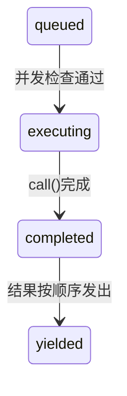

# 第7章：并发工具执行

## 等待的成本

第6章追踪了单个工具调用的生命周期——从API响应中的原始`tool_use`块，经过输入验证、权限检查、执行和结果格式化。该管道处理一个工具。但模型很少只请求一个。

典型的Claude Code交互每轮涉及三到五个工具调用。"读取这两个文件，grep这个模式，然后编辑这个函数。"模型在单个响应中发出所有这些。如果每个工具需要200毫秒，串行运行它们需要整整一秒。如果读取和Grep调用是独立的——它们确实是——并行运行将它们缩短到200毫秒。五比一的改进，免费。

但并非所有工具都是独立的。修改`config.ts`的编辑不能与修改`config.ts`的另一个编辑并发运行。创建目录的Bash命令必须在向该目录写入文件的Bash命令之前完成。并发不是工具的全局属性。它是特定工具调用具有特定输入的属性。

这是驱动整个并发系统的洞察：**安全是每次调用的，不是每种工具类型的**。`Bash("ls -la")`可以安全地并行化。`Bash("rm -rf build/")`不行。相同工具，不同输入，不同并发分类。系统必须在决定之前检查输入。

Claude Code实现两层并发优化。第一层是**批次编排**：在模型响应完全接收后，将工具调用划分为并发和串行组，然后适当地执行每组。第二层是**推测执行**：在模型完成响应之前就开始运行工具，在响应完成之前收获结果。两者结合消除了大部分原本会花费的等待时间。

---

## 分区算法

入口点是`toolOrchestration.ts`中的`partitionToolCalls()`。它接受有序的`ToolUseBlock`消息数组，并生成批次数组，其中每个批次要么是"全部并发安全"，要么是"单个串行工具"。

```typescript
// 伪代码——说明分区算法
type Group = { parallel: boolean; calls: ToolCall[] }

function groupBySafety(calls: ToolCall[], registry: ToolRegistry): Group[] {
  return calls.reduce((groups, call) => {
    const def = registry.lookup(call.name)
    const input = def?.schema.safeParse(call.input)
    // 故障关闭：解析失败或异常 → 串行
    const safe = input?.success
      ? tryCatch(() => def.isParallelSafe(input.data), false)
      : false
    // 将连续的安全调用合并到一个组
    if (safe && groups.at(-1)?.parallel) {
      groups.at(-1)!.calls.push(call)
    } else {
      groups.push({ parallel: safe, calls: [call] })
    }
    return groups
  }, [] as Group[])
}
```

算法从左到右遍历数组。对于每个工具调用：

1. **按名称查找工具定义**。
2. **使用工具的Zod模式通过`safeParse()`解析输入**。如果解析失败，工具被保守分类为非并发安全。
3. **在工具定义上调用`isConcurrencySafe(parsedInput)`**。这是每次输入分类发生的地方。Bash工具解析命令字符串，检查每个子命令是否为只读（`ls`、`git status`、`cat`、`grep`），并且仅当整个复合命令是纯读取时才返回`true`。读取工具始终返回`true`。编辑工具始终返回`false`。调用被包装在try-catch中——如果`isConcurrencySafe`抛出（比如Bash命令字符串无法被shell-quote库解析），工具默认为串行。
4. **合并或创建批次。** 如果当前工具是并发安全且最近批次也是并发安全，追加到该批次。否则，开始新批次。

结果是批次序列，在并发组和单个串行条目之间交替。遍历一个具体示例：

```
模型请求：[Read, Read, Grep, Edit, Read]

步骤1：Read  → 并发安全 → 新批次 {safe, [Read]}
步骤2：Read  → 并发安全 → 追加   {safe, [Read, Read]}
步骤3：Grep  → 并发安全 → 追加   {safe, [Read, Read, Grep]}
步骤4：Edit  → 不安全    → 新批次 {serial, [Edit]}
步骤5：Read  → 并发安全 → 新批次 {safe, [Read]}

结果：3个批次
  批次1：[Read, Read, Grep]  — 并发运行
  批次2：[Edit]              — 单独运行
  批次3：[Read]              — 并发运行（只有一个工具）
```

分区是贪婪且保序的。连续的安全工具累积到单个批次。任何不安全工具中断运行并开始新批次。这意味着模型发出工具调用的顺序很重要——如果在两个读取之间交错写入，你会得到三个批次而不是两个。实际上，模型倾向于将读取聚集在一起，这是算法优化的常见情况。

---

## 批次执行

`runTools()`生成器遍历分区批次，并将每个批次分派给适当的执行器。

### 并发批次

对于并发批次，`runToolsConcurrently()`使用`all()`工具将所有工具并行触发，该工具将活动生成器限制在并发限制内：

```typescript
// 伪代码——说明并发分派模式
async function* dispatchParallel(calls, context) {
  yield* boundedAll(
    calls.map(async function* (call) {
      context.markInProgress(call.id)
      yield* executeSingle(call, context)
      context.markComplete(call.id)
    }),
    MAX_CONCURRENCY,  // 默认：10
  )
}
```

并发限制默认为10，可通过`CLAUDE_CODE_MAX_TOOL_USE_CONCURRENCY`配置。十是慷慨的——你很少在单个模型响应中看到超过五六个工具调用。限制作为病态情况的安全阀，而不是典型约束。

`all()`工具是`Promise.all`的生成器感知变体，具有有界并发性。它同时启动最多N个生成器，从先完成的生成器产生结果，并在每个完成时启动下一个队列中的生成器。机制类似于信号量保护的任务池，但适应于产生中间结果的异步生成器。

**上下文修饰符排队**是微妙的部分。某些工具产生*上下文修饰符*——转换后续工具`ToolUseContext`的函数。当工具并发运行时，你不能立即应用这些修饰符，因为同一批次中的其他工具正在读取相同的上下文。相反，修饰符被收集在以工具使用ID为键的映射中：

```typescript
const queuedContextModifiers: Record<
  string,
  ((context: ToolUseContext) => ToolUseContext)[]
> = {}
```

在整个并发批次完成后，修饰符按工具顺序（而非完成顺序）应用，保留确定性上下文演变：

```typescript
for (const block of blocks) {
  const modifiers = queuedContextModifiers[block.id]
  if (!modifiers) continue
  for (const modifier of modifiers) {
    currentContext = modifier(currentContext)
  }
}
```

实际上，当前没有并发安全工具产生上下文修饰符——代码库中的注释明确承认这一点。但基础设施存在，因为工具可以由MCP服务器添加，自定义只读MCP工具可能合法地想要修改上下文（例如更新"已见文件"集）。

### 串行批次

串行执行很简单。每个工具运行，其上下文修饰符立即应用，下一个工具看到更新的上下文：

```typescript
for (const toolUse of toolUseMessages) {
  for await (const update of runToolUse(toolUse, /* ... */)) {
    if (update.contextModifier) {
      currentContext = update.contextModifier.modifyContext(currentContext)
    }
    yield { message: update.message, newContext: currentContext }
  }
}
```

这是关键区别。串行工具可以为后续工具改变世界。编辑修改文件；下一个读取看到修改后的版本。Bash命令创建目录；下一个Bash命令写入其中。上下文修饰符是这种依赖的形式化：它们让工具说"执行环境发生了变化，这是如何变化的。"

---

## 流式工具执行器

批次编排消除了模型响应到达后不必要的串行化。但有一个更大的机会：模型响应流式传输需要时间。典型的多工具响应可能需要2-3秒才能完全到达。第一个工具调用在500毫秒后可解析。为什么要等待剩余的2秒？

`StreamingToolExecutor`类实现推测执行。当模型流式传输其响应时，每个`tool_use`块在完全解析后立即交给执行器。执行器立即开始运行它——而模型仍在生成下一个工具调用。到响应完成流式传输时，几个工具可能已经完成。

```mermaid
gantt
    title 串行与流式工具执行
    dateFormat X
    axisFormat %Ls

    section 串行
    Model streams response     :a1, 0, 2500
    Tool 1 (0.2s)              :a2, after a1, 200
    Tool 2 (0.3s)              :a3, after a2, 300
    Tool 3 (0.1s)              :a4, after a3, 100

    section Streaming Executor
    Model streams response     :b1, 0, 2500
    Tool 1 starts at 0.5s      :b2, 500, 700
    Tool 2 starts at 1.2s      :b3, 1200, 1500
    Tool 3 drain after stream  :b4, 2500, 2600
```



串行总计：3.1秒。流式总计：2.6秒——工具1和2在流式传输期间完成，节省16%的挂钟时间。

节省是复合的。当模型请求五个只读工具且响应需要3秒流式传输时，所有五个工具都可以在这3秒内启动和完成。后流式排空阶段没有什么可做的。用户在模型响应的最后一个字符出现后几乎立即看到结果。

### 工具生命周期

执行器跟踪的每个工具经历四个状态：



- **queued**：`tool_use`块已解析并注册。等待并发条件允许执行。
- **executing**：工具的`call()`函数正在运行。结果累积在缓冲区中。
- **completed**：执行完成。结果准备产生到对话。
- **yielded**：结果已发出。终止状态。

### addTool()：流式传输期间排队

```typescript
addTool(block: ToolUseBlock, assistantMessage: AssistantMessage): void
```

由流式响应解析器在每次完整的`tool_use`块到达时调用。该方法：

1. 查找工具定义。如果未找到，立即创建带有错误消息的`completed`条目——排队不存在的工具没有意义。
2. 使用与`partitionToolCalls()`相同的逻辑解析输入并确定`isConcurrencySafe`。
3. 推送状态为`'queued'`的`TrackedTool`。
4. 调用`processQueue()`——这可能立即启动工具。

对`processQueue()`的调用是即发即弃（`void this.processQueue()`）。执行器不等待它。这是有意为之：`addTool()`从流式解析器的事件处理程序调用，阻塞那里会停止响应解析。工具在后台开始执行，而解析器继续消费流。

### processQueue()：准入检查

准入检查是单一谓词：

```typescript
// 伪代码——说明互斥规则
canRun = noToolsRunning || (newToolIsSafe && allRunningAreSafe)
```

工具可以开始执行当且仅当：
- **当前没有工具正在执行**（队列为空），或
- **新工具和所有当前执行的工具都是并发安全的。**

这是互斥契约。非并发工具需要独占访问——其他任何东西都不能运行。并发工具可以与其他并发工具共享跑道，但执行集中单个非并发工具会阻塞所有人。

`processQueue()`方法按顺序遍历所有工具。对于每个队列中的工具，它检查`canExecuteTool()`。如果工具可以运行，它启动。如果非并发工具还不能运行，循环*中断*——它停止检查后续工具，因为非并发工具必须保持顺序。如果并发工具不能运行（被执行中的非并发工具阻塞），循环*继续*——但实际上这很少有帮助，因为非并发阻塞器之后的并发工具通常依赖于其结果。

### executeTool()：核心执行循环

这个方法是真正复杂性的所在。它管理中止控制器、错误级联、进度报告和上下文修饰符。

**子中止控制器。** 每个工具获得自己的`AbortController`，它是共享兄弟级控制器的子级。

层次结构是三层深的：查询级控制器（由REPL拥有，在用户Ctrl+C时触发）父级兄弟控制器（由流式执行器拥有，在Bash错误时触发）父级每个工具的单独控制器。中止兄弟控制器会杀死所有运行中的工具。中止工具的单独控制器只杀死该工具——但如果中止原因不是兄弟错误，它也会冒泡到查询控制器。这种冒泡防止系统在例如权限拒绝应该结束整个回合时默默丢弃执行器。

这种冒泡对权限拒绝至关重要。当用户在权限对话框中拒绝工具时，工具的中止控制器触发。该信号必须到达查询循环以便它可以结束回合。没有它，查询循环会继续，好像什么都没发生，向模型发送陈旧的拒绝消息。

**兄弟错误级联。** 当工具产生错误结果时，执行器检查是否取消兄弟工具。规则：**只有Bash错误会级联。** 当shell命令出错时，执行器记录失败，捕获出错工具的描述，并中止兄弟控制器——取消批次中所有其他运行中的工具。

理由是务实的。Bash命令通常形成隐式依赖链：`mkdir build && cp src/* build/ && tar -czf dist.tar.gz build/`。如果`mkdir`失败，运行`cp`和`tar`毫无意义。立即取消兄弟工具节省时间并避免令人困惑的错误消息。

相比之下，读取和Grep错误是独立的。如果一个文件读取失败因为文件被删除，这与并发grep搜索不同目录无关。取消grep会无故浪费工作。

错误级联为兄弟工具产生合成错误消息：

```
已取消：并行工具调用 Bash(mkdir build) 出错
```

描述包括出错工具的命令或文件路径的前40个字符，给模型足够的上下文来理解出了什么问题。

**进度消息**与结果分开处理。虽然结果被缓冲并按顺序产生，进度消息（状态更新如"正在读取文件..."或"正在搜索..."）进入`pendingProgress`数组并通过`getCompletedResults()`立即产生。解析回调在进度到达时唤醒`getRemainingResults()`循环，防止UI在长运行工具期间显得冻结。

**队列重新处理。** 每个工具完成后，`processQueue()`再次被调用：

```typescript
void promise.finally(() => {
  void this.processQueue()
})
```

这是被并发批次阻塞的串行工具如何启动的方式。当最后一个并发工具完成时，后续非并发工具的`canExecuteTool()`检查通过，它开始执行。

### 结果收集

流式执行器暴露两种收集方法，为响应生命周期的两个不同阶段设计。

**`getCompletedResults()` —— 流式传输中收集。** 这是同步生成器，在流式API响应块之间调用。它按顺序遍历工具数组并产生任何已完成工具的结果：

`getCompletedResults()`是同步生成器，按提交顺序遍历工具数组。对于每个工具，它首先排空任何待处理的进度消息。如果工具已完成，它产生结果并将其标记为已产生。关键规则：如果非并发工具仍在执行，遍历**中断**——其后没有任何东西可以产生，即使后续工具已经完成。串行工具之后的结果可能依赖于其上下文修改，所以它们必须等待。对于并发工具，此限制不适用；循环跳过执行中的并发工具并继续检查后续条目。

这种中断是保序机制。如果非并发工具仍在执行，其后没有任何东西可以产生——即使后续工具已经完成。串行工具之后的结果可能依赖于其上下文修改，所以它们必须等待。对于并发工具，此限制不适用；循环跳过执行中的并发工具并继续检查后续条目。

**`getRemainingResults()` —— 流式传输后排空。** 在模型响应完全接收后调用。这个异步生成器循环直到每个工具都被产生：

`getRemainingResults()`是流式传输后排空。它循环直到每个工具都被产生。在每次迭代中，它处理队列（启动任何新解锁的工具），通过`getCompletedResults()`产生任何已完成结果，然后——如果工具仍在执行但没有什么新完成的——使用`Promise.race`在任何先完成的工具上空闲等待：任何执行中工具的promise，或进度可用信号。这避免忙轮询同时仍在事情发生时立即唤醒。当没有工具完成且没有什么新可以启动时，执行器等待任何执行中工具完成（或进度到达）。这避免忙轮询同时仍在事情发生时立即唤醒。

### 保序

结果按工具*接收*的顺序产生，而不是它们*完成*的顺序。这是深思熟虑的设计选择。

考虑模型响应请求`[Read("a.ts"), Read("b.ts"), Read("c.ts")]`。三个都并发启动。`c.ts`先完成（它更小），然后`a.ts`，然后`b.ts`。如果结果按完成顺序产生，对话会显示：

```
工具结果：c.ts 内容
工具结果：a.ts 内容
工具结果：b.ts 内容
```

但模型按a-b-c顺序发出它们。对话历史必须匹配模型的期望，否则下一回合会对哪个结果对应哪个请求感到困惑。通过按到达顺序产生，对话保持连贯：

```
工具结果：a.ts 内容  （第二个完成，第一个产生）
工具结果：b.ts 内容  （第三个完成，第二个产生）
工具结果：c.ts 内容  （第一个完成，第三个产生）
```

成本是次要的：如果工具1慢而工具2-5快，快的结果在缓冲区中等待直到工具1完成。但替代方案——对话不连贯——远比延迟节省更糟糕。

### discard()：流式回退逃生口

当API响应流中途失败（网络错误、服务器断开）时，系统用新的API调用重试。但流式执行器可能已经从失败的尝试启动了工具。这些结果现在是孤立的——它们对应于从未完全接收的响应。

```typescript
discard(): void {
  this.discarded = true
}
```

设置`discarded = true`导致：
- `getCompletedResults()`立即返回，没有结果。
- `getRemainingResults()`立即返回，没有结果。
- 任何开始执行的工具检查`getAbortReason()`，看到`streaming_fallback`，并获得合成错误而不是实际运行。

被丢弃的执行器被放弃。为重试尝试创建新的执行器。

---

## 工具并发属性

每个内置工具通过`isConcurrencySafe()`方法声明其并发特性。分类不是任意的——它反映工具对共享状态的实际影响。

| 工具 | 并发安全 | 条件 | 理由 |
|------|---------|------|------|
| **Read** | 始终 | -- | 纯读取。无副作用。 |
| **Grep** | 始终 | -- | 纯读取。包装ripgrep。 |
| **Glob** | 始终 | -- | 纯读取。文件列表。 |
| **Fetch** | 始终 | -- | HTTP GET。无本地副作用。 |
| **WebSearch** | 始终 | -- | 调用搜索提供商API。 |
| **Bash** | 有时 | 仅只读命令 | `isReadOnly()`解析命令并分类子命令。`ls`、`git status`、`cat`、`grep`是安全的。`rm`、`mkdir`、`mv`不是。 |
| **Edit** | 从不 | -- | 修改文件。两个并发编辑同一文件会损坏它。 |
| **Write** | 从不 | -- | 创建或覆盖文件。相同的损坏风险。 |
| **NotebookEdit** | 从不 | -- | 修改`.ipynb`文件。 |

Bash工具的分类值得详细说明。它使用`splitCommandWithOperators()`分解复合命令（`&&`、`||`、`;`、`|`），然后根据已知安全集对每个子命令进行分类：

- **搜索命令**：`grep`、`rg`、`find`、`fd`、`ag`、`ack`
- **读取命令**：`cat`、`head`、`tail`、`wc`、`jq`、`less`、`file`、`stat`
- **列表命令**：`ls`、`tree`、`du`、`df`
- **中性命令**：`echo`、`printf`（无副作用但不是"读取"）

复合命令仅当每个非中性子命令都在搜索、读取或列表集中时才为只读。`ls -la && cat README.md`是安全的。`ls -la && rm -rf build/`不是——`rm`污染整个命令。

---

## 中断行为契约

工具执行时，用户可以输入新消息。应该发生什么？答案取决于工具。

每个工具声明一个返回`'cancel'`或`'block'`的`interruptBehavior()`方法：

- **`'cancel'`**：立即停止工具，丢弃部分结果，并处理新的用户消息。用于部分执行无害的工具（读取、搜索）。
- **`'block'`**：保持工具运行到完成。用户的新消息等待。用于中断会使系统处于不一致状态的工具（写入中途、长运行bash命令）。这是默认值。

流式执行器跟踪当前工具集的可中断状态：

仅当每个执行中工具都支持取消时，可中断状态才通过检查所有当前执行中工具来更新：如果即使一个工具的中断行为是`'block'`，整个集也被视为不可中断。

仅当所有执行中工具都支持取消时，UI才显示"可中断"指示器。如果即使一个工具是`'block'`，整个集也被视为不可中断。这是保守但正确的：你无法有意义地中断一个工具无论如何都会继续运行的批次。

当用户确实中断且所有工具都可取消时，中止控制器以原因`'interrupt'`触发。执行器的`getAbortReason()`方法单独检查每个工具的中断行为——`'cancel'`工具获得合成`user_interrupted`错误，而`'block'`工具（在完全可中断集中不会存在，但代码处理边缘情况）继续运行。

---

## 上下文修饰符：串行唯一契约

上下文修饰符是类型为`(context: ToolUseContext) => ToolUseContext`的函数。它们让工具说"我改变了执行环境的某些东西，后续工具需要知道。"

契约很简单：**上下文修饰符仅对串行（非并发安全）工具应用。** 这在源代码中明确说明：

```typescript
// 注意：我们目前不支持并发工具的上下文修饰符。
//       没有正在使用的，但如果我们想在并发工具中使用它们，需要在这里支持。
if (!tool.isConcurrencySafe && contextModifiers.length > 0) {
  for (const modifier of contextModifiers) {
    this.toolUseContext = modifier(this.toolUseContext)
  }
}
```

在批次编排路径（`toolOrchestration.ts`）中，并发批次修饰符在批次完成后收集并按工具提交顺序应用。这意味着批次内的并发工具无法看到彼此的上下文更改，但批次之后的批次可以。

不对称是故意的。如果工具A修改上下文而工具B读取该上下文，它们有数据依赖。数据依赖意味着它们不能并发运行。根据定义，如果两个工具是并发安全的，两者都不应该依赖于彼此的上下文修改。系统通过延迟应用来强制执行此规则。

---

## 应用

Claude Code中的并发模式可推广到任何编排多个独立操作的系统。值得提取三个原则。

**按安全分区，不按类型分区。** `isConcurrencySafe(input)`方法接收解析后的输入，而不仅仅是工具名称。这种每次调用分类比静态"这种工具类型始终安全"声明更精确。在你自己的系统中，在决定并行化之前检查操作的参数。数据库读取可以安全地并行化；对同一行的数据库写入不行。仅操作类型不足以告诉你足够信息。

**I/O等待期间的推测执行。** 流式执行器在API响应仍在到达时启动工具。相同的模式适用于任何有慢生产者和快消费者的地方：在后期项目仍在生成时开始处理早期项目。HTTP/2服务器推送、编译器管道并行性和推测性CPU执行都共享这种结构。关键要求是你可以在完整指令集可用之前识别独立工作。

**在结果中保留提交顺序。** 按完成顺序产生结果很诱人——它最小化第一个结果的延迟。但如果消费者（在这种情况下是语言模型）期望特定顺序的结果，重新排序它们造成的混乱比延迟节省更多时间。缓冲已完成结果并按请求顺序释放它们。实现成本是简单的数组遍历；正确性收益是绝对的。

流式执行器模式对agent系统特别强大。任何时候你的agent循环涉及"思考，然后行动"循环，其中思考阶段产生多个独立行动，你可以将思考的尾部与行动的开始重叠。节省与思考时间与行动时间的比率成比例。对于语言模型agent，思考时间（API响应生成）占主导，节省是显著的。

---

## 总结

Claude Code的并发系统在两个级别上运行。分区算法（`partitionToolCalls`）将连续的并发安全工具分组为并行运行的批次，同时将不安全工具隔离到串行批次中，每个工具看到前一个工具的效果。流式工具执行器（`StreamingToolExecutor`）更进一步，在模型响应流式传输期间到达时推测性地启动工具，将工具执行与响应生成重叠。

安全模型按设计是保守的。并发安全通过检查解析后的输入来确定每次调用。未知工具默认为串行。解析失败默认为串行。安全检查中的异常默认为串行。系统从不猜测某物可以安全地并行化——工具必须明确声明它。

错误处理遵循工具的依赖结构。Bash错误级联到兄弟，因为shell命令通常形成隐式管道。读取和搜索错误是隔离的，因为它们是独立操作。中止控制器层次结构——查询控制器、兄弟控制器、每工具控制器——让每个级别能够取消其范围而不破坏上层。

结果是一个从模型工具请求中提取最大并行性同时保持对话历史反映连贯、有序行动序列的不变性的系统。模型按请求顺序看到结果。用户看到工具以底层操作允许的速度完成。这两者之间的差距——执行速度与呈现顺序——由缓冲桥接，而缓冲是整个系统中最简单的部分。
