# 第8章：生成子agent

## 智能的倍增

单个agent是强大的。它可以读取文件、编辑代码、运行测试、搜索网页，并对结果进行推理。但单个agent在单次对话中能做的事情有一个硬性上限：上下文窗口被填满，任务分支到需要不同能力的方向，工具执行的串行性质成为瓶颈。解决方案不是更大的模型。而是更多的agent。

Claude Code的子agent系统让模型请求帮助。当父agent遇到将受益于委派的任务时——不应污染主对话的代码库搜索、需要对抗性思维的验证过程、可以并行运行的独立编辑集——它调用`Agent`工具。该调用生成一个子agent：一个完全独立的agent，拥有自己的对话循环、自己的工具集、自己的权限边界和自己的中止控制器。子agent完成工作并返回结果。父agent从不看到子agent的内部推理，只看到最终输出。

这不是一个便利功能。它是从并行文件探索到协调器-工作者层次结构到多agent群体团队的一切架构基础。它全部流经两个文件：`AgentTool.tsx`，定义模型面向的接口，和`runAgent.ts`，实现生命周期。

设计挑战是重大的。子agent需要足够的上下文来完成工作，但不需要浪费token在无关信息上。它需要足够严格以确保安全但足够灵活以确保实用性的权限边界。它需要生命周期管理来清理它接触的每个资源，而无需调用者记住要清理什么。而这一切必须适用于各种agent类型——从廉价、快速、只读的Haiku搜索器到昂贵、彻底、Opus驱动的验证agent，在后台运行对抗性测试。

本章追踪从模型的"我需要帮助"到完全可操作的子agent的路径。我们将检查模型看到的工具定义、创建执行环境的十五步生命周期、六种内置agent类型及其各自的优化目标、让用户定义自定义agent的frontmatter系统，以及从中涌现的设计原则。

关于术语的说明：在本章中，"父"指调用`Agent`工具的agent，"子"指被生成的agent。父通常是（但不总是）顶级REPL agent。在协调器模式下，协调器生成工作者，它们是子agent。在嵌套场景中，子agent本身可以生成孙agent——相同的生命周期递归应用。

编排层跨越`tools/AgentTool/`、`tasks/`、`coordinator/`、`tools/SendMessageTool/`和`utils/swarm/`中大约40个文件。本章聚焦于生成机制——AgentTool定义和runAgent生命周期。下一章涵盖运行时：进度跟踪、结果检索和多agent协调模式。

---

## AgentTool定义

`AgentTool`以名称`"Agent"`注册，带有遗留别名`"Task"`以向后兼容旧对话记录、权限规则和钩子配置。它使用标准的`buildTool()`工厂构建，但其模式比系统中任何其他工具都更动态。

### 输入模式

输入模式通过`lazySchema()`延迟构造——我们在第6章看到的模式，延迟zod编译直到首次使用。有两层：基础模式和添加多agent和隔离参数的完整模式。

基础字段始终存在：

| 字段 | 类型 | 必需 | 目的 |
|------|------|------|------|
| `description` | `string` | 是 | 任务的简短3-5字摘要 |
| `prompt` | `string` | 是 | agent的完整任务描述 |
| `subagent_type` | `string` | 否 | 使用哪种专门agent |
| `model` | `enum('sonnet','opus','haiku')` | 否 | 此agent的模型覆盖 |
| `run_in_background` | `boolean` | 否 | 异步启动 |

完整模式添加多agent参数（当群体功能激活时）和隔离控制：

| 字段 | 类型 | 目的 |
|------|------|------|
| `name` | `string` | 使agent可通过`SendMessage({to: name})`寻址 |
| `team_name` | `string` | 生成队友的团队上下文 |
| `mode` | `PermissionMode` | 生成队友的权限模式 |
| `isolation` | `enum('worktree','remote')` | 文件系统隔离策略 |
| `cwd` | `string` | 工作目录的绝对路径覆盖 |

多agent字段启用第9章涵盖的群体模式：命名agent可以通过`SendMessage({to: name})`在并发运行时相互发送消息。隔离字段启用文件系统安全：worktree隔离创建临时git worktree，因此agent在仓库副本上操作，防止多个agent同时在同一代码库上工作时发生冲突编辑。

使此模式不寻常的是它**由功能标志动态塑造**：

```typescript
// 伪代码——说明功能门控模式模式
inputSchema = lazySchema(() => {
  let schema = baseSchema()
  if (!featureEnabled('ASSISTANT_MODE')) schema = schema.omit({ cwd: true })
  if (backgroundDisabled || forkMode)    schema = schema.omit({ run_in_background: true })
  return schema
})
```

当fork实验激活时，`run_in_background`完全从模式中消失，因为该路径下所有生成都被强制为异步。当后台任务被禁用时（通过`CLAUDE_CODE_DISABLE_BACKGROUND_TASKS`），该字段也被剥离。当KAIROS功能标志关闭时，`cwd`被省略。模型从看不到它不能使用的字段。

这是一个微妙但重要的设计选择。模式不仅仅是验证——它是模型的指令手册。模式中的每个字段都在模型读取的工具定义中描述。移除模型不应该使用的字段比向提示添加"不要使用此字段"更有效。模型无法误用它看不到的东西。

### 输出模式

输出是具有两个公共变体的判别联合：

- `{ status: 'completed', prompt, ...AgentToolResult }` —— 同步完成，带有agent的最终输出
- `{ status: 'async_launched', agentId, description, prompt, outputFile }` —— 后台启动确认

两个额外的内部变体（`TeammateSpawnedOutput`和`RemoteLaunchedOutput`）存在，但从导出模式中排除，以在外部构建中启用死代码消除。当相应的功能标志被禁用时，打包器剥离这些变体及其相关代码路径，保持分发的二进制文件更小。

`async_launched`变体因其包含的内容而值得注意：`outputFile`路径，agent完成时结果将写入的位置。这让父级（或任何其他消费者）可以轮询或监视文件以获取结果，提供一种在进程重启后仍然存在的基于文件系统的通信通道。

### 动态提示

`AgentTool`提示由`getPrompt()`生成，并且是上下文敏感的。它根据可用agent（内联列出或作为附件以避免破坏提示缓存）、fork是否激活（添加"何时fork"指导）、会话是否处于协调器模式（精简提示，因为协调器系统提示已经涵盖用法）和订阅层级进行适配。非专业用户获得关于并发启动多个agent的说明。

基于附件的agent列表值得强调。代码库注释引用"大约10.2%的舰队cache_creation token"由动态工具描述导致。将agent列表从工具描述移动到附件消息保持工具描述静态，因此连接MCP服务器或加载插件不会破坏每个后续API调用的提示缓存。

这是任何使用具有动态内容的工具定义的系统的值得内化的模式。Anthropic API缓存提示前缀——系统提示、工具定义和对话历史——并为共享相同前缀的后续请求重用缓存的计算。如果工具定义在API调用之间更改（因为添加了agent或连接了MCP服务器），整个缓存失效。将易变内容从工具定义（缓存前缀的一部分）移动到附件消息（附加在缓存部分之后）保留缓存，同时仍将信息传递给模型。

理解了工具定义，我们现在可以追踪当模型实际调用它时会发生什么。

### 功能门控

子agent系统具有代码库中最复杂的功能门控。至少十二个功能标志和GrowthBook实验控制哪些agent可用、哪些参数出现在模式中、以及采取哪些代码路径：

| 功能门 | 控制 |
|--------|------|
| `FORK_SUBAGENT` | Fork agent路径 |
| `BUILTIN_EXPLORE_PLAN_AGENTS` | Explore和Plan agent |
| `VERIFICATION_AGENT` | Verification agent |
| `KAIROS` | `cwd`覆盖、assistant强制异步 |
| `TRANSCRIPT_CLASSIFIER` | 交接分类、`auto`模式覆盖 |
| `PROACTIVE` | 主动模块集成 |

每个门使用来自Bun死代码消除系统的`feature()`（编译时）或来自GrowthBook的`getFeatureValue_CACHED_MAY_BE_STALE()`（运行时A/B测试）。编译时门在构建期间进行字符串替换——当`FORK_SUBAGENT`是`'ant'`时，整个fork代码路径被包含；当它是`'external'`时，它可能被完全排除。GrowthBook门允许实时实验：`tengu_amber_stoat`实验可以A/B测试移除Explore和Plan agent是否改变用户行为，而无需发布新二进制文件。

### call()决策树

在`runAgent()`被调用之前，`AgentTool.tsx`中的`call()`方法通过决策树路由请求，决定生成*什么类型*的agent以及*如何*生成它：

```
1. 这是队友生成吗？（team_name + name都设置）
   是 -> spawnTeammate() -> 返回 teammate_spawned
   否 -> 继续

2. 解析有效agent类型
   - 提供subagent_type -> 使用它
   - 省略subagent_type，fork启用 -> undefined（fork路径）
   - 省略subagent_type，fork禁用 -> "general-purpose"（默认）

3. 这是fork路径吗？（effectiveType === undefined）
   是 -> 递归fork守卫检查 -> 使用FORK_AGENT定义

4. 从activeAgents列表解析agent定义
   - 按权限拒绝规则过滤
   - 按allowedAgentTypes过滤
   - 如果未找到或被拒绝则抛出

5. 检查必需的MCP服务器（等待最多30s）

6. 解析隔离模式（参数覆盖agent定义）
   - "remote" -> teleportToRemote() -> 返回remote_launched
   - "worktree" -> createAgentWorktree()
   - null -> 正常执行

7. 确定同步vs异步
   shouldRunAsync = run_in_background || selectedAgent.background ||
                    isCoordinator || forceAsync || isProactiveActive

8. 组装工作者工具池

9. 构建系统提示和提示消息

10. 执行（异步 -> registerAsyncAgent + void生命周期；同步 -> 迭代runAgent）
```

步骤1到6是纯路由——还没有创建agent。实际生命周期从`runAgent()`开始，同步路径直接迭代它，异步路径将其包装在`runAsyncAgentLifecycle()`中。

路由在`call()`中完成而不是在`runAgent()`中是有原因的：`runAgent()`是一个纯生命周期函数，不了解队友、远程agent或fork实验。它接收解析的agent定义并执行它。决定*哪个*定义解析、*如何*隔离agent、以及*是否*同步或异步运行的决策属于上层。这种分离保持`runAgent()`可测试和可重用——它既从正常AgentTool路径调用，也从异步生命周期包装器调用，当恢复后台agent时。

步骤3中的fork守卫值得注意。Fork子agent在其池中保留`Agent`工具（为了与父级缓存相同的工具定义），但递归fork将是病态的。两个守卫防止它：`querySource === 'agent:builtin:fork'`（在子级上下文选项上设置，在autocompact中幸存）和`isInForkChild(messages)`（扫描对话历史中的`<fork-boilerplate>`标签作为后备）。腰带和吊带——主守卫快速可靠；后备捕获querySource未正确线程化的边缘情况。

---

## runAgent生命周期

`runAgent.ts`中的`runAgent()`是一个异步生成器，驱动子agent的整个生命周期。它在agent工作时产生`Message`对象。每个子agent——fork、内置、自定义、协调器工作者——都流经这个单一函数。该函数大约400行，每行都有其存在的理由。

函数签名揭示了问题的复杂性：

```typescript
export async function* runAgent({
  agentDefinition,       // 什么类型的agent
  promptMessages,        // 告诉它什么
  toolUseContext,        // 父级的执行上下文
  canUseTool,           // 权限回调
  isAsync,              // 后台还是阻塞？
  canShowPermissionPrompts,
  forkContextMessages,  // 父级的历史（仅fork）
  querySource,          // 来源跟踪
  override,             // 系统提示、中止控制器、agent ID覆盖
  model,                // 调用者的模型覆盖
  maxTurns,             // 回合限制
  availableTools,       // 预组装的工具池
  allowedTools,         // 权限范围
  onCacheSafeParams,    // 后台摘要回调
  useExactTools,        // Fork路径：使用父级的精确工具
  worktreePath,         // 隔离目录
  description,          // 人类可读的任务描述
  // ...
}: { ... }): AsyncGenerator<Message, void>
```

十七个参数。每个参数代表生命周期必须处理的一个变化维度。这不是过度工程——这是单一函数服务fork agent、内置agent、自定义agent、同步agent、异步agent、worktree隔离agent和协调器工作者的自然结果。替代方案将是七个具有重复逻辑的不同生命周期函数，这更糟。

`override`对象特别重要——它是fork agent和恢复agent的逃生口，需要注入预计算值（系统提示、中止控制器、agent ID）到生命周期中而不重新推导它们。

以下是十五个步骤。

### 步骤1：模型解析

```typescript
const resolvedAgentModel = getAgentModel(
  agentDefinition.model,                    // agent声明的偏好
  toolUseContext.options.mainLoopModel,      // 父级的模型
  model,                                    // 调用者的覆盖（来自输入）
  permissionMode,                           // 当前权限模式
)
```

解析链是：**调用者覆盖 > agent定义 > 父级模型 > 默认**。`getAgentModel()`函数处理特殊值如`'inherit'`（使用父级使用的任何内容）和特定agent类型的GrowthBook门控覆盖。例如，Explore agent默认为外部用户的Haiku——最便宜最快的模型，适合每周运行3400万次的只读搜索专家。

为什么这个顺序很重要：调用者（父模型）可以通过在工具调用中传递`model`参数来覆盖agent定义的偏好。这让父级将通常便宜的agent提升为更强大的模型以处理特别复杂的搜索，或在任务简单时降级昂贵的agent。但agent定义的模型是默认，不是父级的——Haiku Explore agent不应该仅仅因为没有指定其他内容就意外继承父级的Opus模型。

理解模型解析链很重要，因为它确立了在整个生命周期中反复出现的设计原则：**显式覆盖胜过声明，声明胜过继承，继承胜过默认。** 相同的原管理权限模式、中止控制器和系统提示。一致性使系统可预测——一旦理解一个解析链，你就理解所有解析链。

### 步骤2：Agent ID创建

```typescript
const agentId = override?.agentId ? override.agentId : createAgentId()
```

Agent ID遵循模式`agent-<hex>`，其中hex部分派生自`crypto.randomUUID()`。品牌类型`AgentId`在类型级别防止意外字符串混淆。覆盖路径存在用于需要保持原始ID以进行对话记录连续性的恢复agent。

### 步骤3：上下文准备

Fork agent和新agent在这里分叉：

```typescript
const contextMessages: Message[] = forkContextMessages
  ? filterIncompleteToolCalls(forkContextMessages)
  : []
const initialMessages: Message[] = [...contextMessages, ...promptMessages]

const agentReadFileState = forkContextMessages !== undefined
  ? cloneFileStateCache(toolUseContext.readFileState)
  : createFileStateCacheWithSizeLimit(READ_FILE_STATE_CACHE_SIZE)
```

对于fork agent，父级的整个对话历史被克隆到`contextMessages`中。但有一个关键过滤器：`filterIncompleteToolCalls()`剥离任何缺少匹配`tool_result`块的`tool_use`块。没有此过滤器，API会拒绝格式错误的对话。这发生在父级在fork时刻处于工具执行中时——tool_use已发出但结果尚未到达。

文件状态缓存遵循相同的fork或新模式。Fork子级获得父级缓存的克隆（它们已经"知道"哪些文件已被读取）。新agent从空开始。克隆是浅拷贝——文件内容字符串通过引用共享，而不是复制。这对内存很重要：具有50文件缓存的fork子级不会复制50个文件内容，它复制50个指针。LRU逐出行为是独立的——每个缓存基于自己的访问模式逐出。

### 步骤4：CLAUDE.md剥离

只读agent如Explore和Plan在其定义中有`omitClaudeMd: true`：

```typescript
const shouldOmitClaudeMd =
  agentDefinition.omitClaudeMd &&
  !override?.userContext &&
  getFeatureValue_CACHED_MAY_BE_STALE('tengu_slim_subagent_claudemd', true)
const { claudeMd: _omittedClaudeMd, ...userContextNoClaudeMd } = baseUserContext
const resolvedUserContext = shouldOmitClaudeMd
  ? userContextNoClaudeMd
  : baseUserContext
```

CLAUDE.md文件包含关于提交消息、PR约定、lint规则和编码标准的项目特定指令。只读搜索agent不需要任何这些——它不能提交、不能创建PR、不能编辑文件。父agent拥有完整上下文并将解释搜索结果。在这里丢弃CLAUDE.md每周在舰队中节省数十亿token——一个证明条件上下文注入增加复杂性的聚合成本降低。

类似地，Explore和Plan agent从系统上下文中剥离`gitStatus`。在会话开始时获取的git状态快照可能高达40KB，并明确标记为陈旧。如果这些agent需要git信息，它们可以自己运行`git status`并获取新鲜数据。

这些不是过早优化。在每周3400万次Explore生成时，每个不必要的token都会复合成可测量的成本。kill-switch（`tengu_slim_subagent_claudemd`）默认为true但可以通过GrowthBook翻转，如果剥离导致回归。

### 步骤5：权限隔离

这是最复杂的步骤。每个agent获得一个自定义`getAppState()`包装器，将其权限配置叠加到父级的状态上：

```typescript
const agentGetAppState = () => {
  const state = toolUseContext.getAppState()
  let toolPermissionContext = state.toolPermissionContext

  // 除非父级处于bypassPermissions、acceptEdits或auto，否则覆盖模式
  if (agentPermissionMode && canOverride) {
    toolPermissionContext = {
      ...toolPermissionContext,
      mode: agentPermissionMode,
    }
  }

  // 对无法显示UI的agent自动拒绝提示
  const shouldAvoidPrompts =
    canShowPermissionPrompts !== undefined
      ? !canShowPermissionPrompts
      : agentPermissionMode === 'bubble'
        ? false
        : isAsync
  if (shouldAvoidPrompts) {
    toolPermissionContext = {
      ...toolPermissionContext,
      shouldAvoidPermissionPrompts: true,
    }
  }

  // 范围工具允许规则
  if (allowedTools !== undefined) {
    toolPermissionContext = {
      ...toolPermissionContext,
      alwaysAllowRules: {
        cliArg: state.toolPermissionContext.alwaysAllowRules.cliArg,
        session: [...allowedTools],
      },
    }
  }

  return { ...state, toolPermissionContext, effortValue }
}
```

四个不同的关注点分层在一起：

**权限模式级联。** 如果父级处于`bypassPermissions`、`acceptEdits`或`auto`模式，父级的模式总是获胜——agent定义不能削弱它。否则，应用agent定义的`permissionMode`。这防止自定义agent在用户为会话显式设置宽松模式时降级安全性。

**提示避免。** 后台agent无法显示权限对话框——没有终端连接。所以`shouldAvoidPermissionPrompts`设置为`true`，这导致权限系统自动拒绝而不是阻塞。例外是`bubble`模式：这些agent将提示浮到父级的终端，所以它们无论同步/异步状态如何都可以始终显示提示。

**自动检查排序。** 可以显示提示的后台agent（bubble模式）设置`awaitAutomatedChecksBeforeDialog`。这意味着分类器和权限钩子先运行；用户仅当自动解析失败时才被中断。对于后台工作，等待分类器额外一秒是可以的——用户不应该被不必要地中断。

**工具权限范围。** 当提供`allowedTools`时，它完全替换会话级允许规则。这防止父级批准泄漏到范围agent。但SDK级权限（来自`--allowedTools`CLI标志）被保留——这些代表嵌入应用的显式安全策略，应该到处应用。

### 步骤6：工具解析

```typescript
const resolvedTools = useExactTools
  ? availableTools
  : resolveAgentTools(agentDefinition, availableTools, isAsync).resolvedTools
```

Fork agent使用`useExactTools: true`，不变地传递父级的工具数组。这不仅仅是便利——它是缓存优化。不同的工具定义序列化不同（不同的权限模式产生不同的工具元数据），工具块中的任何偏离都会破坏提示缓存。Fork子级需要字节相同的前缀。

对于普通agent，`resolveAgentTools()`应用分层过滤器：
- `tools: ['*']`表示所有工具；`tools: ['Read', 'Bash']`表示仅那些
- `disallowedTools: ['Agent', 'FileEdit']`从池中移除那些
- 内置agent和自定义agent有不同的基础拒绝工具集
- 异步agent通过`ASYNC_AGENT_ALLOWED_TOOLS`过滤

结果是每种agent类型只看到它应该拥有的工具。Explore agent不能调用FileEdit。Verification agent不能调用Agent（验证器不能递归生成）。自定义agent比内置agent有更严格的默认拒绝列表。

### 步骤7：系统提示

```typescript
const agentSystemPrompt = override?.systemPrompt
  ? override.systemPrompt
  : asSystemPrompt(
      await getAgentSystemPrompt(
        agentDefinition, toolUseContext,
        resolvedAgentModel, additionalWorkingDirectories, resolvedTools
      )
    )
```

Fork agent通过`override.systemPrompt`接收父级的预渲染系统提示。这是从`toolUseContext.renderedSystemPrompt`线程化的——父级在其最后一次API调用中使用的精确字节。通过`getSystemPrompt()`重新计算系统提示可能会偏离。GrowthBook功能可能在父级调用和子级调用之间从冷状态过渡到热状态。系统提示中的单字节差异会破坏整个提示缓存前缀。

对于普通agent，`getAgentSystemPrompt()`调用agent定义的`getSystemPrompt()`函数，然后用环境详情增强——绝对路径、表情符号指导（Claude在某些上下文中倾向于过度使用表情符号）和模型特定指令。

### 步骤8：中止控制器隔离

```typescript
const agentAbortController = override?.abortController
  ? override.abortController
  : isAsync
    ? new AbortController()
    : toolUseContext.abortController
```

三行，三种行为：

- **覆盖**：用于恢复后台agent或特殊生命周期管理时。优先。
- **异步agent获得新的、未链接的控制器。** 当用户按Escape时，父级的中止控制器触发。异步agent应该在此中幸存——它们是用户选择委托的后台工作。它们的独立控制器意味着它们继续运行。
- **同步agent共享父级的控制器。** Escape杀死两者。子级阻塞父级；如果用户想要停止，他们想要停止一切。

这是那些事后看来显而易见但如果错了将是灾难性的决策之一。在父级中止时中止的异步agent会在用户每次按Escape询问后续问题时丢失所有工作。忽略父级中止的同步agent会让用户盯着冻结的终端。

### 步骤9：钩子注册

```typescript
if (agentDefinition.hooks && hooksAllowedForThisAgent) {
  registerFrontmatterHooks(
    rootSetAppState, agentId, agentDefinition.hooks,
    `agent '${agentDefinition.agentType}'`, true
  )
}
```

Agent定义可以在frontmatter中声明自己的钩子（PreToolUse、PostToolUse等）。这些钩子通过`agentId`限定在agent的生命周期内——它们仅为此agent的工具调用触发，并在agent终止时在`finally`块中自动清理。

`isAgent: true`标志（最终`true`参数）将`Stop`钩子转换为`SubagentStop`钩子。子agent触发`SubagentStop`，而不是`Stop`，因此转换确保钩子在正确的事件触发。

这里安全很重要。当`strictPluginOnlyCustomization`对钩子激活时，仅注册插件、内置和策略设置agent钩子。用户控制的agent（来自`.claude/agents/`）的钩子被静默跳过。这防止恶意或配置错误的agent定义注入绕过安全控制的钩子。

### 步骤10：技能预加载

```typescript
const skillsToPreload = agentDefinition.skills ?? []
if (skillsToPreload.length > 0) {
  const allSkills = await getSkillToolCommands(getProjectRoot())
  // 解析名称、加载内容、前置到initialMessages
}
```

Agent定义可以在其frontmatter中指定`skills: ["my-skill"]`。解析尝试三种策略：精确匹配、前缀agent的插件名称（例如`"my-skill"`变为`"plugin:my-skill"`）、和后缀匹配`":skillName"`以用于插件命名空间技能。三种策略解析确保无论agent作者使用完全限定名称、短名称还是插件相对名称，技能引用都能工作。

加载的技能成为用户消息，前置到agent的对话中。这意味着agent在查看任务提示之前"读取"其技能指令——与主REPL中斜杠命令使用的相同机制，重新用于自动技能注入。技能内容通过`Promise.all()`并发加载，以在指定多个技能时最小化启动延迟。

### 步骤11：MCP初始化

```typescript
const { clients: mergedMcpClients, tools: agentMcpTools, cleanup: mcpCleanup } =
  await initializeAgentMcpServers(agentDefinition, toolUseContext.options.mcpClients)
```

Agent可以在frontmatter中定义自己的MCP服务器，附加到父级的客户端。支持两种形式：

- **按名称引用**：`"slack"`查找现有MCP配置并获取共享的、记忆化的客户端
- **内联定义**：`{ "my-server": { command: "...", args: [...] } }`创建agent完成时清理的新客户端

仅新创建的（内联）客户端被清理。共享客户端在父级级别记忆化，并在agent生命周期之后持续。这种区分防止agent意外拆除其他agent或父级仍在使用的MCP连接。

MCP初始化发生在钩子注册和技能预加载之后，但在上下文创建之前。这个顺序很重要：MCP工具必须在`createSubagentContext()`将工具快照到agent选项之前合并到工具池中。重新排序这些步骤意味着agent要么没有MCP工具，要么有但不在其工具池中。

### 步骤12：上下文创建

```typescript
const agentToolUseContext = createSubagentContext(toolUseContext, {
  options: agentOptions,
  agentId,
  agentType: agentDefinition.agentType,
  messages: initialMessages,
  readFileState: agentReadFileState,
  abortController: agentAbortController,
  getAppState: agentGetAppState,
  shareSetAppState: !isAsync,
  shareSetResponseLength: true,
  criticalSystemReminder_EXPERIMENTAL:
    agentDefinition.criticalSystemReminder_EXPERIMENTAL,
  contentReplacementState,
})
```

`utils/forkedAgent.ts`中的`createSubagentContext()`组装新的`ToolUseContext`。关键隔离决策：

- **同步agent与父级共享`setAppState`**。状态更改（如权限批准）对两者立即可见。用户看到一个连贯的状态。
- **异步agent获得隔离的`setAppState`**。父级的副本对子级的写入是无操作。但`setAppStateForTasks`到达根存储——子级仍然可以更新任务状态（进度、完成），UI观察到。
- **两者共享`setResponseLength`**以进行响应指标跟踪。
- **Fork agent继承`thinkingConfig`**以进行缓存相同的API请求。普通agent获得`{ type: 'disabled' }`——思考（扩展推理token）被禁用以控制输出成本。父级为思考付费；子级执行。

`createSubagentContext()`函数值得检查它*隔离*什么与*共享*什么。隔离边界不是全有或全无——它是仔细选择的一组共享和隔离通道：

| 关注点 | 同步Agent | 异步Agent |
|---------|-----------|-----------|
| `setAppState` | 共享（父级看到更改） | 隔离（父级的副本是无操作） |
| `setAppStateForTasks` | 共享 | 共享（任务状态必须到达根） |
| `setResponseLength` | 共享 | 共享（指标需要全局视图） |
| `readFileState` | 自己的缓存 | 自己的缓存 |
| `abortController` | 父级的 | 独立的 |
| `thinkingConfig` | Fork：继承 / 普通：禁用 | Fork：继承 / 普通：禁用 |
| `messages` | 自己的数组 | 自己的数组 |

`setAppState`（异步隔离）和`setAppStateForTasks`（始终共享）之间的不对称是关键设计决策。异步agent不能将状态更改推送到父级的响应式存储——那会导致父级的UI意外跳转。但agent必须仍然能够更新全局任务注册表，因为那是父级知道后台agent已完成的方式。分裂通道解决两个需求。

### 步骤13：缓存安全参数回调

```typescript
if (onCacheSafeParams) {
  onCacheSafeParams({
    systemPrompt: agentSystemPrompt,
    userContext: resolvedUserContext,
    systemContext: resolvedSystemContext,
    toolUseContext: agentToolUseContext,
    forkContextMessages: initialMessages,
  })
}
```

此回调由后台摘要消费。当异步agent运行时，摘要服务可以fork agent的对话——使用这些精确参数构造缓存相同的前缀——并生成定期进度摘要，而不干扰主对话。参数是"缓存安全"的，因为它们产生agent正在使用的相同API请求前缀，最大化缓存命中。

### 步骤14：查询循环

```typescript
try {
  for await (const message of query({
    messages: initialMessages,
    systemPrompt: agentSystemPrompt,
    userContext: resolvedUserContext,
    systemContext: resolvedSystemContext,
    canUseTool,
    toolUseContext: agentToolUseContext,
    querySource,
    maxTurns: maxTurns ?? agentDefinition.maxTurns,
  })) {
    // 转发API请求开始以进行指标
    // 产生附件消息
    // 记录到侧链对话记录
    // 产生可记录消息给调用者
  }
}
```

第3章中的相同`query()`函数驱动子agent的对话。子agent的消息产生回给调用者——`AgentTool.call()`用于同步agent（内联迭代生成器）或`runAsyncAgentLifecycle()`用于异步agent（在分离的异步上下文中消费生成器）。

每个产生的消息通过`recordSidechainTranscript()`记录到侧链对话记录——每个agent的仅追加JSONL文件。这启用恢复：如果会话被中断，agent可以从其对话记录重建。记录是每个消息`O(1)`，仅追加新消息，带有对前一个UUID的引用以保持链连续性。

### 步骤15：清理

`finally`块在正常完成、中止或错误时运行。它是代码库中最全面的清理序列：

```typescript
finally {
  await mcpCleanup()                              // 拆除agent特定的MCP服务器
  clearSessionHooks(rootSetAppState, agentId)      // 移除agent范围的钩子
  cleanupAgentTracking(agentId)                    // 提示缓存跟踪状态
  agentToolUseContext.readFileState.clear()         // 释放文件状态缓存内存
  initialMessages.length = 0                        // 释放fork上下文（GC提示）
  unregisterPerfettoAgent(agentId)                 // Perfetto跟踪层次结构
  clearAgentTranscriptSubdir(agentId)              // 对话记录子目录映射
  rootSetAppState(prev => {                        // 移除agent的待办事项条目
    const { [agentId]: _removed, ...todos } = prev.todos
    return { ...prev, todos }
  })
  killShellTasksForAgent(agentId, ...)             // 杀死孤立的bash进程
}
```

agent生命周期中接触的每个子系统都被清理。MCP连接、钩子、缓存跟踪、文件状态、perfetto跟踪、待办事项条目和孤立shell进程。关于"鲸鱼会话"生成数百个agent的注释是有说服力的——没有这个清理，每个agent会留下累积成长会话中可测量内存压力的小泄漏。

`initialMessages.length = 0`行是手动GC提示。对于fork agent，`initialMessages`包含父级的整个对话历史。将长度设置为零释放这些引用，以便垃圾收集器可以回收内存。在具有200K token上下文的会话中生成五个fork子级，那是每个子级一兆字节的重复消息对象。

这里有一个关于长运行agent系统中资源管理的教训。每个清理步骤解决不同类型的泄漏：MCP连接（文件描述符）、钩子（应用状态存储中的内存）、文件状态缓存（内存中的文件内容）、Perfetto注册（跟踪元数据）、待办事项条目（响应式状态键）和shell进程（操作系统级进程）。agent在其生命周期中与许多子系统交互，每个子系统必须在agent完成时收到通知。`finally`块是所有这些通知发生的单一位置，生成器协议保证它运行。这就是基于生成器的架构不仅仅是便利的原因——它是正确性要求。

### 生成器链

在检查内置agent类型之前，值得退一步看看使这一切工作的结构模式。整个子agent系统建立在异步生成器上。链流：

```mermaid
graph TD
    subgraph 同步路径
        S1[AgentTool.call] -->|内联迭代| S2[runAgent生成器]
        S2 -->|yield* query| S3[子查询循环]
        S3 -->|消息| S2
        S2 -->|最终结果| S1
        S1 -->|tool_result| S4[父查询循环]
    end

    subgraph 异步路径
        A1[AgentTool.call] -->|分离| A2[runAsyncAgentLifecycle]
        A2 -->|包装| A3[runAgent生成器]
        A3 -->|yield* query| A4[子查询循环]
        A1 -->|立即返回| A5[父级继续]
        A4 -->|完成| A6[任务通知]
        A6 -->|注入| A5
    end

    subgraph Fork路径
        F1[AgentTool.call] -->|分离，强制异步| F2[runAsyncAgentLifecycle]
        F2 -->|包装| F3[runAgent生成器]
        F3 -->|yield* query with
字节相同前缀| F4[子查询循环]
        F1 -->|立即返回| F5[父级继续]
        F4 -->|完成| F6[任务通知]
    end
```



这种基于生成器的架构启用四个关键能力：

**流式。** 消息通过系统增量流动。父级（或异步生命周期包装器）可以在消息产生时观察每个消息——更新进度指示器、转发指标、记录对话记录——而不缓冲整个对话。

**取消。** 返回异步迭代器触发`runAgent()`中的`finally`块。无论agent正常完成、被用户中止还是抛出错误，十五步清理都会运行。JavaScript的异步生成器协议保证这一点。

**后台化。** 耗时太长的同步agent可以在执行中后台化。迭代器从前景（`AgentTool.call()`正在迭代它）移交到异步上下文（`runAsyncAgentLifecycle()`接管）。agent不重新启动——它从停止的地方继续。

**进度跟踪。** 每个产生的消息都是一个观察点。异步生命周期包装器使用这些观察点更新任务状态机、计算进度百分比，并在agent完成时生成通知。

---

## 内置Agent类型

内置agent通过`builtInAgents.ts`中的`getBuiltInAgents()`注册。注册表是动态的——哪些agent可用取决于功能标志、GrowthBook实验和会话的入口点类型。六种内置agent随系统提供，每种针对特定工作类别优化。

### 通用目的

当`subagent_type`被省略且fork未激活时的默认agent。完全工具访问，不省略CLAUDE.md，模型由`getDefaultSubagentModel()`确定。其系统提示将其定位为面向完成的工作者："完全完成任务——不要镀金，但也不要半途而废。"它包括搜索策略指导（先广泛，后狭窄）和文件创建纪律（除非任务需要，否则绝不创建文件）。

这是主力。当模型不知道它需要什么类型的agent时，它获得一个可以做父级能做的一切减去生成自己的子agent的通用目的agent。"减去生成"限制很重要：没有它，通用目的子级可以生成自己的子级，它们可以生成它们的，创建在几秒钟内烧完API预算的指数级扇出。`Agent`工具在默认拒绝列表中是有充分理由的。

### Explore

只读搜索专家。使用Haiku（最便宜、最快的模型）。省略CLAUDE.md和git状态。从其工具池中移除`FileEdit`、`FileWrite`、`NotebookEdit`和`Agent`，在工具级别和通过其系统提示中的`=== CRITICAL: READ-ONLY MODE ===`部分强制执行。

Explore agent是最激进优化的内置agent，因为它是最频繁生成的——每周在舰队中3400万次。它被标记为一次性agent（`ONE_SHOT_BUILTIN_AGENT_TYPES`），这意味着agentId、SendMessage指令和使用预告片从其提示中跳过，每次调用节省大约135个字符。在3400万次调用时，这些135个字符每周累加为大约46亿个字符的节省提示token。

可用性由`BUILTIN_EXPLORE_PLAN_AGENTS`功能标志和`tengu_amber_stoat`GrowthBook实验门控，后者A/B测试移除这些专门agent的影响。

### Plan

软件架构师agent。与Explore相同的只读工具集，但为其模型使用`'inherit'`（与父级相同的能力）。其系统提示引导它完成结构化的四步过程：理解需求、彻底探索、设计解决方案、详细规划。它必须以"实施的关键文件"列表结束。

Plan agent继承父级的模型，因为架构需要与实施相同的推理能力。你不希望Haiku级模型做出Opus级模型必须执行的设计决策。模型不匹配会产生执行agent无法遵循的计划——或者更糟，听起来合理但仅更有能力的模型才能察觉微妙错误的计划。

与Explore相同的可用性门（`BUILTIN_EXPLORE_PLAN_AGENTS` + `tengu_amber_stoat`）。

### Verification

对抗性测试器。只读工具，`'inherit'`模型，始终在后台运行（`background: true`），在终端中显示为红色。其系统提示是任何内置agent中最详细的，大约130行。

使Verification agent有趣的是其反回避编程。提示明确列出模型可能求助的借口，并指示它"识别它们并做相反的事"。每个检查必须包含带有实际终端输出的"运行命令"块——不挥手，不"这应该工作"。agent必须包含至少一个对抗性探测（并发、边界、幂等性、孤儿清理）。在报告失败之前，它必须检查行为是故意的还是在其他地方处理的。

`criticalSystemReminder_EXPERIMENTAL`字段在每个工具结果后注入提醒，强化这只是验证。这是防止模型从"验证"漂移到"修复"的护栏——一种会破坏独立验证通过整个目的的趋势。语言模型有强烈的乐于助人倾向，"乐于助人"在大多数上下文中意味着"修复问题"。Verification agent的整个价值主张取决于抵制这种倾向。

`background: true`标志意味着Verification agent始终异步运行。父级不等待验证结果——它在验证器在后台探测时继续工作。当验证器完成时，出现带有结果的通知。这反映了人类代码审查的工作方式：开发人员在审查者阅读其PR时不会停止编码。

可用性由`VERIFICATION_AGENT`功能标志和`tengu_hive_evidence`GrowthBook实验门控。

### Claude Code Guide

关于Claude Code本身、Claude Agent SDK和Claude API问题的文档获取agent。使用Haiku，以`dontAsk`权限模式运行（不需要用户提示——它只读取文档），有两个硬编码的文档URL。

其`getSystemPrompt()`是独特的，因为它接收`toolUseContext`并动态包含关于项目自定义技能、自定义agent、配置的MCP服务器、插件命令和用户设置的上下文。这让它可以通过知道已配置什么来回答"如何配置X？"。

当入口点是SDK（TypeScript、Python或CLI）时排除，因为SDK用户不是问Claude Code如何使用Claude Code。他们正在其上构建自己的工具。

Guide agent是agent设计中有趣的案例研究，因为它是唯一一个其系统提示以依赖于用户项目的方式动态的内置agent。它需要知道配置了什么才能有效回答"如何配置X？"。这使其`getSystemPrompt()`函数比其他函数更复杂，但权衡是值得的——不知道用户已设置什么的文档agent给出的答案比知道的要差。

### Statusline Setup

用于配置终端状态行的专门agent。使用Sonnet，显示为橙色，仅限制为`Read`和`Edit`工具。知道如何将shell PS1转义序列转换为shell命令、写入`~/.claude/settings.json`，以及处理`statusLine`命令的JSON输入格式。

这是最 narrowly-scoped 的内置agent——它存在，因为状态行配置是一个具有特定格式化规则的独立领域，会扰乱通用目的agent的上下文。始终可用，无功能门。

Statusline Setup agent说明一个重要原则：**有时专门agent比具有更多上下文的通用目的agent更好。** 给予状态行文档作为上下文的通用目的agent可能会正确配置它。但它也会更昂贵（更大的模型）、更慢（更多上下文要处理），并且更可能因状态行语法与手头任务的交互而困惑。具有Read和Edit工具以及聚焦系统提示的专用Sonnet agent做得更快、更便宜、更可靠。

### 工作者Agent（协调器模式）

不在`built-in/`目录中，但当协调器模式激活时动态加载：

```typescript
if (isEnvTruthy(process.env.CLAUDE_CODE_COORDINATOR_MODE)) {
  const { getCoordinatorAgents } = require('../../coordinator/workerAgent.js')
  return getCoordinatorAgents()
}
```

工作者agent在协调器模式下替换所有标准内置agent。它有单一类型`"worker"`和完全工具访问。这种简化是故意的——当协调器编排工作者时，协调器决定每个工作者做什么。工作者不需要Explore或Plan的专门化；它需要灵活性来做协调器分配的任何事。

---

## Fork Agent

Fork agent——子级继承父级的完整对话历史、系统提示和工具数组以进行提示缓存利用——是第9章的主题。当模型从Agent工具调用中省略`subagent_type`且fork实验激活时，触发fork路径。Fork系统中的每个设计决策都追溯到一个目标：跨并行子级的字节相同API请求前缀，在共享上下文上启用90%的缓存折扣。

---

## 来自Frontmatter的Agent定义

用户和插件可以通过在`.claude/agents/`中放置markdown文件来定义自定义agent。Frontmatter模式支持完整的agent配置范围：

```yaml
---
description: "何时使用此agent"
tools:
  - Read
  - Bash
  - Grep
disallowedTools:
  - FileWrite
model: haiku
permissionMode: dontAsk
maxTurns: 50
skills:
  - my-custom-skill
mcpServers:
  - slack
  - my-inline-server:
      command: node
      args: ["./server.js"]
hooks:
  PreToolUse:
    - command: "echo validating"
      event: PreToolUse
color: blue
background: false
isolation: worktree
effort: high
---

# My Custom Agent

You are a specialized agent for...
```

Markdown正文成为agent的系统提示。Frontmatter字段直接映射到`runAgent()`消费的`AgentDefinition`接口。`loadAgentsDir.ts`中的加载管道根据`AgentJsonSchema`验证frontmatter，解析来源（用户、插件或策略），并在可用agent列表中注册agent。

存在四种agent定义来源，按优先级顺序：

1. **内置agent** —— 硬编码在TypeScript中，始终可用（受功能门限制）
2. **用户agent** —— `.claude/agents/`中的markdown文件
3. **插件agent** —— 通过`loadPluginAgents()`加载
4. **策略agent** —— 通过组织策略设置加载

当模型用`subagent_type`调用`Agent`时，系统针对此组合列表解析名称，按权限规则（`Agent(AgentName)`的拒绝规则）和工具规范的`allowedAgentTypes`过滤。如果请求的agent类型未找到或被拒绝，工具调用失败并返回错误。

这种设计意味着组织可以通过插件运送自定义agent（代码审查agent、安全审计agent、部署agent），并让它们与内置agent一起无缝出现。模型在相同列表中看到它们，具有相同接口，并以相同方式委托给它们。

Frontmatter定义agent的能力在于它们需要零TypeScript。想要"PR审查"agent的团队负责人用正确的frontmatter编写markdown文件，放入`.claude/agents/`，它出现在每个团队成员的agent列表中，在他们的下一次会话中。系统提示是markdown正文。工具限制、模型偏好和权限模式在YAML中声明。`runAgent()`生命周期处理其他一切——相同的十五步、相同的清理、相同的隔离保证。

这也意味着agent定义与代码库一起版本控制。仓库可以运送针对其架构、约定和工具定制的agent。agent随代码演进。当团队采用新测试框架时，验证agent的提示在与添加框架依赖相同的提交中更新。

有一个重要的安全考虑：信任边界。用户agent（来自`.claude/agents/`）是用户控制的——当这些策略激活时，它们的钩子、MCP服务器和工具配置受`strictPluginOnlyCustomization`限制。插件agent和策略agent是管理员信任的，绕过这些限制。内置agent是Claude Code二进制文件本身的一部分。系统精确跟踪每个agent定义的`source`，以便安全策略可以区分"用户写的这个"和"组织批准的这个"。

`source`字段不仅仅是元数据——它门控真实行为。当插件唯一策略对MCP激活时，声明MCP服务器的用户agent frontmatter被静默跳过（MCP连接未建立）。当插件唯一策略对钩子激活时，用户agent frontmatter钩子未注册。agent仍然运行——它只是运行时没有不受信任的扩展。这是优雅降级原则：即使其完整能力被策略限制，agent也是有用的。

---

## 应用：设计Agent类型

内置agent展示了agent设计的模式语言。如果你正在构建生成子agent的系统——无论是直接使用Claude Code的AgentTool还是设计自己的多agent架构——设计空间分解为五个维度。

### 维度1：它能看到什么？

`omitClaudeMd`、git状态剥离和技能预加载的组合控制agent的意识。只读agent看到更少（它们不需要项目约定）。专门agent看到更多（预加载技能注入领域知识）。

关键洞察是上下文不是免费的。系统提示、用户上下文或对话历史中的每个token都花费金钱并置换工作内存。Claude Code从Explore agent剥离CLAUDE.md不是因为这些指令有害，而是因为它们无关——而每周3400万次生成时的无关性成为基础设施账单上的行项目。设计你自己的agent类型时，问："这个agent需要知道什么才能完成工作？"并剥离其他一切。

### 维度2：它能做什么？

`tools`和`disallowedTools`字段设置硬边界。Verification agent不能编辑文件。Explore agent不能写入任何内容。通用目的agent可以做一切，除了生成自己的子agent。

工具限制服务两个目的：**安全**（Verification agent不能意外"修复"它发现的东西，保留其独立性）和**专注**（工具更少的agent花费更少时间决定使用哪个工具）。将工具级限制与系统提示指导（Explore的`=== CRITICAL: READ-ONLY MODE ===`）结合的模式是纵深防御——工具机械地强制执行边界，提示解释*为什么*边界存在，因此模型不会浪费回合试图绕过它。

### 维度3：它如何与用户交互？

`permissionMode`和`canShowPermissionPrompts`设置决定agent是请求权限、自动拒绝，还是将提示浮到父级的终端。无法中断用户的后台agent必须在预批准边界内工作，或上浮。

`awaitAutomatedChecksBeforeDialog`设置值得理解的细微差别。可以显示提示的后台agent（bubble模式）在打扰用户之前等待分类器和权限钩子运行。这意味着用户仅对真正模糊的权限被中断——不是对自动系统本可以解析的东西。在五个后台agent同时运行的多agent系统中，这是可用界面与权限提示轰炸之间的区别。

### 维度4：它与父级是什么关系？

同步agent阻塞父级并共享其状态。异步agent独立运行，有自己的中止控制器。Fork agent继承完整对话上下文。选择塑造用户体验（父级等待吗？）和系统行为（Escape杀死子级吗？）。

步骤8中的中止控制器决策结晶了这一点：同步agent共享父级的控制器（Escape杀死两者），异步agent获得自己的（Escape让它们继续运行）。Fork agent更进一步——它们继承父级的系统提示、工具数组和消息历史，以最大化提示缓存共享。每种关系类型都有明确的用例：同步用于顺序委托（"做这个然后我继续"），异步用于并行工作（"做这个同时我做其他事"），fork用于上下文繁重的委托（"你知道我知道的一切，现在去处理这部分"）。

### 维度5：它有多贵？

模型选择、思考配置和上下文大小都贡献成本。Haiku用于便宜的只读工作。Sonnet用于中等任务。继承父级用于需要父级推理能力的任务。非fork agent禁用思考以控制输出token成本——父级为推理付费；子级执行。

经济维度通常是多agent系统设计中的事后考虑，但它是Claude Code架构的核心。使用Opus而不是Haiku的Explore agent对任何单独调用都能正常工作。但在每周3400万次调用时，模型选择是乘法成本因子。每次Explore调用节省135个字符的一次性优化每周转化为46亿个字符的节省提示token。这些不是微优化——它们是可行产品与负担不起的产品之间的区别。

### 统一生命周期

`runAgent()`生命周期通过其十五步实现所有五个维度，从相同的构建块组装为每种agent类型独特的执行环境。结果是生成子agent不是"运行父级的另一个副本"的系统。它是创建精确定义、资源控制、隔离执行上下文——针对手头工作量身定制，并在工作完成时完全清理。

架构的优雅在于统一性。无论agent是Haiku驱动的只读搜索器还是具有完全工具访问和bubble权限的Opus驱动的fork子级，它都流经相同的十五步。步骤不基于agent类型分支——它们参数化。模型解析选择正确的模型。上下文准备选择正确的文件状态。权限隔离选择正确的模式。agent类型不在控制流中编码；它在配置中编码。这就是使系统可扩展的原因：添加新agent类型意味着编写定义，而不是修改生命周期。

### 设计空间总结

六种内置agent涵盖一个频谱：

| Agent | 模型 | 工具 | 上下文 | 同步/异步 | 目的 |
|-------|------|------|--------|-----------|------|
| 通用目的 | 默认 | 全部 | 完整 | 任一 | 主力委托 |
| Explore | Haiku | 只读 | 剥离 | 同步 | 快速、便宜的搜索 |
| Plan | 继承 | 只读 | 剥离 | 同步 | 架构设计 |
| Verification | 继承 | 只读 | 完整 | 始终异步 | 对抗性测试 |
| Guide | Haiku | 读取 + 网页 | 动态 | 同步 | 文档查找 |
| Statusline | Sonnet | 读取 + 编辑 | 最小 | 同步 | 配置任务 |

没有两个agent在所有五个维度上做出相同选择。每个都针对其特定用例优化。`runAgent()`生命周期通过相同的十五步处理所有它们，由agent定义参数化。这就是架构的力量：生命周期是通用机器，agent定义是在其上运行的程序。

下一章深入检查fork agent——使并行委托经济上可行的提示缓存利用机制。第10章然后跟进编排层：异步agent如何通过任务状态机报告进度，父级如何检索结果，以及协调器模式如何编排数十个agent朝着单一目标工作。如果本章是关于*创建*agent，第9章是关于使它们便宜，第10章是关于*管理*它们。
