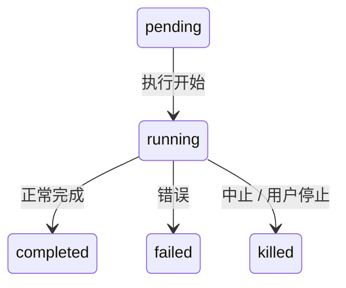
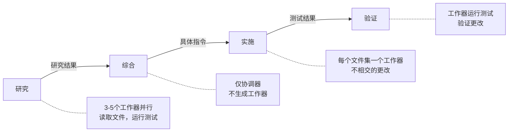
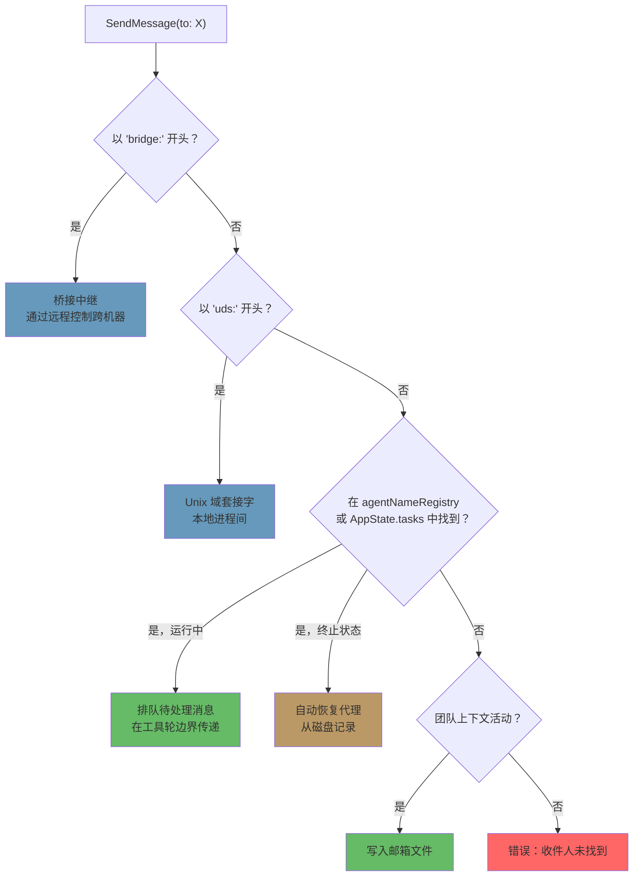

# 第10章：任务、协调与集群

## 单线程的局限

第8章展示了如何创建子代理——从代理定义构建隔离执行上下文的十五步生命周期。第9章展示了如何通过提示缓存利用使并行生成变得经济。但创建代理与管理代理是两个不同的问题。本章讨论后者。

单个代理循环——一个模型、一个对话、一次一个工具——可以完成大量工作。它可以读取文件、编辑代码、运行测试、搜索网页，并对复杂问题进行推理。但它有一个上限。

这个上限不是智能，而是并行性和范围。一个开发者在进行大规模重构时需要更新40个文件，每批运行测试，并验证没有破坏任何东西。代码库迁移同时涉及前端、后端和数据库层。彻底的代码审查需要读取数十个文件，同时在后台运行测试套件。这些不是更难的问题——它们是更广泛的问题。它们需要能够同时做多件事、将工作委派给专家并协调结果的能力。

Claude Code 对这个问题的回答不是一个机制，而是一层分层的编排模式，每种模式适合不同形状的工作。后台任务用于即发即弃的命令。协调器模式用于管理者-工作者层级结构。集群团队用于点对点协作。还有一个统一的通信协议将它们全部联系在一起。

编排层跨越 `tools/AgentTool/`、`tasks/`、`coordinator/`、`tools/SendMessageTool/` 和 `utils/swarm/` 中大约40个文件。尽管范围广泛，但设计由一个所有模式共享的单一状态机锚定。理解那个状态机——`Task.ts` 中的 `Task` 抽象——是理解其他一切的前提。

本章追溯整个技术栈，从基础的任务状态机到最复杂的多代理拓扑。

---

## 任务状态机

Claude Code 中的每个后台操作——shell 命令、子代理、远程会话、工作流脚本——都被跟踪为一个*任务*。任务抽象位于 `Task.ts` 中，提供了编排层其余部分构建的统一状态模型。

### 七种类型

系统定义了七种任务类型，每种代表不同的执行模型：

七种任务类型是：`local_bash`（后台 shell 命令）、`local_agent`（后台子代理）、`remote_agent`（远程会话）、`in_process_teammate`（集群队友）、`local_workflow`（工作流脚本执行）、`monitor_mcp`（MCP 服务器监控）和 `dream`（推测性后台思考）。

`local_bash` 和 `local_agent` 是主力——分别是后台 shell 命令和后台子代理。`in_process_teammate` 是集群原语。`remote_agent` 桥接到远程 Claude Code Runtime 环境。`local_workflow` 运行多步脚本。`monitor_mcp` 监控 MCP 服务器健康状态。`dream` 最不寻常——一个后台任务，让代理在等待用户输入时进行推测性思考。

每种类型都有一个单字符 ID 前缀，用于即时视觉识别：

| 类型 | 前缀 | 示例 ID |
|------|--------|------------|
| `local_bash` | `b` | `b4k2m8x1` |
| `local_agent` | `a` | `a7j3n9p2` |
| `remote_agent` | `r` | `r1h5q6w4` |
| `in_process_teammate` | `t` | `t3f8s2v5` |
| `local_workflow` | `w` | `w6c9d4y7` |
| `monitor_mcp` | `m` | `m2g7k1z8` |
| `dream` | `d` | `d5b4n3r6` |

任务 ID 使用单字符前缀（a 表示代理，b 表示 bash，t 表示队友等），后跟8个随机字母数字字符，从不区分大小写的安全字母表（数字加小写字母）中抽取。这产生约2.8万亿种组合——足以抵抗对磁盘上任务输出文件的暴力符号链接攻击。

当你在日志行中看到 `a7j3n9p2` 时，你立即知道它是一个后台代理。当你看到 `b4k2m8x1` 时，是一个 shell 命令。前缀是对人类读者的微优化，但在一个可以有数十个并发任务的系统中，这很重要。

### 五种状态

生命周期是一个没有循环的简单有向图：



`pending` 是注册和首次执行之间的短暂状态。`running` 表示任务正在积极工作。三种终止状态是 `completed`（成功）、`failed`（错误）和 `killed`（被用户、协调器或中止信号显式停止）。一个辅助函数防止与已死亡的任务交互：

```typescript
export function isTerminalTaskStatus(status: TaskStatus): boolean {
  return status === 'completed' || status === 'failed' || status === 'killed'
}
```

这个函数无处不在——出现在消息注入守卫、驱逐逻辑、孤儿清理以及决定是排队消息还是恢复已死亡代理的 SendMessage 路由中。

### 基础状态

每个任务状态都扩展 `TaskStateBase`，它携带所有七种类型共享的字段：

```typescript
export type TaskStateBase = {
  id: string              // 带前缀的随机 ID
  type: TaskType          // 鉴别器
  status: TaskStatus      // 当前生命周期位置
  description: string     // 人类可读的摘要
  toolUseId?: string      // 生成此任务的 tool_use 块
  startTime: number       // 创建时间戳
  endTime?: number        // 终止状态时间戳
  totalPausedMs?: number  // 累积暂停时间
  outputFile: string      // 流式输出的磁盘路径
  outputOffset: number    // 增量输出的读取游标
  notified: boolean       // 完成是否已报告给父级
}
```

两个字段值得关注。`outputFile` 是异步执行与父对话之间的桥梁——每个任务将其输出写入磁盘上的文件，父级可以通过 `outputOffset` 增量读取它。`notified` 防止重复完成消息；一旦父级被告知任务完成，标志翻转为 `true`，通知再也不会发送。没有这个守卫，在两个连续轮询通知队列之间完成的任务会生成重复通知，让模型困惑地认为两个任务完成了而实际上只有一个。

### 代理任务状态

`LocalAgentTaskState` 是最复杂的变体，携带管理后台子代理完整生命周期所需的一切：

```typescript
export type LocalAgentTaskState = TaskStateBase & {
  type: 'local_agent'
  agentId: string
  prompt: string
  selectedAgent?: AgentDefinition
  agentType: string
  model?: string
  abortController?: AbortController
  pendingMessages: string[]       // 通过 SendMessage 排队
  isBackgrounded: boolean         // 这是否最初是前台代理？
  retain: boolean                 // UI 正在持有此任务
  diskLoaded: boolean             // 侧链记录已加载
  evictAfter?: number             // GC 截止时间
  progress?: AgentProgress
  lastReportedToolCount: number
  lastReportedTokenCount: number
  // ... 其他生命周期字段
}
```

三个字段揭示了重要的设计决策。`pendingMessages` 是收件箱——当 `SendMessage` 针对正在运行的代理时，消息会排队在这里而不是立即注入。消息在工具轮边界被排空，这保留了代理的轮次结构。`isBackgrounded` 区分天生异步的代理与最初作为前台同步代理开始、后来被用户按键后台化的代理。`evictAfter` 是一个垃圾回收机制：非保留的已完成任务在从内存中清除状态之前有一个宽限期。

所有任务状态都存储在 `AppState.tasks` 中，作为 `Record<string, TaskState>`，以带前缀的 ID 为键。这是一个扁平映射，不是树——系统不在状态存储中建模父子关系。父子关系在对话流中是隐式的：父级持有生成子级的 `toolUseId`。

### 任务注册表

每种任务类型都由一个具有最小接口的 `Task` 对象支持：

```typescript
export type Task = {
  name: string
  type: TaskType
  kill(taskId: string, setAppState: SetAppState): Promise<void>
}
```

注册表收集所有任务实现：

```typescript
export function getAllTasks(): Task[] {
  return [
    LocalShellTask,
    LocalAgentTask,
    RemoteAgentTask,
    DreamTask,
    ...(LocalWorkflowTask ? [LocalWorkflowTask] : []),
    ...(MonitorMcpTask ? [MonitorMcpTask] : []),
  ]
}
```

注意条件包含——`LocalWorkflowTask` 和 `MonitorMcpTask` 是功能门控的，在运行时可能不存在。`Task` 接口是故意最小的。早期迭代包括 `spawn()` 和 `render()` 方法，但当清楚生成和渲染从不会被多态调用时，这些被移除了。每种任务类型有自己的生成逻辑、自己的状态管理和自己的渲染。唯一真正需要按类型分派的操作是 `kill()`，所以这就是接口所需的全部。

这是通过减法进行接口演化的一个例子。最初的设计设想所有任务类型将共享一个共同的生命周期接口。实际上，类型分歧太大，共享接口变成了虚构——shell 命令的 `spawn()` 和进程内队友的 `spawn()` 几乎没有共同之处。与其维护一个泄漏的抽象，团队移除了除一个方法之外的所有内容，而该方法实际上受益于多态性。

---

## 通信模式

在后台运行的任务只有在其父级可以观察其进度并接收其结果时才有用。Claude Code 支持三种通信通道，每种针对不同的访问模式优化。

### 前台：生成器链

当代理同步运行时，父级直接迭代其 `runAgent()` 异步生成器，将每条消息向上传递回调用栈。这里有趣的机制是后台逃生舱口——同步循环在"来自代理的下一条消息"和"后台信号"之间竞争：

```typescript
const agentIterator = runAgent({ ...params })[Symbol.asyncIterator]()

while (true) {
  const nextMessagePromise = agentIterator.next()
  const raceResult = backgroundPromise
    ? await Promise.race([nextMessagePromise.then(...), backgroundPromise])
    : { type: 'message', result: await nextMessagePromise }

  if (raceResult.type === 'background') {
    // 用户触发后台化——转换为异步
    await agentIterator.return(undefined)
    void runAgent({ ...params, isAsync: true })
    return { data: { status: 'async_launched' } }
  }

  agentMessages.push(message)
}
```

如果用户在执行过程中决定将同步代理变为后台任务，前台生成器被干净地返回（触发其 `finally` 块进行资源清理），代理以相同的 ID 重新生成为异步任务。过渡是无缝的——没有工作丢失，代理从它离开的地方继续，使用一个与父级 ESC 键解耦的异步中止控制器。

这是一个真正难以正确处理的状态转换。前台代理共享父级的中止控制器（ESC 杀死两者）。后台代理需要自己的控制器（ESC 不应杀死它）。代理的消息需要从前台生成器流转移到后台通知系统。任务状态需要翻转 `isBackgrounded`，以便 UI 知道在后台面板中显示它。所有这一切必须原子地发生——过渡中没有消息丢失，没有僵尸生成器继续运行。`nextMessage` 和后台信号之间的 `Promise.race` 是使这成为可能的机制。

### 后台：三个通道

后台代理通过磁盘、通知和排队消息进行通信。

**磁盘输出文件。** 每个任务写入一个 `outputFile` 路径——一个指向代理 JSONL 格式记录的符号链接。父级（或任何观察者）可以使用 `outputOffset` 增量读取此文件，它跟踪文件中已消耗的部分。`TaskOutputTool` 将此暴露给模型：

```typescript
inputSchema = z.strictObject({
  task_id: z.string(),
  block: z.boolean().default(true),
  timeout: z.number().default(30000),
})
```

当 `block: true` 时，工具轮询直到任务达到终止状态或超时到期。这是协调器生成工作者并等待其结果的主要机制。

**任务通知。** 当后台代理完成时，系统生成 XML 通知并将其排队以传递到父级的对话中：

```xml
<task-notification>
  <task-id>a7j3n9p2</task-id>
  <tool-use-id>toolu_abc123</tool-use-id>
  <output-file>/path/to/output</output-file>
  <status>completed</status>
  <summary>代理 "调查认证错误" 已完成</summary>
  <result>在 src/auth/validate.ts:42 发现空指针...</result>
  <usage>
    <total_tokens>15000</total_tokens>
    <tool_uses>8</tool_uses>
    <duration_ms>12000</duration_ms>
  </usage>
</task-notification>
```

通知作为用户角色消息注入父级的对话中，这意味着模型在其正常消息流中看到它。它不需要特殊工具来检查完成——它们作为上下文到达。任务状态上的 `notified` 标志防止重复传递。

**命令队列。** `LocalAgentTaskState` 上的 `pendingMessages` 数组是第三个通道。当 `SendMessage` 针对正在运行的代理时，消息会排队：

```typescript
if (isLocalAgentTask(task) && task.status === 'running') {
  queuePendingMessage(agentId, input.message, setAppState)
  return { data: { success: true, message: '消息已排队...' } }
}
```

这些消息由 `drainPendingMessages()` 在工具轮边界排空，并作为用户消息注入代理的对话中。这是一个关键的设计选择——消息在工具轮之间到达，而不是执行中间。代理完成其当前思考，然后接收新信息。没有竞争条件，没有损坏的状态。

### 进度跟踪

`ProgressTracker` 提供对代理活动的实时可见性：

```typescript
export type ProgressTracker = {
  toolUseCount: number
  latestInputTokens: number        // 累积（最新值，不是总和）
  cumulativeOutputTokens: number   // 跨轮次求和
  recentActivities: ToolActivity[] // 最近5个工具使用
}
```

输入和输出令牌跟踪之间的区别是刻意的，反映了 API 计费模型的一个微妙之处。输入令牌是每次 API 调用累积的，因为完整对话每次都会重新发送——第15轮包含所有前14轮，所以 API 报告的输入令牌计数已经反映了总数。保持最新值是正确的聚合。输出令牌是每轮的——模型每次生成新令牌——所以求和是正确的聚合。搞错这一点会要么严重高估（累积输入令牌求和）要么严重低估（仅保留最新输出令牌）。

`recentActivities` 数组（上限为5个条目）提供代理正在做什么的人类可读流："读取 src/auth/validate.ts"、"Bash: npm test"、"编辑 src/auth/validate.ts"。这出现在 VS Code 子代理面板和终端的后台任务指示器中，让用户无需阅读完整记录即可看到代理工作。

对于后台代理，进度通过 `updateAsyncAgentProgress()` 写入 `AppState` 并通过 `emitTaskProgress()` 作为 SDK 事件发出。VS Code 子代理面板消费这些事件以渲染实时进度条、工具计数和活动流。进度跟踪不仅仅是装饰性的——它是告诉用户后台代理正在取得进展还是陷入循环的主要反馈机制。

---

## 协调器模式

协调器模式将 Claude Code 从具有后台助手的单个代理转变为真正的管理者-工作者架构。它是系统中最固执己见的编排模式，其设计揭示了关于 LLM 应该如何和不应该委派工作的深入思考。

### 协调器模式解决的问题

标准代理循环有一个对话和一个上下文窗口。当它生成后台代理时，后台代理独立运行并通过任务通知报告结果。这对于简单委派很有效——"在我继续编辑时运行测试"——但对于复杂的多步工作流会崩溃。

考虑一个代码库迁移。代理需要：(1) 理解200个文件中的当前模式，(2) 设计迁移策略，(3) 对每个文件应用更改，(4) 验证没有破坏任何东西。步骤1和3受益于并行性。步骤2需要综合步骤1的结果。步骤4依赖于步骤3。一个按顺序执行此操作的单个代理会将其大部分令牌预算花在重新读取文件上。没有协调的多个后台代理会产生不一致的更改。

协调器模式通过将"思考"代理与"执行"代理分开来解决这个问题。协调器处理步骤1和2（分派研究工作器，然后综合）。工作者处理步骤3和4（应用更改，运行测试）。协调器看到完整的画面；工作者看到其特定任务。

### 激活

单个环境变量切换开关：

```typescript
export function isCoordinatorMode(): boolean {
  if (feature('COORDINATOR_MODE')) {
    return isEnvTruthy(process.env.CLAUDE_CODE_COORDINATOR_MODE)
  }
  return false
}
```

在会话恢复时，`matchSessionMode()` 检查恢复的会话存储的模式是否与当前环境匹配。如果它们分歧，环境变量被翻转以匹配。这防止了令人困惑的场景，即协调器会话作为常规代理恢复（失去对其工作者的感知）或常规会话作为协调器恢复（失去对其工具的访问）。会话的模式是真相来源；环境变量是运行时信号。

### 工具限制

协调器的力量不是来自拥有更多工具，而是来自拥有更少。在协调器模式下，协调器代理恰好获得三个工具：

- **Agent** —— 生成工作者
- **SendMessage** —— 与现有工作者通信
- **TaskStop** —— 终止正在运行的工作者

就这些。没有文件读取。没有代码编辑。没有 shell 命令。此限制不是限制——它是核心设计原则。协调器的工作是思考、计划、分解和综合。工作者执行工作。

相反，工作者获得完整的工具集减去内部协调工具：

```typescript
const INTERNAL_WORKER_TOOLS = new Set([
  TEAM_CREATE_TOOL_NAME,
  TEAM_DELETE_TOOL_NAME,
  SEND_MESSAGE_TOOL_NAME,
  SYNTHETIC_OUTPUT_TOOL_NAME,
])
```

工作者不能生成自己的子团队或向对等体发送消息。它们通过正常的任务完成机制报告结果，协调器跨它们进行综合。

### 370行的系统提示

协调器系统提示，逐行来看，是代码库中关于如何使用 LLM 进行编排的最有指导意义的文档。它大约370行，编码了关于委派模式的来之不易的教训。关键教导：

**"永远不要委派理解。"** 这是中心论点。协调器必须将研究发现综合成具有文件路径、行号和确切更改的具体提示。提示明确指出了反模式，如"根据你的发现，修复错误"——一个将*理解*委派给工作者的提示，迫使它重新推导协调器已经拥有的上下文。正确的模式是："在 `src/auth/validate.ts` 的第42行，当从 OAuth 流调用时，`userId` 参数可以为 null。添加一个返回401响应的空检查。"

**"并行性是你的超能力。"** 提示建立了一个清晰的并发模型。只读任务自由并行运行——研究、探索、文件读取。写密集型任务按文件集序列化。协调器应该推理哪些任务可以重叠，哪些必须顺序执行。一个好的协调器同时生成五个研究工作器，等待所有它们，综合，然后生成三个触及不相交文件集的实施工作器。一个糟糕的协调器生成一个工作器，等待，生成下一个，再次等待——将本可以并行的工作序列化。

**任务工作流阶段。** 提示定义了四个阶段：



1. **研究** —— 工作器并行探索代码库，读取文件，运行测试，收集信息
2. **综合** —— 协调器（不是工作器）读取所有研究结果并构建统一理解
3. **实施** —— 工作器接收源自综合的精确指令
4. **验证** —— 工作器运行测试并验证更改

协调器不应该跳过阶段。最常见的失败模式是从研究直接跳到实施而没有综合。当这种情况发生时，协调器将理解委派给实施工作器——每个工作器必须从头重新推导上下文，导致不一致的更改和浪费的令牌。

**继续与生成决策。** 当工作器完成且协调器有后续工作时，它应该向现有工作器发送消息（通过 SendMessage）还是生成一个新的（通过 Agent）？决策是上下文重叠的函数：

- **高重叠，相同文件**：继续。工作器已经在其上下文中拥有文件内容，理解模式，并可以建立在其先前工作的基础上。生成新的会强制重新读取相同的文件并重新推导相同的理解。
- **低重叠，不同领域**：生成新的。刚刚调查认证系统的工作器携带20,000个令牌的身份验证特定上下文，对于 CSS 重构任务来说是死重。重新开始更便宜。
- **高重叠但工作器失败**：生成新的并附带关于出错内容的明确指导。继续失败的工作器通常意味着与困惑的上下文作斗争。以"先前的尝试因 X 失败，避免 Y"重新开始更可靠。
- **后续需要工作器的输出**：继续，输出包含在 SendMessage 中。工作器不需要重新推导自己的结果。

**工作器提示编写和反模式。** 提示教导协调器如何编写有效的工作器提示并明确标记不良模式：

反模式：*"根据你的研究发现，实施修复。"* 这委派了理解。工作器不是做研究的那个——协调器阅读了研究结果。

反模式：*"修复认证模块中的错误。"* 没有文件路径，没有行号，没有错误描述。工作器必须从头开始搜索整个代码库。

反模式：*"对所有其他文件进行相同的更改。"* 哪些文件？什么更改？协调器知道；它应该枚举它们。

良好模式：*"在 `src/auth/validate.ts` 的第42行，当从 `src/oauth/callback.ts:89` 调用时，`userId` 参数可以为 null。添加一个空检查：如果 `userId` 为 null，返回 `{ error: 'unauthorized', status: 401 }`。然后更新 `src/auth/__tests__/validate.test.ts` 中的测试以覆盖 null 情况。"

编写具体提示的成本由协调器承担一次。好处——一个第一次就正确执行的工作器——是巨大的。模糊的提示创造了虚假的经济：协调器节省30秒的提示编写，工作器浪费5分钟的探索。

### 工作器上下文

协调器将有关可用工具的信息注入自己的上下文，以便模型知道工作者可以做什么：

```typescript
export function getCoordinatorUserContext(mcpClients, scratchpadDir?) {
  return {
    workerToolsContext: `通过 Agent 生成的工作者可以访问：${workerTools}`
      + (mcpClients.length > 0
        ? `\n工作者还可以从以下位置访问 MCP 工具：${serverNames}` : '')
      + (scratchpadDir ? `\n草稿本：${scratchpadDir}` : '')
  }
}
```

草稿本目录（由 `tengu_scratch` 功能标志门控）是一个共享文件系统位置，工作者可以在无需权限提示的情况下读取和写入。它支持持久的跨工作者知识共享——一个工作者的研究笔记成为另一个工作者的输入，通过文件系统而不是通过协调器的令牌窗口进行中介。

这很重要，因为它解决了协调器模式的一个基本限制。没有草稿本，所有信息都流经协调器：工作者 A 产生发现，协调器通过 TaskOutput 读取它们，将它们综合到工作者 B 的提示中。协调器的上下文窗口成为瓶颈——它必须持有所有中间结果足够长的时间以进行综合。有了草稿本，工作者 A 将发现写入 `/tmp/scratchpad/auth-analysis.md`，协调器告诉工作者 B："阅读 `/tmp/scratchpad/auth-analysis.md` 中的身份验证分析，并将该模式应用于 OAuth 模块。" 协调器通过引用而不是值来移动信息。

### 与 Fork 的互斥

协调器模式和基于 fork 的子代理是互斥的：

```typescript
export function isForkSubagentEnabled(): boolean {
  if (feature('FORK_SUBAGENT')) {
    if (isCoordinatorMode()) return false
    // ...
  }
}
```

冲突是根本性的。Fork 代理继承父级的完整对话上下文——它们是共享提示缓存的廉价克隆。协调器工作者是具有新鲜上下文和特定指令的独立代理。这些是相反的委托理念，系统在功能标志级别强制执行选择。

---

## 集群系统

协调器模式是层级化的：一个管理者，多个工作者，自上而下控制。集群系统是对等的替代方案——多个 Claude Code 实例作为一个团队工作，领导者通过消息传递协调多个队友。

### 团队上下文

团队由 `teamName` 标识并跟踪在 `AppState.teamContext` 中：

```typescript
teamContext?: {
  teamName: string
  teammates: {
    [id: string]: { name: string; color?: string; ... }
  }
}
```

每个队友获得一个名称（用于寻址）和一种颜色（用于 UI 中的视觉区分）。团队文件持久化在磁盘上，以便团队成员关系在进程重启后仍然存在。

### 代理名称注册表

后台代理可以在生成时被赋予名称，这使它们可以通过人类可读的标识符而不是随机任务 ID 来寻址：

```typescript
if (name) {
  rootSetAppState(prev => {
    const next = new Map(prev.agentNameRegistry)
    next.set(name, asAgentId(asyncAgentId))
    return { ...prev, agentNameRegistry: next }
  })
}
```

`agentNameRegistry` 是一个 `Map<string, AgentId>`。当 `SendMessage` 解析 `to` 字段时，首先检查注册表：

```typescript
const registered = appState.agentNameRegistry.get(input.to)
const agentId = registered ?? toAgentId(input.to)
```

这意味着你可以向 `"researcher"` 而不是 `a7j3n9p2` 发送消息。这种间接很简单，但它使协调器能够以角色而不是 ID 来思考——这对模型推理多代理工作流的能力是一个重大改进。

### 进程内队友

进程内队友在与领导者相同的 Node.js 进程中运行，通过 `AsyncLocalStorage` 隔离。它们的状态用团队特定字段扩展基础：

```typescript
export type InProcessTeammateTaskState = TaskStateBase & {
  type: 'in_process_teammate'
  identity: TeammateIdentity
  prompt: string
  messages?: Message[]                  // 上限为50
  pendingUserMessages: string[]
  isIdle: boolean
  shutdownRequested: boolean
  awaitingPlanApproval: boolean
  permissionMode: PermissionMode
  onIdleCallbacks?: Array<() => void>
  currentWorkAbortController?: AbortController
}
```

`messages` 上限为50个条目值得解释。在开发过程中，分析显示每个进程内代理在500+轮次时累积约20MB RSS。鲸鱼会话——运行扩展工作流的高级用户——被观察到在2分钟内启动292个代理，将 RSS 推至36.8GB。UI 表示的50条消息上限是一个内存安全阀。代理的实际对话以完整历史继续；只有面向 UI 的快照被截断。

`isIdle` 标志启用工作窃取模式。空闲队友不消耗令牌或 API 调用——它只是等待下一条消息。`onIdleCallbacks` 数组让系统钩入从活动到空闲的转换，启用编排模式，如"等待所有队友完成，然后继续。"

`currentWorkAbortController` 与队友的主中止控制器不同。中止当前工作控制器会取消队友正在进行的轮次，但不会杀死队友。这启用了一种"重定向"模式：领导者发送更高优先级的消息，队友的当前工作被中止，队友接收新消息。当主中止控制器被中止时，它会完全杀死队友。两级中断对应两级意图。

`shutdownRequested` 标志实现协作终止。当领导者发送关闭请求时，设置此标志。队友可以在自然停止点检查它并优雅地关闭——完成其当前文件写入、提交其更改或发送最终状态更新。这比硬杀死更温和，硬杀死可能使文件处于不一致状态。

### 邮箱

队友通过基于文件的邮箱系统进行通信。当 `SendMessage` 针对队友时，消息被写入收件人的邮箱文件：

```typescript
await writeToMailbox(recipientName, {
  from: senderName,
  text: content,
  summary,
  timestamp: new Date().toISOString(),
  color: senderColor,
}, teamName)
```

消息可以是纯文本、结构化协议消息（关闭请求、计划批准）或广播（`to: "*"` 发送给除发送者外的所有团队成员）。一个轮询钩子处理传入消息并将它们路由到队友的对话中。

基于文件的方法是故意简单的。没有消息代理，没有事件总线，没有共享内存通道。文件是持久的（在进程崩溃中幸存）、可检查的（你可以 `cat` 一个邮箱）和廉价的（没有基础设施依赖）。对于一个消息量以每会话数十条衡量而不是每秒数千条的系统，这是正确的权衡。Redis 支持的消息队列会增加操作复杂性、依赖性和故障模式——所有这些都是文件系统调用轻松处理的吞吐量需求。

广播机制值得注意。当消息发送到 `"*"` 时，发送者从团队文件中迭代所有团队成员，跳过自己（不区分大小写比较），并写入每个成员的邮箱：

```typescript
for (const member of teamFile.members) {
  if (member.name.toLowerCase() === senderName.toLowerCase()) continue
  recipients.push(member.name)
}
for (const recipientName of recipients) {
  await writeToMailbox(recipientName, { from: senderName, text: content, ... }, teamName)
}
```

没有扇出优化——每个收件人获得单独的文件写入。同样，在代理团队的规模（通常3-8个成员）下，这完全足够。如果一个团队有100个成员，这需要重新考虑。但防止36GB RSS 场景的50条消息内存上限也隐式限制了有效团队规模。

### 权限转发

集群工作者以受限权限运行，但可以在需要批准敏感操作时升级到领导者：

```typescript
const request = createPermissionRequest({
  toolName, toolUseId, input, description, permissionSuggestions
})
registerPermissionCallback({ requestId, toolUseId, onAllow, onReject })
void sendPermissionRequestViaMailbox(request)
```

流程是：工作者遇到需要权限的工具，bash 分类器尝试自动批准，如果失败，请求通过邮箱系统转发给领导者。领导者在其 UI 中看到请求并可以批准或拒绝。回调触发，工作者继续。这让工作者可以自主进行安全操作，同时对危险操作保持人工监督。

---

## 代理间通信：SendMessage

`SendMessageTool` 是通用通信原语。它通过单一工具接口处理四种不同的路由模式，由 `to` 字段的形状选择。

### 输入模式

```typescript
inputSchema = z.object({
  to: z.string(),
  // "teammate-name", "*", "uds:<socket>", "bridge:<session-id>"
  summary: z.string().optional(),
  message: z.union([
    z.string(),
    z.discriminatedUnion('type', [
      z.object({ type: z.literal('shutdown_request'), reason: z.string().optional() }),
      z.object({ type: z.literal('shutdown_response'), request_id, approve, reason }),
      z.object({ type: z.literal('plan_approval_response'), request_id, approve, feedback }),
    ]),
  ]),
})
```

`message` 字段是纯文本和结构化协议消息的联合。这意味着 SendMessage 有双重职责——它既是非正式的聊天通道（"这是我的发现"）也是正式的协议层（"我批准你的计划"/"请关闭"）。

### 路由分派

`call()` 方法遵循优先级排序的分派链：



**1. 桥接消息** (`bridge:<session-id>`)。通过 Anthropic 的远程控制服务器进行跨机器通信。这是最广泛的范围——两台 Claude Code 实例在不同机器上，可能在不同大陆，通过中继通信。系统在发送桥接消息之前需要显式用户同意——一个安全检查，防止一个代理单方面与远程实例建立通信。没有这个门，一个被入侵或困惑的代理可能会将信息泄露给远程会话。同意检查使用 `postInterClaudeMessage()`，它处理通过远程控制中继的序列化和传输。

**2. UDS 消息** (`uds:<socket-path>`)。通过 Unix 域套接字进行本地进程间通信。这适用于在同一台机器上但在不同进程中运行的 Claude Code 实例——例如，托管一个实例的 VS Code 扩展和托管另一个实例的终端。UDS 通信快速（没有网络往返）、安全（文件系统权限控制访问）和可靠（内核处理传递）。`sendToUdsSocket()` 函数序列化消息并将其写入 `to` 字段中指定的套接字路径。对等体通过扫描活动 UDS 端点的 `ListPeers` 工具发现彼此。

**3. 进程内子代理路由**（纯名称或代理 ID）。这是最常见的路径。路由逻辑：

- 在 `agentNameRegistry` 中查找 `input.to`
- 如果找到且正在运行：`queuePendingMessage()` —— 消息等待下一个工具轮边界
- 如果找到但在终止状态：`resumeAgentBackground()` —— 代理被透明地重新启动
- 如果不在 `AppState` 中：尝试从磁盘记录恢复

**4. 团队邮箱**（当团队上下文活动时的后备）。命名收件人获得写入其邮箱文件的消息。`"*"` 通配符触发向所有团队成员的广播。

### 结构化协议

除了纯文本，SendMessage 还携带两个正式协议。

**关闭协议。** 领导者向队友发送 `{ type: 'shutdown_request', reason: '...' }`。队友以 `{ type: 'shutdown_response', request_id, approve: true/false, reason }` 响应。如果获得批准，进程内队友中止其控制器；基于 tmux 的队友接收 `gracefulShutdown()` 调用。该协议是协作的——如果队友正在进行关键工作，它可以拒绝关闭请求，领导者必须处理这种情况。

**计划批准协议。** 在计划模式下运行的队友必须在执行前获得批准。它们提交计划，领导者以 `{ type: 'plan_approval_response', request_id, approve, feedback }` 响应。只有团队领导可以发出批准。这创建了一个审查门——领导者可以在触及任何文件之前检查工作者打算采用的方法，及早发现误解。

### 自动恢复模式

路由系统最优雅的特性是透明代理恢复。当 `SendMessage` 针对已完成或被杀死的代理时，它不会返回错误，而是复活代理：

```typescript
if (task.status !== 'running') {
  const result = await resumeAgentBackground({
    agentId,
    prompt: input.message,
    toolUseContext: context,
    canUseTool,
  })
  return {
    data: {
      success: true,
      message: `代理 "${input.to}" 已停止；已用你的消息恢复`
    }
  }
}
```

`resumeAgentBackground()` 函数从其磁盘记录重建代理：

1. 读取侧链 JSONL 记录
2. 重建消息历史，过滤孤立的思考块和未解决的工具使用
3. 为提示缓存稳定性重建内容替换状态
4. 从存储的元数据解析原始代理定义
5. 使用新的中止控制器重新注册为后台任务
6. 使用恢复的历史加上新消息作为提示调用 `runAgent()`

从协调器的角度来看，向已死亡的代理发送消息和向活动的代理发送消息是相同的操作。路由层处理复杂性。这意味着协调器不需要跟踪哪些代理是活动的——它们只需发送消息，系统会解决它。

影响是重大的。没有自动恢复，协调器需要维护代理活跃性的心理模型："`researcher` 还在运行吗？让我检查一下。它完成了。我需要生成一个新代理。但是等等，我应该使用相同的名称吗？它会有相同的上下文吗？" 有了自动恢复，所有这些都简化为："向 `researcher` 发送消息。" 如果它是活动的，消息会排队。如果它已死亡，它会以其完整历史复活。协调器的提示复杂性大幅下降。

当然，有代价。从磁盘记录恢复意味着重新读取可能数千条消息，重建内部状态，并使用完整上下文窗口进行新的 API 调用。对于一个长期存在的代理，这在延迟和令牌方面都可能很昂贵。但替代方案——要求协调器手动管理代理生命周期——更糟。协调器是一个 LLM。它擅长推理问题和编写指令。它不擅长记账。自动恢复通过完全消除一类记账来发挥 LLM 的优势。

---

## TaskStop：终止开关

`TaskStopTool` 是 Agent 和 SendMessage 的补充——它终止正在运行的任务：

```typescript
inputSchema = z.strictObject({
  task_id: z.string().optional(),
  shell_id: z.string().optional(),  // 已弃用的向后兼容
})
```

实现委托给 `stopTask()`，它基于任务类型分派：

1. 在 `AppState.tasks` 中查找任务
2. 调用 `getTaskByType(task.type).kill(taskId, setAppState)`
3. 对于代理：中止控制器，将状态设置为 `'killed'`，启动驱逐计时器
4. 对于 shell：杀死进程组

该工具有一个传统别名 `"KillShell"`——提醒任务系统从只有后台 shell 命令的简单起源演化而来。

终止机制因任务类型而异，但模式是一致的。对于代理，终止意味着中止中止控制器（导致 `query()` 循环在下一个 yield 点退出），将状态设置为 `'killed'`，并启动驱逐计时器，以便在宽限期后清理任务状态。对于 shell，终止意味着向进程组发送信号——首先是 `SIGTERM`，如果进程在超时内没有退出，则是 `SIGKILL`。对于进程内队友，终止还会向团队触发关闭通知，以便其他成员知道队友已离开。

驱逐计时器值得注意。当代理被杀死时，其状态不会立即清除。它在 `AppState.tasks` 中徘徊一段宽限期（由 `evictAfter` 控制），以便 UI 可以显示已杀死状态，可以读取任何最终输出，并且通过 SendMessage 自动恢复仍然可能。宽限期后，状态被垃圾回收。这与已完成任务使用的模式相同——系统区分"完成"（结果可用）和"遗忘"（状态已清除）。

---

## 模式之间的选择

（关于命名的说明：代码库还包含管理结构化待办事项列表的 `TaskCreate`/`TaskGet`/`TaskList`/`TaskUpdate` 工具——一个与这里描述的后台任务状态机完全独立的系统。`TaskStop` 操作 `AppState.tasks`；`TaskUpdate` 操作项目跟踪数据存储。命名重叠是历史性的，也是模型困惑的反复来源。）

有三种编排模式可用——后台委派、协调器模式和集群团队——自然的问题是何时使用每种。

**简单委派**（带有 `run_in_background: true` 的 Agent 工具）适用于父级有一两个独立任务要卸载时。在继续编辑时在后台运行测试。在等待构建时搜索代码库。父级保持控制，在准备好时检查结果，永远不需要复杂的通信协议。开销最小——一个任务状态条目，一个磁盘输出文件，完成时一个通知。

**协调器模式**适用于问题分解为研究阶段、综合阶段和实施阶段——以及协调器需要在指导下一步之前跨多个工作者的结果进行推理时。协调器不能触及文件，这强制关注点清晰分离：思考发生在一个上下文中，执行发生在另一个上下文中。370行的系统提示不是仪式——它编码了防止 LLM 委派最常见失败模式的模式，即委派理解而不是委派行动。

**集群团队**适用于需要点对点通信的长期协作会话，工作是持续的而不是批处理的，代理可能需要根据传入消息空闲和恢复。邮箱系统支持协调器模式（同步生成-等待-综合）不支持的异步模式。计划批准门增加了一个审查层。权限转发保持安全，而不需要每个代理都拥有完整权限。

实用的决策表：

| 场景 | 模式 | 原因 |
|----------|---------|-----|
| 在编辑时运行测试 | 简单委派 | 一个后台任务，无需协调 |
| 搜索代码库中的所有用法 | 简单委派 | 即发即弃，完成后读取输出 |
| 跨3个模块重构40个文件 | 协调器 | 研究阶段发现模式，综合计划更改，工作者按模块并行执行 |
| 带审查门的多日功能开发 | 集群 | 长期存在的代理，计划批准协议，对等通信 |
| 修复已知位置的 bug | 都不——单个代理 | 编排开销超过聚焦、顺序工作的收益 |
| 迁移数据库模式 + 更新 API + 更新前端 | 协调器 | 共享研究/计划阶段后的三个独立工作流 |
| 与用户监督结对编程 | 带计划模式的集群 | 工作者提议，领导者批准，工作者执行 |

这些模式原则上不是互斥的，但在实践中是。协调器模式禁用 fork 子代理。集群团队有自己的通信协议，不与协调器任务通知混合。选择是在会话启动时通过环境变量和功能标志做出的，它塑造了整个交互模型。

最后一个观察：最简单的模式几乎总是正确的起点。大多数任务不需要协调器模式或集群团队。一个偶尔有后台委派的单个代理处理绝大多数开发工作。复杂的模式存在于5%的情况下，问题真正广泛、真正并行或真正长期运行。在单文件 bug 修复上求助于协调器模式就像为静态网站部署 Kubernetes——技术上可能，架构上不恰当。

---

## 编排的成本

在从哲学上审视编排层揭示什么之前，值得承认它在实践上的成本。

每个后台代理都是一个单独的 API 对话。它有自己的上下文窗口、自己的令牌预算和自己的提示缓存槽。生成5个研究工作器的协调器正在进行6个并发 API 调用，每个都有自己的系统提示、工具定义和 CLAUDE.md 注入。令牌开销不小——仅系统提示就可以是数千个令牌，每个工作者重新读取其他工作者可能已经读取的文件。

通信通道增加延迟。磁盘输出文件需要文件系统 I/O。任务通知在工具轮边界传递，不是即时的。命令队列引入完整的往返延迟——协调器发送消息，消息等待工作者完成其当前工具使用，工作者处理消息，结果写入磁盘供协调器读取。

状态管理增加复杂性。七种任务类型，五种状态，每个任务状态数十个字段。驱逐逻辑、垃圾回收计时器、内存上限——所有这些存在都是因为无界状态增长导致了真实的生产事故（36.8GB RSS）。

这些都不意味着编排是错误的。它意味着编排是一个有成本的工具，成本应该与收益权衡。运行5个并行工作者搜索代码库是值得的，当搜索需要5分钟顺序执行时。运行协调器来修复一个文件中的打字错误是纯开销。

---

## 编排层揭示了什么

这个系统最有趣的方面不是任何单个机制——任务状态、邮箱和通知 XML 都是直接的工程。有趣的是它们如何组合在一起所显现的*设计理念*。

协调器提示的"永远不要委派理解"不仅仅是 LLM 编排的好建议。它是对基于上下文窗口的推理的基本限制的陈述。一个具有新鲜上下文窗口的工作者无法理解协调器在阅读50个文件并综合三份研究报告后理解的内容。弥合这一差距的唯一方法是让协调器将其理解提炼成具体、可操作的提示。模糊的委派不仅仅是低效——它在信息论上是损耗的。

SendMessage 中的自动恢复模式揭示了对*表面简单性而非实际简单性*的偏好。实现是复杂的——读取磁盘记录、重建内容替换状态、重新解析代理定义。但接口是简单的：发送消息，无论收件人是死是活它都能工作。复杂性被基础设施吸收，以便模型（和用户）可以用更简单的术语推理。

进程内队友的50条消息内存上限提醒我们，编排系统在真实的物理约束下运行。2分钟内292个代理达到36.8GB RSS不是理论上的担忧——它发生在生产中。抽象是优雅的，但它们在具有有限内存的硬件上运行，当用户将其推向极端时，系统必须优雅地降级。

分层架构本身也有一个教训。任务状态机是无关的——它不知道协调器或集群。通信通道是无关的——SendMessage 不知道它是被协调器、集群领导者还是独立代理调用。协调器提示分层在上面，添加方法论而不改变底层机制。每一层可以独立理解、独立测试和独立演化。当团队添加集群系统时，他们不需要修改任务状态机。当他们添加协调器提示时，他们不需要修改 SendMessage。

这是良好分解编排的标志：原语是通用的，模式由它们组合而成。协调器只是一个具有受限工具和详细系统提示的代理。集群领导者只是一个具有团队上下文和邮箱访问权限的代理。后台工作者只是一个具有独立中止控制器和磁盘输出文件的代理。七种任务类型、五种状态和四种路由模式组合产生大于其各部分之和的编排模式。

编排层是 Claude Code 停止作为单线程工具执行器，变得更像开发团队的地方。任务状态机提供记账。通信通道提供信息流。协调器提示提供方法论。集群系统为不适合严格层级结构的问题提供点对点拓扑。它们一起使语言模型能够做单个模型调用无法做到的事情：广泛地、并行地、协调地工作。

下一章检查权限系统——安全层，它确定这些代理可以做什么，以及如何将危险操作从工作者升级给人类。没有权限控制的编排将是错误的乘数。权限系统确保更多代理意味着更多能力，而不是更多风险。
