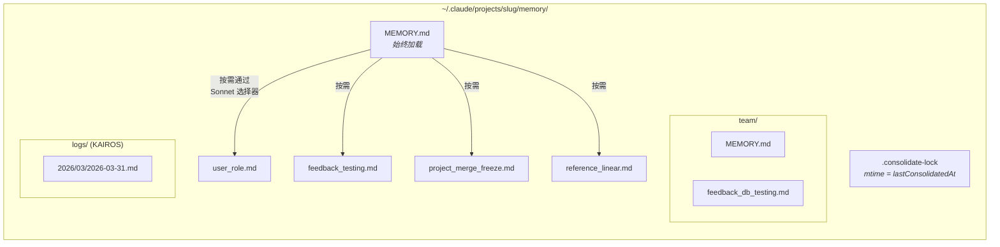
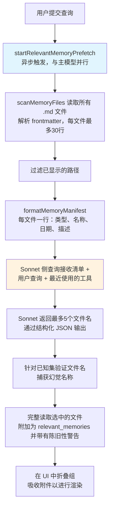
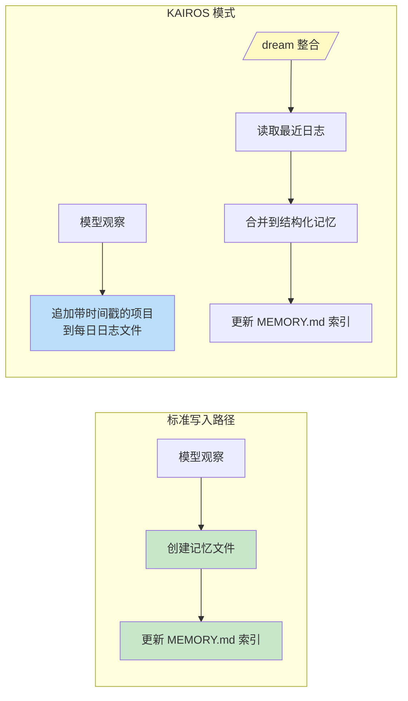

# 第11章：记忆——跨对话学习

## 无状态问题

到目前为止，每一章都描述了存在于单个会话中的机制。代理循环运行，工具执行，子代理协调，当进程退出时，所有这些都消失了。下一次对话以相同的系统提示、相同的工具定义、相同的模型开始——以及对之前发生的事情的零知识。

这是无状态架构的基本限制。开发者在周一纠正了模型的测试方法，周二模型犯了同样的错误。用户解释他们的角色、他们项目的约束、他们对代码风格的偏好，每个新会话都需要他们再次解释。模型不是健忘——它从来不知道。每个对话都是一个独立的宇宙。

问题不是理论上的。它以具体的方式显现，侵蚀信任。用户说"记住，我们在测试中使用真实的数据库实例，而不是 mock"——下周模型生成 mock 测试。用户解释他们是高级工程师，不需要初学者解释——下一次会话以教程级别的演练开始。没有记忆，每个会话从零开始。代理永远是第一天上班的新员工。

行业中的标准解决方案是检索增强生成（RAG）：将文档嵌入向量，存储在向量数据库中，在查询时检索相关块。这对知识库很有效——文档、FAQ、参考材料。但它在架构上与代理实际需要跨会话记住的内容不匹配。代理的记忆不是知识库。它是观察的集合：用户是谁、他们纠正了什么、项目当前的约束是什么、在哪里找到东西。这些观察很小，经常变化，必须是人类可编辑的。向量数据库解决了错误的问题。

Claude Code 的记忆系统是完全不同的选择：磁盘上的文件、Markdown 格式、LLM 驱动的回忆、无基础设施。赌注是存储的简单性，结合检索的智能，产生比两者都复杂更好的系统。

设计理念有塑造整个系统的后果：

- **人类可读。** 想要查看 Claude Code 记住什么的用户可以打开 `~/.claude/projects/<slug>/memory/MEMORY.md`。无需特殊工具，无需解密，无需导出命令。
- **人类可编辑。** 陈旧的记忆可以用 vim 纠正。错误的记忆可以用 `rm` 删除。用户对代理的知识有完全的控制权。
- **版本可控。** 团队记忆可以提交到 git。记忆更改干净地差异，因为它们是 Markdown。
- **零基础设施。** 记忆系统离线工作，无需服务器，在任何有文件系统的操作系统上工作。没有迁移路径，因为没有模式。
- **可调试。** 当记忆行为异常时，诊断路径是 `ls` 和 `cat`，而不是查询日志和数据库检查。

模型使用 `FileWriteTool` 和 `FileEditTool` 读写记忆——与编辑源代码相同的工具（在第6章中介绍）。不存在特殊的记忆 API。系统提示教导模型一个两步写入协议（创建文件，更新索引），模型在其现有能力下根据新指令执行它。这是工具重用作为架构原则——记忆系统不是螺栓连接到代理上的子系统，而是代理使用其现有能力产生的行为。

文件化选择在这里有效有更深层次的原因。对于 AI 代理来说，记忆与传统应用程序中的记忆根本不同。传统应用程序的数据库保存权威状态——系统数据的真相来源。代理的记忆保存*观察*——在某个时间点为真的事物，可能仍然为真也可能不为真。文件自然地传达了这种认识论状态。它们有修改时间，揭示观察何时被记录。它们可以被知道观察错误的人类读取、编辑和删除。数据库暗示永久性和权威性；Markdown 文件暗示某人写下的笔记可能需要更新。存储介质传达了数据的性质——这些是工作笔记，不是福音。

### 按项目作用域

记忆作用域到 git 仓库根，而不是工作目录。如果用户在 `src/components/` 打开终端，另一个在 `tests/`，两个会话共享相同的记忆目录。解析逻辑首先找到规范的 git 根，回退到项目根：

基础路径解析首先找到规范的 git 根，回退到项目根。这确保同一仓库的所有 git 工作树共享单个记忆目录。

`findCanonicalGitRoot` 调用确保同一仓库的所有 git 工作树共享单个记忆目录。git 根被清理（斜杠变为破折号，通过 `sanitizePath()`）以产生扁平目录名：

```
~/.claude/projects/-Users-alex-code-myapp/memory/
```

完全填充的记忆目录揭示系统的结构：



命名约定是语义的：`<type>_<topic>.md`。类型前缀不是由代码强制执行的，而是提示指令的一部分，使其易于目视扫描目录并理解记忆图景。

---

## 四类型分类法

并非所有内容都值得记住。记忆系统将所有记忆约束为恰好四种类型：

四种类型是：**user**、**feedback**、**project** 和 **reference**。

分类法围绕单一标准设计：**这些知识是否可以从当前项目状态推导出来？** 代码模式、架构、文件结构、git 历史——所有这些都可以通过读取代码库重新推导。它们被排除。四种类型捕获无法重新推导的内容。

**User 记忆**记录关于人的信息：他们的角色、目标、职责、专业水平。一个不熟悉 React 的高级 Go 工程师获得的解释与第一次编程的人不同。

**Feedback 记忆**捕获关于如何接近工作的指导——包括纠正和确认。系统明确指示模型记录两者："如果你只保存纠正，你将偏离用户已经验证的方法。" 每个反馈记忆有一个特定的结构：规则本身，然后一个 `**Why:**` 行说明原因（通常是过去的事件），然后一个 `**How to apply:**` 行说明触发条件。

**Project 记忆**记录正在进行的工作上下文——谁在做什么、为什么、什么时候。提示强调将相对日期转换为绝对日期："周四"变为"2026-03-05"，以便记忆在几周后仍然可解释。

**Reference 记忆**是书签——指向外部系统中信息所在位置的指针。Linear 项目 URL、Grafana 仪表板、Slack 频道。这些告诉模型在哪里查找，而不是找到什么。

### 分类法作为过滤器

四种类型不仅仅是类别——它们是过滤器。通过定义什么算作记忆，系统隐式定义了什么不算。没有分类法，一个热心的模型会保存所有内容：代码模式、架构图、错误消息。所有都可以从代码库推导。保存它会创建信息的并行、可能陈旧的副本，而这些信息最好从其来源获取。

分类法还防止了一个更微妙的失败：记忆作为拐杖。如果模型将架构决策保存为记忆，它会停止读取代码库来理解架构。通过排除可推导的信息，系统迫使模型保持在代码当前状态的基础上。

排除列表是明确的：代码模式、git 历史、调试解决方案、CLAUDE.md 中的任何内容、短暂的任务细节。即使当用户明确要求保存时，这些排除也适用。如果用户说"记住这个 PR 列表"，模型被指示回推——"*什么*是令人惊讶的或非显而易见的？" 那令人惊讶的部分值得保留。原始列表不值得。这个指令通过评估验证，当添加排除覆盖指令时，从 0/2 提高到 3/3。

### Frontmatter 作为契约

每个记忆文件使用带有三个必需字段的 YAML frontmatter：

```markdown
---
name: {{记忆名称}}
description: {{单行描述——用于决定相关性}}
type: {{user, feedback, project, reference}}
---
```

`description` 是最关键的字段。它是相关性选择器（下面讨论的 Sonnet 侧查询）用于决定是否显示此记忆的内容。像"测试内容"这样模糊的描述要么匹配太广，要么完全无法匹配。像"集成测试必须命中真实 DB，而不是 mock——Q4 被 mock 分歧烧伤"这样具体的描述在重要的对话中精确匹配。描述是记忆的搜索索引——不是由搜索引擎消费，而是由可以理解细微差别、上下文和意图的语言模型消费。

frontmatter 也是扫描系统在回忆期间读取文件的唯一部分。`scanMemoryFiles()` 只读取每个文件的前30行以提取标题。正文是私有的，直到文件被显式选择和加载。

---

## 写入路径

写入记忆是一个使用标准文件工具执行的两步过程。

**步骤1：写入记忆文件。** 模型在记忆目录中创建一个带有 YAML frontmatter 的 `.md` 文件：

```markdown
---
name: 测试策略
description: 集成测试必须命中真实 DB，而不是 mock
type: feedback
---

不要在集成测试中 mock 数据库。

**Why:** 上个季度我们被 mock 测试通过了，但生产查询击中了 mock 没有覆盖的边界情况。

**How to apply:** `__tests__/` 下任何触及数据库操作的测试文件应该使用来自 test-utils 的真实 PGlite 实例。
```

**步骤2：更新索引。** 模型向 `MEMORY.md` 添加一行指针：

```markdown
- [测试策略](feedback_testing.md) -- 集成测试必须命中真实 DB
```

每个条目必须保持在约150个字符以下。索引是目录，不是知识库。

当模型学到修改现有记忆的新信息时，它使用 `FileEditTool` 更新现有文件而不是创建重复项。系统内部不版本化记忆——文件在本地文件系统上，如果用户想要版本控制，他们有 `git`。在构建提示之前，`ensureMemoryDirExists()` 创建记忆目录，提示告诉模型目录已经存在，避免在 `ls` 和 `mkdir -p` 上浪费轮次。

---

## 回忆路径

写入记忆是必要的，但不够。更难的问题是检索：给定用户的查询，潜在数百个记忆文件中哪些应该加载到模型的上下文中？加载所有会耗尽令牌预算。加载 none 会 defeat the purpose。加载错误的会浪费令牌在无关信息上，同时错过会改变模型行为的知识。

回忆系统分两级运行。`MEMORY.md` 索引始终在会话开始时加载到上下文中，提供方向。单个记忆文件通过 LLM 驱动的相关性查询按需显示，每轮最多选择五个记忆。

### 完整回忆管道



步骤2中的异步预取是关键性能决策。当主模型到达回忆的上下文有用的点时，侧查询通常已经完成。用户不会体验到额外的延迟。

### Sonnet 侧查询

清单被发送到 Sonnet 模型作为侧查询。选择器的系统提示是精确的：

选择器的系统提示指示它保持保守：仅包含对当前查询有用的记忆，如果不确定则跳过记忆，避免选择已在使用中的工具的活动 API/使用文档（因为模型已经加载了这些工具）——但仍显示关于这些工具的警告、注意事项或已知问题。

响应使用结构化输出——`{ selected_memories: string[] }`——文件名针对已知集进行验证。

这种方法用延迟换取精度，权衡分析是有指导意义的。**关键词匹配**会快但没有上下文理解——它无法表达"不要选择已在使用中的工具的记忆"。**嵌入相似性**处理语义匹配但引入基础设施（嵌入模型、向量存储、更新管道）并在否定上挣扎——"不要使用数据库 mock"的嵌入非常接近"使用数据库 mock"。**Sonnet 侧查询**理解语义相关性，推理上下文，处理否定，需要零基础设施。延迟成本是有界的（数百毫秒）并隐藏在主模型的初始处理之后。

遥测系统跟踪选择率，即使没有选择记忆。0/150 的选择率与 0/3 的含义不同——前者表示精度问题，后者表示覆盖问题。

---

## 陈旧性

陈旧性系统解决了从实际使用中出现的失败模式。用户报告说，旧的记忆——包含对自那时以来已更改的代码的 file:line 引用——被模型作为事实断言。引用使陈旧的声明听起来*更*权威，而不是更少。

解决方案不是过期。旧记忆不会被删除——它们可能包含多年有效的制度知识。相反，系统附加年龄警告：

陈旧性函数计算记忆的年龄（以天为单位）。今天或昨天的记忆没有警告（函数返回空字符串）。所有更旧的都获得一个警告注入到记忆内容旁边：一条消息说明年龄（以天为单位）并警告代码行为声明或 file:line 引用可能已过时，建议针对当前代码进行验证。

今天或昨天的记忆没有警告。所有更旧的都获得一个陈旧性警告注入到记忆内容旁边。人类可读的格式——"今天"、"昨天"、"47天前"——存在是因为模型不擅长日期算术。原始 ISO 时间戳不会像"47天前"那样触发陈旧性推理。这是关于模型行为的实证观察，通过评估验证：动作提示框架"在从记忆推荐之前"得分为 3/3，而相同的正文文本的更抽象"信任你回忆的内容"得分为 0/3。

有一个值得指出的哲学张力。陈旧性系统将记忆视为假设，而不是事实。但模型的自然倾向是自信地呈现信息。陈旧性警告正在与模型自己的声音作斗争——使用其指令遵循能力来覆盖其信心生成倾向。

---

## MEMORY.md 作为始终加载的索引

每个对话以 `MEMORY.md` 在上下文中开始。它不是记忆——它是索引，实际记忆文件的目录。

索引有两个硬性上限：

索引有两个硬性上限：200行和25,000字节。

200行上限捕获正常增长。25KB 字节上限捕获观察到的失败模式：用户打包长行，保持在200行以下但消耗巨大的令牌预算。在第97百分位，一个只有197行的 MEMORY.md 重达197KB。当任一上限触发时，可操作的指导告诉用户修复什么："保持索引条目在一行约200字符以下；将细节移到主题文件中。"

这种两层架构——轻量级始终开启的索引加上按需的重内容——是允许记忆扩展的设计。一个有150个记忆的项目有一个150行的索引，消耗大约3,000个令牌，而不是150个完整文件消耗100,000个。

---

从个体记忆到共享知识的过渡是自然的。测试策略、部署约定、构建系统中的已知陷阱——这些需要在团队中共享。

## 团队记忆

团队记忆是 auto-memory 目录的子目录，位于 `<autoMemPath>/team/`，由功能标志门控，需要启用 auto-memory。架构嵌套是故意的：禁用 auto-memory 会传递性地禁用团队记忆。

### 纵深防御

团队记忆引入了个人记忆没有的攻击面。团队同步文件来自其他用户，恶意队友可能尝试路径遍历。安全模型使用三层防御。

**第1层：输入清理。** `sanitizePathKey()` 函数针对空字节、URL 编码遍历（`%2e%2e%2f`）、Unicode 规范化攻击（规范化为 `../` 的全角字符）、反斜杠和绝对路径进行验证。

**第2层：字符串级路径验证。** 清理后，`path.resolve()` 规范化剩余的 `..` 段，解析的路径针对团队目录前缀进行检查（包括尾部分隔符以防止 `team-evil/` 匹配 `team/`）。

**第3层：符号链接解析。** `realpathDeepestExisting()` 在最深现有祖先上解析符号链接，捕获字符串级验证无法检测的攻击。如果 `team/evil` 是指向 `/etc/` 的符号链接，字符串验证看到有效前缀，但 `realpath` 揭示真实目标。

所有验证失败都会产生 `PathTraversalError`。没有部分成功，没有后备。失败关闭。

### 作用域指导

提示教导模型关于私有与共享记忆。User 记忆始终是私有的。Reference 记忆通常是团队的。Feedback 记忆默认为私有的，除非它们代表项目范围的约定。交叉检查指令——"在保存私有反馈记忆之前，检查它是否与团队反馈记忆矛盾"——防止冲突的指导不可预测地显示，取决于哪个记忆首先被回忆。

---

## KAIROS 模式：仅追加每日日志

标准记忆假设离散的会话。KAIROS 模式（Claude Code 的助手模式）打破这个假设——会话是长期运行的，可能持续数天。两步写入模式无法扩展到连续操作。

解决方案是捕获和整合之间的架构分离：



在 KAIROS 模式中，模型追加到日期命名的日志文件（`<autoMemPath>/logs/YYYY/MM/YYYY-MM-DD.md`）。每个条目是一个短的时间戳项目。模型被指示："不要重写或重组日志"——在捕获期间重组会失去整合需要的时序信号。

提示中的路径被描述为*模式*而不是今天的文字日期。这是一个缓存优化：记忆提示被缓存，在午夜日期更改时不会失效。模型从单独的 `date_change` 附件推导当前日期。

### /dream 整合

整合分四个阶段运行：**Orient**（列出目录，读取索引，浏览现有文件）、**Gather**（搜索日志，检查漂移的记忆）、**Consolidate**（写入或更新文件，合并而不是重复）、**Prune**（在200行以下更新索引，删除陈旧指针）。强调合并到现有文件而不是创建新文件很重要——没有它，记忆目录会随使用线性增长。

### 整合锁

锁文件 `.consolidate-lock` 有双重用途：其内容是持有者的 PID（互斥），其 mtime *是* `lastConsolidatedAt`（调度状态）。自动 dream 在三个门通过时触发，按最便宜优先评估：自上次整合以来的小时数超过24，自那时以来修改的会话超过5，没有其他进程持有锁。崩溃恢复通过 `process.kill(pid, 0)` 检测死 PID，以一小时陈旧超时作为防御 PID 重用。

---

## 后台提取

主代理有主动写入记忆的完整指令。但代理是不完美的——不完美是可预测的。当用户说"记住始终使用集成测试"然后立即问"现在修复登录错误"时，模型的注意力完全转移到错误上。记忆保存指令被处理但可能无法执行。

在每个完整查询循环结束时，一个 fork 的代理——共享父级的提示缓存——分析最近消息并写入主代理遗漏的任何记忆。当主代理在当前轮次范围内已经写入记忆时，提取代理跳过该范围。提取代理有一个受限的工具预算：只读工具加上仅对记忆目录路径的写入访问。其提示指示一个两轮策略：第1轮并行读取，第2轮并行写入。

交互是合作的，不是竞争的。主代理的提示始终包含完整的保存指令。当主代理保存时，后台代理延迟。当它不保存时，后台代理捕获差距。这个模式——带有后台安全网的主路径——使记忆捕获更可靠，而不负担主要交互。单独任何一个都不够。

---

## 路径解析和安全

auto-memory 路径通过优先级链解析：

1. **`CLAUDE_COWORK_MEMORY_PATH_OVERRIDE`** —— Cowork 的完整路径覆盖。
2. **`settings.json` 中的 `autoMemoryDirectory`** —— 仅受信任的设置源。项目设置被故意排除。
3. **默认计算路径** —— `~/.claude/projects/<sanitized-git-root>/memory/`。

项目设置的排除是一个安全决策。恶意仓库可以提交带有 `autoMemoryDirectory: "~/.ssh"` 的 `.claude/settings.json`，记忆的权限例外会授予模型对 SSH 密钥的自动写入访问。通过将覆盖限制为策略、标志、本地和用户设置——没有一个可以提交到仓库——这个攻击向量被关闭。

`isAutoMemPath()` 函数在前缀检查之前规范化路径以防止遍历，尾部分隔符约定确保前缀匹配需要目录边界。

### 启用/禁用链

是否启用 auto-memory 由 `isAutoMemoryEnabled()` 确定，实现自己的优先级链：环境变量、裸模式、没有持久存储的 CCR、设置、默认启用。禁用时，提示部分被删除（因此模型接收不到记忆指令）和后台进程停止（提取记忆、自动 dream、团队同步）。两个门必须对齐——仅删除提示不会停止提取代理，它有自己的提示。

---

## 应用：设计代理记忆

记忆系统的复杂性在行为层——提示指令、LLM 驱动的回忆、陈旧性管理、后台提取——而不是存储基础设施。这种复杂性分布本身就是一个设计原则。

**文件胜过数据库作为代理记忆。** 文件是可检查的、可编辑的、可版本控制的。透明建立信任。当替代方案是用户无法轻松读取的数据库时，文件仅凭信任就获胜。

**约束保存的内容，而不仅仅是如何保存。** 可推导性测试——这些知识是否可以从当前项目状态重新推导？——消除了大多数潜在记忆，同时保留了真正重要的那些。

**使用 LLM 进行回忆，而不是关键词或嵌入。** LLM 侧查询理解上下文，推理对话中已有的内容，处理否定，不需要索引维护。延迟成本是真实的，但有界，并隐藏在主模型的处理之后。

**警告陈旧性，不要过期。** 制度知识可能多年保持有效。附加年龄警告让模型将旧记忆视为假设而不是事实。人类可读的年龄格式以原始时间戳无法做到的方式触发正确的推理。

**为捕获构建安全网。** 主代理会遗漏记忆。一个审查最近对话的后台提取代理使系统更可靠，而不负担主要交互。当主代理保存时，后台代理延迟。

---

代理现在可以跨会话学习——积累关于其用户、他们的偏好、他们项目的状态以及他们所做的纠正的知识。记忆系统做出了哲学承诺：代理与其用户的关系应该随时间加深，而不是在每次交互时重置。基于文件的实现使这一承诺具体化——在磁盘上可见，人类可编辑，与代码一起版本控制。代理的记忆不是黑盒。它是文件夹中的笔记集合，用模型和人类都能阅读的语言书写。

下一章检查 Claude Code 如何扩展其核心能力之外：教授模型新行为的技能系统，以及让外部代码在超过两打生命周期点约束和修改这些行为的钩子系统。
