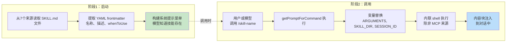
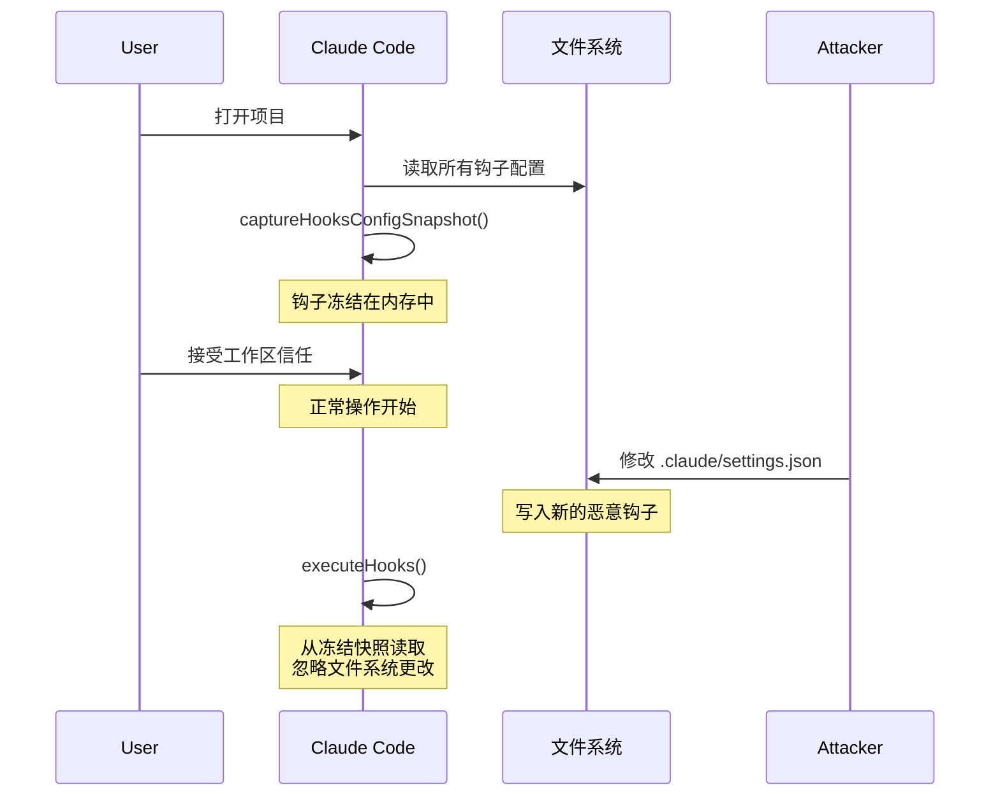
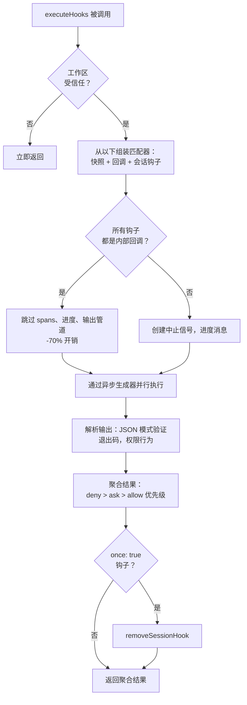

# 第12章：扩展性——技能与钩子

## 扩展的两个维度

每个扩展性系统回答两个问题：系统能做什么，以及何时执行。大多数框架将两者混为一谈——一个插件在同一个对象中注册能力和生命周期回调，"添加功能"和"拦截功能"之间的边界模糊成单个注册 API。

Claude Code 干净地将它们分开。技能扩展模型能做什么。它们是变成斜杠命令的 markdown 文件，在被调用时将新指令注入对话。钩子扩展何时以及如何发生。它们是在会话期间超过两打不同点触发的生命周期拦截器，运行可以阻止操作、修改输入、强制继续或静默观察的任意代码。

这种分离不是偶然的。技能是内容——它们通过添加提示文本来扩展模型的知识和能力。钩子是控制流——它们修改执行路径而不改变模型知道什么。技能可能教模型如何运行团队的部署流程。钩子可能确保没有部署命令在没有通过测试套件的情况下执行。技能添加能力；钩子添加约束。

本章深入涵盖两个系统，然后检查它们交叉的地方：技能声明的钩子，在技能被调用时注册为会话范围的生命周期拦截器。

---

## 技能：教模型新技巧

### 两阶段加载

技能系统的核心优化是 frontmatter 在启动时加载，但完整内容仅在调用时加载。



**阶段1**读取每个 `SKILL.md` 文件，将 YAML frontmatter 与 markdown 正文分开，并提取元数据。frontmatter 字段成为系统提示的一部分，以便模型知道技能存在。markdown 正文在闭包中被捕获但不被处理。一个有50个技能的项目支付50个短描述的令牌成本，而不是50个完整文档。

**阶段2**在模型或用户调用技能时触发。`getPromptForCommand` 预置基础目录，替换变量（`$ARGUMENTS`、`${CLAUDE_SKILL_DIR}`、`${CLAUDE_SESSION_ID}`），并执行内联 shell 命令（以 `!` 为反引号前缀）。结果作为内容块注入对话中返回。

### 七个来源与优先级

技能来自七个不同的来源，并行加载并按优先级合并：

| 优先级 | 来源 | 位置 | 说明 |
|----------|--------|----------|-------|
| 1 | 托管（策略） | `<MANAGED_PATH>/.claude/skills/` | 企业控制 |
| 2 | 用户 | `~/.claude/skills/` | 个人，随处可用 |
| 3 | 项目 | `.claude/skills/`（向上遍历到 home） | 提交到版本控制 |
| 4 | 附加目录 | `<add-dir>/.claude/skills/` | 通过 `--add-dir` 标志 |
| 5 | 传统命令 | `.claude/commands/` | 向后兼容 |
| 6 | 捆绑 | 编译到二进制中 | 功能门控 |
| 7 | MCP | MCP 服务器提示 | 远程，不受信任 |

去重使用 `realpath` 解析符号链接和重叠的父目录。先看到的来源获胜。`getFileIdentity` 函数通过 `realpath` 解析到规范路径，而不是依赖 inode 值，这在容器/NFS 挂载和 ExFAT 上不可靠。

### Frontmatter 契约

控制技能行为的关键 frontmatter 字段：

| YAML 字段 | 用途 |
|-----------|---------|
| `name` | 面向用户的显示名称 |
| `description` | 显示在自动完成和系统提示中 |
| `when_to_use` | 模型发现的详细使用场景 |
| `allowed-tools` | 技能可以使用的工具 |
| `disable-model-invocation` | 阻止自主模型使用 |
| `context` | `'fork'` 作为子代理运行 |
| `hooks` | 调用时注册的生命周期钩子 |
| `paths` | 条件激活的 glob 模式 |

`context: 'fork'` 选项将技能作为具有自己上下文窗口的子代理运行，对于需要大量工作而不污染主对话令牌预算的技能至关重要。`disable-model-invocation` 和 `user-invocable` 字段控制两个不同的访问路径——将两者都设置为 true 使技能不可见，对仅钩子的技能有用。

### MCP 安全边界

变量替换后，内联 shell 命令执行。安全边界是绝对的：**MCP 技能从不执行内联 shell 命令。** MCP 服务器是外部系统。包含 `` !`rm -rf /` `` 的 MCP 提示如果允许将使用用户的完整权限执行。系统将 MCP 技能视为仅内容。这个信任边界连接到第15章讨论的更广泛的 MCP 安全模型。

### 动态发现

技能不仅在启动时加载。当模型触及文件时，`discoverSkillDirsForPaths` 从每个路径向上遍历寻找 `.claude/skills/` 目录。带有 `paths` frontmatter 的技能存储在 `conditionalSkills` 映射中，仅当触及的路径匹配其模式时激活。声明 `paths: "packages/database/**"` 的技能在模型读取或编辑数据库文件之前保持不可见——上下文敏感的能力扩展。

---

## 钩子：控制何时发生

钩子是 Claude Code 在生命周期点拦截和修改行为的机制。主执行引擎超过4,900行。系统服务于三个受众：个人开发者（自定义 linting、验证）、团队（提交到项目的共享质量门）和企业（策略管理的合规规则）。

### 真实世界的钩子：阻止提交到 Main

在深入机制之前，这里是一个实践中钩子的样子。假设你的团队想要阻止模型直接提交到 `main` 分支。

**步骤1：settings.json 配置：**

```json
{
  "hooks": {
    "PreToolUse": [
      {
        "matcher": "Bash",
        "hooks": [
          {
            "type": "command",
            "command": "/path/to/check-not-main.sh",
            "if": "Bash(git commit*)"
          }
        ]
      }
    ]
  }
}
```

**步骤2：shell 脚本：**

```bash
#!/bin/bash
BRANCH=$(git rev-parse --abbrev-ref HEAD 2>/dev/null)
if [ "$BRANCH" = "main" ]; then
  echo "不能直接提交到 main。先创建一个功能分支。" >&2
  exit 2  # 退出码 2 = 阻止错误
fi
exit 0
```

**步骤3：模型体验到的内容。** 当模型尝试在 `main` 分支上执行 `git commit` 时，钩子在命令执行前触发。脚本检查分支，写入 stderr，并以代码 2 退出。模型看到一条系统消息："不能直接提交到 main。先创建一个功能分支。" 提交永远不会运行。模型创建一个分支并在那里提交。

`if: "Bash(git commit*)"` 条件意味着脚本仅对 git commit 命令运行——不是对每个 Bash 调用。退出码 2 阻止；退出码 0 通过；任何其他退出码产生非阻止警告。这是完整的协议。

### 四种用户可配置类型

Claude Code 定义了六种钩子类型——四种用户可配置，两种内部。

**Command 钩子**生成 shell 进程。钩子输入 JSON 通过管道传输到 stdin；钩子通过退出码和 stdout/stderr 通信。这是主力类型。

**Prompt 钩子**进行单个 LLM 调用，返回 `{"ok": true}` 或 `{"ok": false, "reason": "..."}`。轻量级 AI 驱动的验证，无需完整的代理循环。

**Agent 钩子**运行多轮代理循环（最多50轮，`dontAsk` 权限，禁用思考）。每个获得自己的会话范围。这是"验证测试套件通过并覆盖新功能"的重型机械。

**HTTP 钩子**将钩子输入 POST 到 URL。无需本地进程生成即可启用远程策略服务器和审计日志。

两种内部类型是 **callback 钩子**（以编程方式注册，通过跳过 span 跟踪的快速路径在热路径上节省70%开销）和 **function 钩子**（用于代理钩子中结构化输出执行的会话范围 TypeScript 回调）。

### 五个最重要的生命周期事件

钩子系统在超过两打生命周期点触发。五个主导实际使用：

**PreToolUse** —— 在每次工具执行前触发。可以阻止、修改输入、自动批准或注入上下文。权限行为遵循严格的优先级：deny > ask > allow。质量门最常见的钩子点。

**PostToolUse** —— 在成功执行后触发。可以注入上下文或完全替换 MCP 工具输出。对工具结果的自动反馈有用。

**Stop** —— 在 Claude 结束其响应前触发。阻止钩子强制继续。这是自动验证循环的机制："你真的完成了吗？"

**SessionStart** —— 在会话开始时触发。可以设置环境变量、覆盖第一条用户消息或注册文件监视路径。不能阻止（钩子不能阻止会话启动）。

**UserPromptSubmit** —— 在用户提交提示时触发。可以阻止处理，在模型看到之前启用输入验证或内容过滤。

**参考表——剩余事件：**

| 类别 | 事件 |
|----------|--------|
| 工具生命周期 | PostToolUseFailure, PermissionDenied, PermissionRequest |
| 会话 | SessionEnd（1.5秒超时）, Setup |
| 子代理 | SubagentStart, SubagentStop |
| 压缩 | PreCompact, PostCompact |
| 通知 | Notification, Elicitation, ElicitationResult |
| 配置 | ConfigChange, InstructionsLoaded, CwdChanged, FileChanged, TaskCreated, TaskCompleted, TeammateIdle |

阻止不对称是故意的。代表可恢复决策的事件（工具调用、停止条件）支持阻止。代表不可撤销事实的事件（会话已启动、API 失败）不支持。

### 退出码语义

对于 command 钩子，退出码携带特定含义：

| 退出码 | 含义 | 阻止 |
|-----------|---------|--------|
| 0 | 成功，如果 JSON 则解析 stdout | 否 |
| 2 | 阻止错误，stderr 显示为系统消息 | 是 |
| 其他 | 非阻止警告，仅显示给用户 | 否 |

退出码 2 是故意选择的。退出码 1 太常见——任何未处理的异常、断言失败或语法错误都会产生退出 1。使用退出码 2 防止意外执行。

### 六个钩子来源

| 来源 | 信任级别 | 说明 |
|--------|-------------|-------|
| `userSettings` | 用户 | `~/.claude/settings.json`，最高优先级 |
| `projectSettings` | 项目 | `.claude/settings.json`，版本控制 |
| `localSettings` | 本地 | `.claude/settings.local.json`，gitignored |
| `policySettings` | 企业 | 不能被覆盖 |
| `pluginHook` | 插件 | 优先级 999（最低） |
| `sessionHook` | 会话 | 仅内存，由技能注册 |

---

## 快照安全模型

钩子执行任意代码。项目的 `.claude/settings.json` 可以定义在每次工具调用前触发的钩子。如果恶意仓库在用户接受工作区信任对话框后修改其钩子会发生什么？

什么都没有。钩子配置在启动时被冻结。



`captureHooksConfigSnapshot()` 在启动期间调用一次。从那时起，`executeHooks()` 从快照读取，从不隐式重新读取设置文件。快照仅通过显式通道更新：`/hooks` 命令或文件监视器检测，两者都通过 `updateHooksConfigSnapshot()` 重建。

策略执行级联：`policySettings` 中的 `disableAllHooks` 清除所有内容。`allowManagedHooksOnly` 排除用户和项目钩子。用户可以通过设置 `disableAllHooks` 禁用他们自己的钩子，但他们不能禁用企业管理的钩子。策略层总是获胜。

信任检查本身（`shouldSkipHookDueToTrust()`）是在两个漏洞之后引入的：SessionEnd 钩子在用户*拒绝*信任对话框时执行，以及 SubagentStop 钩子在呈现信任之前触发。两者共享相同的根本原因——在用户未同意工作区代码执行的生命周期状态中触发的钩子。修复是在 `executeHooks()` 顶部的一个集中门。

---

## 执行流程



内部回调的快速路径是一个重要的优化。当所有匹配的钩子都是内部的（文件访问分析、提交归属）时，系统跳过 span 跟踪、中止信号创建、进度消息和完整的输出处理管道。大多数 PostToolUse 调用仅命中内部回调。

钩子输入 JSON 通过惰性 `getJsonInput()` 闭包序列化一次并在所有并行钩子中重用。环境注入设置 `CLAUDE_PROJECT_DIR`、`CLAUDE_PLUGIN_ROOT`，以及对于某些事件，设置 `CLAUDE_ENV_FILE`，钩子可以在其中写入环境导出。

---

## 集成：技能与钩子的交汇点

当技能被调用时，其 frontmatter 声明的钩子注册为会话范围的钩子。`skillRoot` 成为钩子 shell 命令的 `CLAUDE_PLUGIN_ROOT`：

```
my-skill/
  SKILL.md          # 技能内容
  validate.sh       # 由 frontmatter 中声明的 PreToolUse 钩子调用
```

技能的 frontmatter 声明：

```yaml
hooks:
  PreToolUse:
    - matcher: "Bash"
      hooks:
        - type: command
          command: "${CLAUDE_PLUGIN_ROOT}/validate.sh"
          once: true
```

当用户调用 `/my-skill` 时，技能内容加载到对话中**并且** PreToolUse 钩子注册。下一个 Bash 工具调用触发 `validate.sh`。因为设置了 `once: true`，钩子在第一次成功执行后自行移除。

对于代理，frontmatter 中声明的 `Stop` 钩子自动转换为 `SubagentStop` 钩子，因为子代理触发 `SubagentStop`，而不是 `Stop`。没有转换，代理的停止验证钩子永远不会触发。

### 权限行为优先级

`executePreToolHooks()` 可以通过 `blockingError` 阻止，通过 `permissionBehavior: 'allow'` 自动批准，通过 `'ask'` 强制询问，通过 `'deny'` 拒绝，通过 `updatedInput` 修改输入，或通过 `additionalContext` 添加上下文。当多个钩子返回不同行为时，deny 总是获胜。这是安全相关决策的正确默认值。

### Stop 钩子：强制继续

当 Stop 钩子返回退出码 2 时，stderr 作为反馈显示给模型，对话继续。这将单次提示-响应转变为目标导向循环。Stop 钩子可以说是整个系统中最强大的集成点。

---

## 应用：设计扩展性系统

**将内容与控制流分开。** 技能添加能力；钩子约束行为。将两者混为一谈使得无法推理插件做什么与阻止什么。

**在信任边界冻结配置。** 快照机制在同意时刻捕获钩子，从不隐式重新读取。如果你的系统执行用户提供的代码，这消除了 TOCTOU 攻击。

**对语义信号使用不常见的退出码。** 退出码 1 是噪音——每个未处理的错误都产生它。退出码 2 作为阻止信号防止意外执行。选择需要故意意图的信号。

**在套接字级别验证，而不是应用级别。** SSRF 防护在 DNS 查找时运行，而不是作为预检检查。这消除了 DNS 重新绑定窗口。验证网络目的地时，检查必须与连接原子化。

**为常见情况优化。** 内部回调快速路径（-70% 开销）认识到大多数钩子调用仅命中内部回调。两阶段技能加载认识到大多数技能在给定会话中从未被调用。每个优化针对实际使用分布。

扩展性系统反映了对权力与安全之间张力的成熟理解。技能在 MCP 安全线（第15章）的边界内赋予模型新能力。钩子通过快照机制、退出码语义和策略级联赋予外部代码影响模型行为的能力。两个系统互不信任——这种相互不信任使组合可以安全地大规模部署。

下一章转向视觉层：Claude Code 如何以 60fps 渲染响应式终端 UI 并处理跨五种终端协议的输入。
