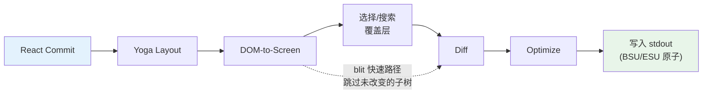
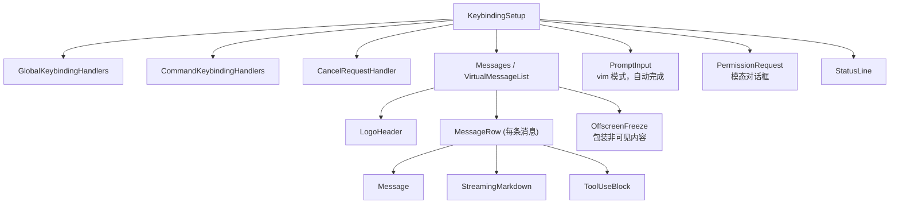

# 第13章：终端 UI

## 为什么要构建自定义渲染器？

终端不是浏览器。没有 DOM，没有 CSS 引擎，没有合成器，没有保留模式图形管道。有一个字节流流向 stdout，一个字节流来自 stdin。这两个流之间的一切——布局、样式、差异、点击测试、滚动、选择——都必须从零开始发明。

Claude Code 需要一个响应式 UI。它有提示输入、流式 markdown 输出、权限对话框、进度旋转器、可滚动消息列表、搜索高亮和 vim 模式编辑器。React 是声明这种组件树的明显选择。但 React 需要一个渲染到的宿主环境，而终端不提供。

Ink 是标准答案：一个用于终端的 React 渲染器，基于 Yoga 构建用于 flexbox 布局。Claude Code 从 Ink 开始，然后将其 fork 得面目全非。库存版本每帧每单元分配一个 JavaScript 对象——在 200x120 终端上，这是每 16ms 创建和垃圾回收的 24,000 个对象。它在字符串级别进行差异比较，比较整行的 ANSI 编码文本。它没有 blit 优化概念，没有双缓冲，没有单元级脏跟踪。对于每秒刷新一次的简单 CLI 仪表板，这没问题。对于在 60fps 下流式传输令牌而用户滚动浏览数百条消息的对话的 LLM 代理，这是不可行的。

Claude Code 中保留的是一个自定义渲染引擎，它与 Ink 共享概念 DNA——React 协调器、Yoga 布局、ANSI 输出——但重新实现了关键路径：打包的类型化数组而不是每单元一个对象，基于池的字符串驻留而不是每帧一个字符串，双缓冲渲染与单元级差异比较，以及将相邻终端写入合并为最小转义序列的优化器。

结果在从 Claude 流式传输令牌时，在 200 列终端上以 60fps 运行。要理解如何，我们需要检查四层：React 协调的自定义 DOM、将该 DOM 转换为终端输出的渲染管道、使系统能够在数小时会话中保持活力而不被垃圾回收淹没的基于池的内存管理，以及将所有内容联系在一起的组件架构。

---

## 自定义 DOM

React 的协调器需要一些东西来协调。在浏览器中，那是 DOM。在 Claude Code 的终端中，它是一个具有七种元素类型和一种文本节点类型的自定义内存树。

元素类型直接映射到终端渲染概念：

- **`ink-root`** —— 文档根，每个 Ink 实例一个
- **`ink-box`** —— flexbox 容器，终端相当于 `<div>`
- **`ink-text`** —— 具有 Yoga 度量函数的文本节点用于自动换行
- **`ink-virtual-text`** —— 另一个文本节点内的嵌套样式文本（当在文本上下文内时自动从 `ink-text` 提升）
- **`ink-link`** —— 超链接，通过 OSC 8 转义序列渲染
- **`ink-progress`** —— 进度指示器
- **`ink-raw-ansi`** —— 具有已知尺寸的预渲染 ANSI 内容，用于语法高亮的代码块

每个 `DOMElement` 携带渲染管道需要的状态：

```typescript
// 说明性的——实际接口显著扩展
interface DOMElement {
  yogaNode: YogaNode;           // Flexbox 布局节点
  style: Styles;                // 映射到 Yoga 的类 CSS 属性
  attributes: Map<string, DOMNodeAttribute>;
  childNodes: (DOMElement | TextNode)[];
  dirty: boolean;               // 需要重新渲染
  _eventHandlers: EventHandlerMap; // 与属性分离
  scrollTop: number;            // 命令式滚动状态
  pendingScrollDelta: number;
  stickyScroll: boolean;
  debugOwnerChain?: string;     // 用于调试的 React 组件栈
}
```

`_eventHandlers` 与 `attributes` 的分离是故意的。在 React 中，处理程序标识在每次渲染时都会改变（除非手动记忆化）。如果处理程序作为属性存储，每次渲染都会将节点标记为脏并触发完整重绘。通过单独存储它们，协调器的 `commitUpdate` 可以在不弄脏节点的情况下更新处理程序。

`markDirty()` 函数是 DOM 变异与渲染管道之间的桥梁。当任何节点的内容改变时，`markDirty()` 向上遍历每个祖先，在每个元素上设置 `dirty = true` 并在叶文本节点上调用 `yogaNode.markDirty()`。这就是单个字符改变在深层嵌套文本节点中如何安排到根的整个路径重新渲染——但仅该路径。兄弟子树保持干净，可以从上一帧 blit。

`ink-raw-ansi` 元素类型值得特别提及。当代码块已经被语法高亮（产生 ANSI 转义序列）时，重新解析这些序列以提取字符和样式将是浪费的。相反，预高亮的内容被包装在一个带有 `rawWidth` 和 `rawHeight` 属性的 `ink-raw-ansi` 节点中，告诉 Yoga 确切尺寸。渲染管道将原始 ANSI 内容直接写入输出缓冲区，而不将其分解为单个样式字符。这使得语法高亮的代码块在初始高亮通过后基本上是零成本的——UI 中最昂贵的视觉元素也是渲染成本最低的。

`ink-text` 节点的度量函数值得理解，因为它在 Yoga 的布局通道内运行，这是同步和阻塞的。该函数接收可用宽度并必须返回文本的尺寸。它执行自动换行（尊重 `wrap` 样式属性：`wrap`、`truncate`、`truncate-start`、`truncate-middle`），考虑字素簇边界（所以它不会跨行分割多码点表情符号），正确测量 CJK 双宽字符（每个计为2列），并从宽度计算中剥离 ANSI 转义码（转义序列具有零视觉宽度）。所有这些必须在每节点微秒内完成，因为具有50个可见文本节点的对话意味着每布局通道50个度量函数调用。

---

## React Fiber 容器

协调器桥使用 `react-reconciler` 创建自定义宿主配置。这与 React DOM 和 React Native 使用的 API 相同。关键区别：Claude Code 在 `ConcurrentRoot` 模式下运行。

```typescript
createContainer(rootNode, ConcurrentRoot, ...)
```

ConcurrentRoot 启用 React 的并发特性——用于懒加载语法高亮的 Suspense，用于流式期间非阻塞状态更新的 transitions。替代方案 `LegacyRoot` 会强制同步渲染并在繁重的 markdown 重新解析期间阻塞事件循环。

宿主配置方法将 React 操作映射到自定义 DOM：

- **`createInstance(type, props)`** 通过 `createNode()` 创建 `DOMElement`，应用初始样式和属性，附加事件处理程序，并捕获 React 组件所有者链以进行调试归属。所有者链存储为 `debugOwnerChain`，并由 `CLAUDE_CODE_DEBUG_REPAINTS` 模式使用，以将全屏重置归因于特定组件
- **`createTextInstance(text)`** 创建 `TextNode` —— 但仅在文本上下文内。协调器强制执行原始字符串必须包装在 `<Text>` 中。尝试在文本上下文外创建文本节点会抛出，在协调时而不是渲染时捕获一类错误
- **`commitUpdate(node, type, oldProps, newProps)`** 通过浅比较差异旧和新 props，然后仅应用更改的内容。样式、属性和事件处理程序各有自己的更新路径。如果没有任何改变，diff 函数返回 `undefined`，完全避免不必要的 DOM 变异
- **`removeChild(parent, child)`** 从树中移除节点，递归释放 Yoga 节点（在 `free()` 之前调用 `unsetMeasureFunc()` 以避免访问释放的 WASM 内存），并通知焦点管理器
- **`hideInstance(node)` / `unhideInstance(node)`** 切换 `isHidden` 并在 `Display.None` 和 `Display.Flex` 之间切换 Yoga 节点。这是 React 用于 Suspense fallback 过渡的机制
- **`resetAfterCommit(container)`** 是关键钩子：它调用 `rootNode.onComputeLayout()` 运行 Yoga，然后调用 `rootNode.onRender()` 安排终端绘制

协调器跟踪每次提交周期的两个性能计数器：Yoga 布局时间（`lastYogaMs`）和总提交时间（`lastCommitMs`）。这些流入 Ink 类报告的 `FrameEvent`，支持生产中的性能监控。

事件系统镜像浏览器的捕获/冒泡模型。`Dispatcher` 类实现具有三个阶段的全事件传播：捕获（根到目标）、at-target 和冒泡（目标到根）。事件类型映射到 React 调度优先级——离散用于键盘和点击（最高优先级，立即处理），连续用于滚动和调整大小（可以延迟）。调度器将所有事件处理包装在 `reconciler.discreteUpdates()` 中以进行适当的 React 批处理。

当你在终端中按下一个键时，生成的 `KeyboardEvent` 通过自定义 DOM 树分派，从焦点元素向上冒泡到根，完全如同键盘事件会冒泡通过浏览器 DOM 元素。路径上的任何处理程序都可以调用 `stopPropagation()` 或 `preventDefault()`，语义与浏览器规范相同。

---

## 渲染管道

每帧遍历七个阶段，每个阶段单独计时：



每个阶段单独计时并在 `FrameEvent.phases` 中报告。这种每阶段检测对于诊断性能问题至关重要：当一帧需要 30ms 时，你需要知道瓶颈是 Yoga 重新测量文本（阶段2）、渲染器遍历大型脏子树（阶段3），还是来自慢终端的 stdout 背压（阶段7）。答案决定修复。

**阶段1：React 提交和 Yoga 布局。** 协调器处理状态更新并调用 `resetAfterCommit`。这将根节点的宽度设置为 `terminalColumns` 并运行 `yogaNode.calculateLayout()`。Yoga 在一次通道中计算整个 flexbox 树，遵循 CSS flexbox 规范：它解析所有节点的 flex-grow、flex-shrink、padding、margin、gap、alignment 和 wrapping。结果——`getComputedWidth()`、`getComputedHeight()`、`getComputedLeft()`、`getComputedTop()`——每个节点缓存。对于 `ink-text` 节点，Yoga 在布局期间调用自定义度量函数（`measureTextNode`），通过自动换行和字素测量计算文本尺寸。这是最昂贵的每节点操作：它必须处理 Unicode 字素簇、CJK 双宽字符、表情符号序列和嵌入文本内容中的 ANSI 转义码。

**阶段2：DOM 到屏幕。** 渲染器深度优先遍历 DOM 树，将字符和样式写入 `Screen` 缓冲区。每个字符变成一个打包的单元。输出是一个完整的帧：终端上的每个单元都有定义的字符、样式和宽度。

**阶段3：覆盖层。** 文本选择和搜索高亮就地修改屏幕缓冲区，翻转匹配单元上的样式 ID。选择应用反色视频以创建熟悉的"高亮文本"外观。搜索高亮应用更激进的视觉处理：反色 + 黄色前景 + 粗体 + 下划线用于当前匹配，仅反色用于其他匹配。这会污染缓冲区——由 `prevFrameContaminated` 标志跟踪，以便下一帧知道跳过 blit 快速路径。污染是一个刻意的权衡：就地修改缓冲区避免了分配单独的覆盖缓冲区（在 200x120 终端上节省 48KB），代价是覆盖清除后的一帧全损伤。

**阶段4：Diff。** 新屏幕与前一帧的屏幕进行单元级比较。只有改变的单元产生输出。比较是每个单元两次整数比较（两个打包的 `Int32` 字），diff 遍历损伤矩形而不是整个屏幕。在稳态帧（只有旋转器滴答）上，这可能为 24,000 个单元中的 3 个产生补丁。每个补丁是一个 `{ type: 'stdout', content: string }` 对象，包含光标移动序列和 ANSI 编码的单元内容。

**阶段5：Optimize。** 同一行上的相邻补丁合并为单次写入。消除冗余光标移动——如果补丁 N 在第10列结束，补丁 N+1 在第11列开始，光标已经在正确的位置，不需要移动序列。样式转换通过 `StylePool.transition()` 缓存预序列化，所以从"粗体红色"变为"暗淡绿色"是单个缓存的字符串查找，而不是差异和序列化操作。优化器通常将字节数减少 30-50%，相比朴素的每单元输出。

**阶段6：Write。** 优化的补丁被序列化为 ANSI 转义序列，并在支持的终端上以单个 `write()` 调用写入 stdout，包装在同步更新标记（BSU/ESU）中。BSU（开始同步更新，`ESC [ ? 2026 h`）告诉终端缓冲所有后续输出，ESU（`ESC [ ? 2026 l`）告诉它刷新。这在支持协议的终端上消除可见撕裂——整个帧原子地出现。

每帧通过 `FrameEvent` 对象报告其时序分解：

```typescript
interface FrameEvent {
  durationMs: number;
  phases: {
    renderer: number;    // DOM 到屏幕
    diff: number;        // 屏幕比较
    optimize: number;    // 补丁合并
    write: number;       // stdout 写入
    yoga: number;        // 布局计算
  };
  yogaVisited: number;   // 遍历的节点
  yogaMeasured: number;  // 运行 measure() 的节点
  yogaCacheHits: number; // 缓存布局的节点
  flickers: FlickerEvent[];  // 全重置归属
}
```

当 `CLAUDE_CODE_DEBUG_REPAINTS` 启用时，全屏重置通过 `findOwnerChainAtRow()` 归因于其源 React 组件。这是 React DevTools"高亮更新"的终端等价物——它向你展示哪个组件导致整个屏幕重绘，这是渲染管道中可能发生的最昂贵的事情。

blit 优化值得特别关注。当节点不脏且其位置自上一帧以来没有改变时（通过节点缓存检查），渲染器直接从 `prevScreen` 复制单元到当前屏幕，而不是重新渲染子树。这使得稳态帧极其廉价——在典型的只有旋转器滴答的帧上，blit 覆盖 99% 的屏幕，只有旋转器的 3-4 个单元从头重新渲染。

blit 在三种条件下禁用：

1. **`prevFrameContaminated` 为 true** —— 选择覆盖或搜索高亮就地修改了前一帧的屏幕缓冲区，所以这些单元不能作为"正确"前一状态信任
2. **移除了绝对定位节点** —— 绝对定位意味着节点可能绘制在非兄弟单元上，这些单元需要从实际拥有它们的元素重新渲染
3. **布局偏移** —— 任何节点的缓存位置与其当前计算位置不同，意味着 blit 会将单元复制到错误的坐标

损伤矩形（`screen.damage`）跟踪渲染期间所有写入单元的边界框。diff 仅检查此矩形内的行，跳过完全未改变的区域。在流式消息占据行 80-100 的 120 行终端上，diff 检查 20 行而不是 120 —— 比较工作量减少 6 倍。

---

## 双缓冲渲染和帧调度

Ink 类维护两个帧缓冲区：

```typescript
private frontFrame: Frame;  // 当前显示在终端上
private backFrame: Frame;   // 正在渲染到
```

每个 `Frame` 包含：

- `screen: Screen` —— 单元缓冲区（打包的 `Int32Array`）
- `viewport: Size` —— 渲染时的终端尺寸
- `cursor: { x, y, visible }` —— 停放终端光标的位置
- `scrollHint` —— alt-screen 模式的 DECSTBM（滚动区域）优化提示
- `scrollDrainPending` —— ScrollBox 是否有剩余滚动增量要处理

每次渲染后，帧交换：`backFrame = frontFrame; frontFrame = newFrame`。旧的前一帧成为下一个后一帧，为 blit 优化提供 `prevScreen` 和单元级差异比较的基线。

这种双缓冲设计消除分配。不是每帧创建新的 `Screen`，渲染器重用后一帧的缓冲区。交换是指针赋值。该模式借鉴自图形编程，其中双缓冲通过确保显示器在渲染器写入另一个时读取完整帧来防止撕裂。在终端上下文中，撕裂不是关注点（BSU/ESU 协议处理）；关注是每 16ms 分配和丢弃包含 48KB+ 类型数组的 `Screen` 对象的 GC 压力。

渲染调度使用 lodash `throttle` 在 16ms（大约 60fps），启用前缘和后缘：

```typescript
const deferredRender = () => queueMicrotask(this.onRender);
this.scheduleRender = throttle(deferredRender, FRAME_INTERVAL_MS, {
  leading: true,
  trailing: true,
});
```

微任务延迟不是偶然的。`resetAfterCommit` 在 React 的布局效果阶段之前运行。如果渲染器在这里同步运行，它会错过在 `useLayoutEffect` 中设置的光标声明。微任务在布局效果之后但在同一事件循环滴答内运行——终端看到单个一致的帧。

对于滚动操作，单独的 `setTimeout` 在 4ms（FRAME_INTERVAL_MS >> 2）提供更快的滚动帧而不干扰节流。滚动变异完全绕过 React：`ScrollBox.scrollBy()` 直接变异 DOM 节点属性，调用 `markDirty()`，并通过微任务安排渲染。没有 React 状态更新，没有协调开销，没有为单个滚轮事件重新渲染整个消息列表。

**调整大小处理**是同步的，不是防抖的。当终端调整大小时，`handleResize` 立即更新尺寸以保持布局一致。对于 alt-screen 模式，它重置帧缓冲区并将 `ERASE_SCREEN` 延迟到下一个原子 BSU/ESU 绘制块，而不是立即写入。同步写入擦除会使屏幕空白约 80ms 渲染时间；将其延迟到原子块意味着旧内容保持可见，直到新帧完全准备好。

**Alt-screen 管理**增加另一层。`AlternateScreen` 组件在挂载时进入 DEC 1049 备用屏幕缓冲区，将高度约束为终端行。它使用 `useInsertionEffect` —— 不是 `useLayoutEffect` —— 以确保 `ENTER_ALT_SCREEN` 转义序列在第一个渲染帧之前到达终端。使用 `useLayoutEffect` 会太晚：第一帧会渲染到主屏幕缓冲区，在切换前产生可见的闪烁。`useInsertionEffect` 在布局效果之前和浏览器（或终端）绘制之前运行，使过渡无缝。

---

## 基于池的内存：为什么驻留重要

200 列乘 120 行的终端有 24,000 个单元。如果每个单元都是一个带有 `char` 字符串、`style` 字符串和 `hyperlink` 字符串的 JavaScript 对象，那就是每帧 72,000 次字符串分配——加上单元本身的 24,000 次对象分配。在 60fps 下，这是每秒 576 万次分配。V8 的垃圾回收器可以处理这个，但会有在流式令牌更新期间出现的暂停，导致可见的卡顿，正是用户观看输出时。

Claude Code 通过打包的类型化数组和三个驻留池完全消除这一点。结果：单元缓冲区的零每帧对象分配。唯一的分配在池本身（摊销，因为大多数字符和样式在第一帧上驻留，之后重用）和 diff 产生的补丁字符串（不可避免，因为 stdout.write 需要字符串或 Buffer 参数）。

**单元布局**每单元使用两个 `Int32` 字，存储在连续的 `Int32Array` 中：

```
word0: charId        (32 位，CharPool 的索引)
word1: styleId[31:17] | hyperlinkId[16:2] | width[1:0]
```

同一缓冲区上的并行 `BigInt64Array` 视图启用批量操作——清除一行是对 64 位字的单个 `fill()` 调用，而不是清零单个字段。

**CharPool** 将字符字符串驻留到整数 ID。它有一个 ASCII 的快速路径：128 条目的 `Int32Array` 直接将字符代码映射到池索引，完全避免 `Map` 查找。多字节字符（表情符号、CJK 表意文字）落入 `Map<string, number>`。索引 0 始终是空格，索引 1 始终是空字符串。

```typescript
export class CharPool {
  private strings: string[] = [' ', '']
  private ascii: Int32Array = initCharAscii()

  intern(char: string): number {
    if (char.length === 1) {
      const code = char.charCodeAt(0)
      if (code < 128) {
        const cached = this.ascii[code]!
        if (cached !== -1) return cached
        const index = this.strings.length
        this.strings.push(char)
        this.ascii[code] = index
        return index
      }
    }
    // 多字节字符的 Map 后备
    ...
  }
}
```

**StylePool** 将 ANSI 样式代码数组驻留到整数 ID。巧妙的部分：每个 ID 的位 0 编码样式是否对空格字符有可见效果（背景色、反色、下划线）。仅前景样式获得偶数 ID；在空格上可见的样式获得奇数 ID。这让渲染器通过单个位掩码检查跳过不可见空格——`if (!(styleId & 1) && charId === 0) continue`——无需查找样式定义。池还缓存任意两个样式 ID 之间的预序列化 ANSI 转换字符串，所以从"粗体红色"变为"暗淡绿色"是缓存的字符串连接，而不是差异和序列化操作。

**HyperlinkPool** 驻留 OSC 8 超链接 URI。索引 0 表示没有超链接。

所有三个池在前帧和后帧之间共享。这是一个关键的设计决策。因为池是共享的，驻留 ID 跨帧有效：blit 优化可以直接从 `prevScreen` 复制打包的单元字到当前屏幕而无需重新驻留。diff 可以将 ID 作为整数比较而无需字符串查找。如果每个帧有自己的池，blit 需要为每个复制的单元重新驻留（通过旧 ID 查找字符串，然后在新池中驻留它），这会抵消 blit 的大部分性能优势。

池定期重置（每5分钟）以防止长会话期间无界增长。迁移通道将前一帧的实时单元重新驻留到新鲜池中。

**CellWidth** 用 2 位分类处理双宽字符：

| 值 | 含义 |
|-------|---------|
| 0 (窄) | 标准单列字符 |
| 1 (宽) | CJK/表情符号头单元，占据两列 |
| 2 (间隔尾) | 宽字符的第二列 |
| 3 (间隔头) | 软换行延续标记 |

这存储在 `word1` 的低 2 位，使打包单元的宽度检查免费——常见情况无需字段提取。

额外的每单元元数据存在于并行数组中而不是打包单元中：

- **`noSelect: Uint8Array`** —— 每单元标志，将内容排除在文本选择之外。用于不应出现在复制文本中的 UI 边框（边框、指示器）
- **`softWrap: Int32Array`** —— 每行标记，指示自动换行延续。当用户跨软换行选择文本时，选择逻辑知道不在换行点插入换行符
- **`damage: Rectangle`** —— 当前帧中所有写入单元的边界框。diff 仅检查此矩形内的行，跳过完全未改变的区域

这些并行数组避免加宽打包单元格式（这会增加 diff 内循环中的缓存压力），同时提供选择、复制和优化所需的元数据。

`Screen` 还暴露一个 `createScreen()` 工厂，接受尺寸和池引用。创建屏幕通过 `BigInt64Array` 视图上的 `fill(0n)` 将 `Int32Array` 清零——单个本机调用在微秒内清除整个缓冲区。这在调整大小期间（需要新帧缓冲区）和池迁移期间（旧屏幕的单元重新驻留到新鲜池）使用。

---

## REPL 组件

REPL（`REPL.tsx`）大约 5,000 行。它是代码库中最大的单个组件，这是有原因的：它是整个交互体验的协调器。一切流经它。

该组件大致分为九个部分：

1. **导入**（~100 行）——拉入引导状态、命令、历史、钩子、组件、键绑定、成本跟踪、通知、集群/团队支持、语音集成
2. **功能标志导入** —— 通过 `feature()` 守卫和 `require()` 对语音集成、主动模式、brief 工具和协调器代理的条件加载
3. **状态管理** —— 广泛的 `useState` 调用，涵盖消息、输入模式、待处理权限、对话框、成本阈值、会话状态、工具状态和代理状态
4. **QueryGuard** —— 管理活动 API 调用生命周期，防止并发请求相互干扰
5. **消息处理** —— 处理来自查询循环的传入消息，规范化排序，管理流式状态
6. **工具权限流** —— 协调 tool use 块与 PermissionRequest 对话框之间的权限请求
7. **会话管理** —— 恢复、切换、导出对话
8. **键绑定设置** —— 连接键绑定提供者：`KeybindingSetup`、`GlobalKeybindingHandlers`、`CommandKeybindingHandlers`
9. **渲染树** —— 从以上内容组合最终 UI

其渲染树在全屏模式下组合完整界面：



`OffscreenFreeze` 是特定于终端渲染的性能优化。当消息滚动到视口上方时，其 React 元素被缓存，其子树被冻结。这防止离屏消息中的基于定时器的更新（旋转器、经过时间计数器）触发终端重置。没有这个，消息 3 中的旋转指示器会导致完整重绘，即使用户正在查看消息 47。

该组件由 React Compiler 全程编译。不是手动的 `useMemo` 和 `useCallback`，编译器使用槽数组插入每表达式记忆化：

```typescript
const $ = _c(14);  // 14 个记忆化槽
let t0;
if ($[0] !== dep1 || $[1] !== dep2) {
  t0 = expensiveComputation(dep1, dep2);
  $[0] = dep1; $[1] = dep2; $[2] = t0;
} else {
  t0 = $[2];
}
```

这种模式出现在代码库的每个组件中。它比 `useMemo`（在钩子级别记忆化）提供更细粒度——渲染函数内的单个表达式获得自己的依赖跟踪和缓存。对于像 REPL 这样的 5,000 行组件，这消除了每次渲染数百个潜在的不必要重新计算。

---

## 选择和搜索高亮

文本选择和搜索高亮作为主渲染后的屏幕缓冲区覆盖层操作，但在 diff 之前。

**文本选择**仅 alt-screen。Ink 实例持有跟踪锚点和焦点、拖动模式（字符/单词/行）和已滚动离屏的捕获行的 `SelectionState`。当用户点击并拖动时，选择处理程序更新这些坐标。在 `onRender` 期间，`applySelectionOverlay` 遍历受影响的行并使用 `StylePool.withSelectionBg()` 就地修改单元样式 ID，返回添加反色的新样式 ID。屏幕缓冲区的这种直接变异是 `prevFrameContaminated` 标志存在的原因——前一帧的缓冲区已被覆盖修改，所以下一帧不能信任它进行 blit 优化，必须进行全损伤 diff。

鼠标跟踪使用 SGR 1003 模式，报告点击、拖动和带有列/行坐标的运动。`App` 组件实现多点检测：双击选择一个单词，三击选择一行。检测使用 500ms 超时和 1 单元位置容差（鼠标可以在点击之间移动一个单元而不重置多点计数器）。超链接点击被这个超时故意延迟——双击链接选择单词而不是打开浏览器，匹配用户对文本编辑器的期望行为。

丢失释放恢复机制处理用户在终端内开始拖动，将鼠标移到窗口外，然后释放的情况。终端报告按下和拖动，但不报告释放（发生在其窗口外）。没有恢复，选择会永久卡在拖动模式。恢复通过检测没有按钮按下的鼠标运动事件工作——如果我们在拖动状态并接收到无按钮运动事件，我们推断按钮在窗口外被释放并完成选择。

**搜索高亮**有两个并行运行的机制。基于扫描的路径（`applySearchHighlight`）遍历可见单元寻找查询字符串并应用 SGR 反色样式。基于位置的路径使用来自 `scanElementSubtree()` 的预计算 `MatchPosition[]`，消息相对存储，并以已知的偏移量应用它们，使用堆叠的 ANSI 代码（反色 + 黄色前景 + 粗体 + 下划线）进行"当前匹配"黄色高亮。黄色前景与反色组合变成黄色背景——终端在反色激活时交换 fg/bg。下划线是黄色与现有背景色冲突的主题中的后备可见标记。

**光标声明**解决一个微妙的问题。终端仿真器在物理光标位置渲染 IME（输入法编辑器）预编辑文本。组合字符的 CJK 用户需要光标位于文本输入的插入符号，而不是终端自然停放它的屏幕底部。`useDeclaredCursor` 钩子让组件声明每帧后光标应该在哪里。Ink 类从 `nodeCache` 读取声明节点的位置，将其转换为屏幕坐标，并在 diff 后发出光标移动序列。屏幕阅读器和放大镜也跟踪物理光标，所以这个机制也利于可访问性以及 CJK 输入。

在主屏幕模式下，声明的光标位置与 `frame.cursor`（必须保持在内容底部以维持 log-update 的相对移动不变量）分开跟踪。在 alt-screen 模式下，问题更简单：每帧以 `CSI H`（光标回家）开始，所以声明的光标只是帧末尾发出的绝对位置。

---

## 流式 Markdown

渲染 LLM 输出是终端 UI 面临的最苛刻任务。令牌一次到达一个，每秒 10-50 个，每个都改变可能包含代码块、列表、粗体文本和内联代码的消息的内容。朴素的方法——在每个令牌上重新解析整个消息——在规模上将是灾难性的。

Claude Code 使用三种优化：

**令牌缓存。** 模块级 LRU 缓存（500 条目）存储由内容哈希键控的 `marked.lexer()` 结果。缓存在虚拟滚动期间的 React 卸载/重新挂载周期中幸存。当用户滚动回先前可见的消息时，markdown 令牌从缓存提供而不是重新解析。

**快速路径检测。** `hasMarkdownSyntax()` 通过单个正则表达式检查前 500 个字符中的 markdown 标记。如果没有找到语法，它直接构造单段落令牌，绕过完整的 GFM 解析器。这在纯文本消息上每渲染节省约 3ms——当你以每秒 60 帧渲染时这很重要。

**惰性语法高亮。** 代码块高亮通过 React `Suspense` 加载。`MarkdownBody` 组件立即用 `highlight={null}` 作为 fallback 渲染，然后异步解析 cli-highlight 实例。用户立即看到代码（无样式），然后在一两帧后弹出颜色。

流式情况增加了一个皱纹。当令牌从模型到达时，markdown 内容增量增长。在每个令牌上重新解析整个内容将是消息过程中的 O(n^2)。快速路径检测有帮助——大多数流式内容是纯文本段落，完全绕过解析器——但对于带有代码块和列表的消息，LRU 缓存提供真正的优化。缓存键是内容哈希，所以当 10 个令牌到达且只有最后一段改变时，未改变前缀的缓存解析结果被重用。markdown 渲染器仅重新解析改变的尾部。

`StreamingMarkdown` 组件与静态 `Markdown` 组件不同。它处理内容仍在生成的情况：不完整的代码围栏（没有关闭围栏的 ` ``` `）、部分粗体标记和截断的列表项。流式变体在解析上更宽容——它不会因未关闭的语法而报错，因为关闭语法尚未到达。当消息完成流式传输时，组件过渡到静态 `Markdown` 渲染器，应用具有严格语法检查的完整 GFM 解析。

代码块的语法高亮是渲染管道中最昂贵的每元素操作。100 行代码块用 cli-highlight 高亮可能需要 50-100ms。加载高亮库本身需要 200-300ms（它捆绑了数十种语言的语法定义）。两个成本都隐藏在 React `Suspense` 后面：代码块立即作为纯文本渲染，高亮库异步加载，当它解析时，代码块用颜色重新渲染。用户立即看到代码，片刻后看到颜色——比库加载时 300ms 的空白帧好得多的体验。

---

## 应用：高效渲染流式输出

终端渲染管道是消除工作的案例研究。三个原则驱动设计：

**驻留一切。** 如果你有出现在数千个单元中的值——样式、字符、URL——存储一次并通过整数 ID 引用。整数比较是一条 CPU 指令。字符串比较是一个循环。当你的内循环以 60fps 运行 24,000 次时，整数上的 `===` 和字符串上的 `===` 之间的差异是平滑滚动和可见延迟之间的差异。

**在正确的级别进行差异比较。** 单元级差异比较听起来昂贵——每帧 24,000 次比较。但它是每单元两次整数比较（打包的字），在稳态帧上，diff 在检查第一个单元后退出大多数行。替代方案——重新渲染整个屏幕并将其写入 stdout——每帧会产生 100KB+ 的 ANSI 转义序列。diff 通常产生不到 1KB。

**将热路径与 React 分开。** 滚动事件以鼠标输入频率到达（可能每秒数百次）。将每个事件通过 React 的协调器路由——状态更新、协调、提交、布局、渲染——每次事件增加 5-10ms 延迟。通过直接变异 DOM 节点并通过微任务安排渲染，滚动路径保持在 1ms 以下。React 仅参与最终绘制，它无论如何都会运行。

这些原则适用于任何流式输出系统，不仅仅是终端。如果你正在构建渲染实时数据的 Web 应用程序——日志查看器、聊天客户端、监控仪表板——同样的权衡适用。驻留重复值。与前一帧进行差异比较。将热路径保持在反应框架之外。

第四个原则，特定于长会话：**定期清理。** Claude Code 的池随新字符和样式的驻留单调增长。在多会话过程中，池可能积累数千个不再被任何实时单元引用的条目。5 分钟重置周期限制这种增长：每 5 分钟，创建新鲜池，前一帧的单元迁移（重新驻留到新池），旧池成为垃圾。这是代际收集策略，在应用级别应用，因为 JavaScript GC 对池条目的语义活性没有可见性。

选择 `Int32Array` 而不是普通对象除了 GC 压力之外还有一个更微妙的好处：内存局部性。当 diff 比较 24,000 个单元时，它遍历连续的类型化数组。现代 CPU 预取顺序内存访问，所以整个屏幕比较在 L1/L2 缓存内运行。每单元一个对象的布局会将单元分散到堆上，将每次比较变成缓存未命中。性能差异是可测量的：在 200x120 屏幕上，类型化数组 diff 在 0.5ms 内完成，而等效的对象 diff 需要 3-5ms——当与其他管道阶段组合时足以突破 16ms 帧预算。

第五个原则适用于任何渲染到固定大小网格的系统：**跟踪损伤边界。** 每个屏幕上的 `damage` 矩形记录渲染期间写入的单元边界框。diff 查阅此矩形并完全跳过其外的行。当流式消息占据 120 行终端的底部 20 行时，diff 检查 20 行，而不是 120。与 blit 优化（仅为重新渲染区域而不是 blit 区域填充损伤矩形）结合，这意味着常见情况——一条消息流式传输而对话的其余部分是静态的——触及屏幕缓冲区的一小部分。

更广泛的教训：渲染系统中的性能不是让任何单个操作更快。它是完全消除操作。blit 消除重新渲染。损伤矩形消除差异比较。池共享消除重新驻留。打包单元消除分配。每个优化消除整个工作类别，它们乘法堆叠。

用数字说明：最坏情况的帧（一切脏，无 blit，全屏损伤）在 200x120 终端上大约需要 12ms。最佳情况的帧（一个脏节点，blit 其他所有，3 行损伤矩形）需要不到 1ms。系统大部分时间花在最佳情况上。流式令牌到达触发一个脏文本节点，这将其祖先弄脏到消息容器，通常是屏幕的 10-30 行。blit 处理其他 90-110 行。损伤矩形将 diff 限制在脏区域。池查找是整数操作。流式一个令牌的稳态成本由 Yoga 布局（重新测量脏文本节点及其祖先）和 markdown 重新解析主导——而不是渲染管道本身。


---


