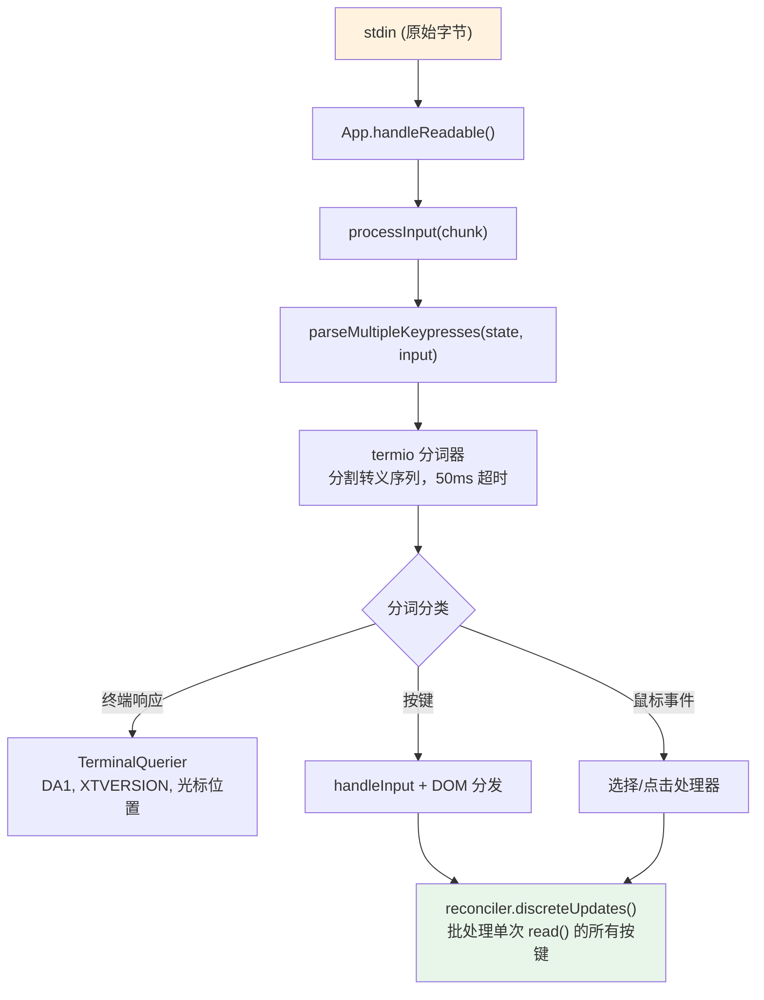
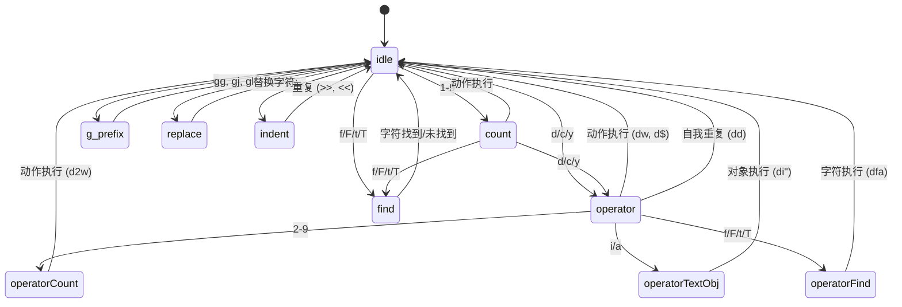

# 第14章：输入与交互

## 原始字节，有意义的动作

当你在 Claude Code 中按下 Ctrl+X 然后紧接着按 Ctrl+K 时，终端会发送两个字节序列，间隔大约 200 毫秒。第一个是 `0x18`（ASCII CAN）。第二个是 `0x0B`（ASCII VT）。这些字节本身除了表示"控制字符"外没有任何内在含义。输入系统必须识别出这两个在超时窗口内按顺序到达的字节构成了和弦 `ctrl+x ctrl+k`，它映射到动作 `chat:killAgents`，该动作会终止所有正在运行的子代理。

在原始字节和终止的代理之间，有六个系统被激活：一个分词器分割转义序列，一个解析器对五种终端协议进行分类，一个快捷键解析器根据上下文特定的绑定匹配序列，一个和弦状态机管理多键序列，一个处理器执行动作，React 将结果状态更新批处理成单次渲染。

难点不在于其中任何一个系统本身。而在于终端多样性的组合爆炸。iTerm2 发送 Kitty 键盘协议序列。macOS 终端发送传统的 VT220 序列。通过 SSH 连接的 Ghostty 发送 xterm modifyOtherKeys。tmux 根据其配置可能会吞掉、转换或透传这些序列中的任何一种。Windows 终端在 VT 模式上有自己的特性。输入系统必须能够从所有这些终端产生正确的 `ParsedKey` 对象，因为用户不应该需要知道他们的终端使用哪种键盘协议。

本章追踪从原始字节到有意义动作的路径，跨越这一复杂的生态系统。

设计理念是渐进增强与优雅降级。在支持 Kitty 键盘协议的现代终端上，Claude Code 获得完整的修饰符检测（Ctrl+Shift+A 与 Ctrl+A 是不同的）、Super 键报告（Cmd 快捷键）以及明确的键识别。在通过 SSH 连接的传统终端上，它回退到最佳可用协议，失去一些修饰符区分但保持核心功能完整。用户永远不会看到关于终端不受支持的错误消息。他们可能无法使用 `ctrl+shift+f` 进行全局搜索，但 `ctrl+r` 用于历史搜索在任何地方都能工作。

---

## 按键解析管道

输入以 stdin 上的字节块形式到达。管道分阶段处理它们：



分词器是基础。终端输入是字节流，混合了可打印字符、控制码和多字节转义序列，没有明确的帧边界。单次从 stdin `read()` 可能返回 `\x1b[1;5A`（Ctrl+上箭头），或者可能在一个 read 中返回 `\x1b`，在下一个 read 中返回 `[1;5A`，具体取决于字节从 PTY 到达的速度。分词器维护一个状态机，缓冲部分转义序列并发出完整的词符。

不完整序列问题是根本性的。当分词器看到单独的 `\x1b` 时，它无法知道这是 Escape 键还是 CSI 序列的开始。它缓冲该字节并启动 50ms 定时器。如果没有后续字节到达，缓冲区被刷新，`\x1b` 变成 Escape 按键。但在刷新之前，分词器会检查 `stdin.readableLength`——如果字节在内核缓冲区中等待，定时器会重新启动而不是刷新。这处理了事件循环被阻塞超过 50ms 且后续字节已缓冲但尚未读取的情况。

对于粘贴操作，超时延长到 500ms。粘贴的文本可能很大，并分多个块到达。

单次 `read()` 中的所有解析键都在一个 `reconciler.discreteUpdates()` 调用中处理。这将 React 状态更新批处理，因此粘贴 100 个字符产生一次重新渲染，而不是 100 次。批处理至关重要：没有它，粘贴中的每个字符都会触发完整的协调周期——状态更新、协调、提交、Yoga 布局、渲染、差异比较、写入。以每周期 5ms 计算，100 个字符的粘贴需要 500ms 来处理。使用批处理，同样的粘贴只需一个 5ms 的周期。

### stdin 管理

`App` 组件通过引用计数管理原始模式。当任何组件需要原始输入时（提示符、对话框、vim 模式），它调用 `setRawMode(true)`，递增计数器。当它不再需要原始输入时，调用 `setRawMode(false)`，递减计数器。只有当计数器归零时才禁用原始模式。这防止了终端应用程序中的常见错误：组件 A 启用原始模式，组件 B 启用原始模式，组件 A 禁用原始模式，突然组件 B 的输入中断，因为原始模式被全局禁用了。

首次启用原始模式时，App 会：

1. 停止早期输入捕获（在 React 挂载之前收集按键的引导阶段机制）
2. 将 stdin 设置为原始模式（无行缓冲、无回显、无信号处理）
3. 附加 `readable` 监听器以进行异步输入处理
4. 启用括号粘贴（以便识别粘贴的文本）
5. 启用焦点报告（以便应用知道终端窗口何时获得/失去焦点）
6. 启用扩展键报告（Kitty 键盘协议 + xterm modifyOtherKeys）

禁用时，所有这些都按相反顺序恢复。仔细的排序防止转义序列泄漏——在禁用原始模式之前禁用扩展键报告确保终端在应用停止解析后不会继续发送 Kitty 编码序列。

`onExit` 信号处理器（通过 `signal-exit` 包）确保即使在意外终止时也能进行清理。如果进程收到 SIGTERM 或 SIGINT，处理器会禁用原始模式、恢复终端状态、退出备用屏幕（如果活动），并在进程退出前重新显示光标。没有此清理，崩溃的 Claude Code 会话将使终端处于原始模式，没有光标且没有回显——用户需要盲目输入 `reset` 来恢复他们的终端。

---

## 多协议支持

终端在键盘输入编码方式上无法达成一致。像 Kitty 这样的现代终端模拟器发送带有完整修饰符信息的结构化序列。通过 SSH 连接的传统终端发送需要上下文解释的模糊字节序列。Claude Code 的解析器同时处理五种不同的协议，因为用户的终端可能是其中任何一种。

**CSI u（Kitty 键盘协议）** 是现代标准。格式：`ESC [ codepoint [; modifier] u`。示例：`ESC[13;2u` 是 Shift+Enter，`ESC[27u` 是没有修饰符的 Escape。码点明确识别按键——Escape 键和 Escape 作为序列前缀之间没有歧义。修饰符字将 shift、alt、ctrl 和 super（Cmd）编码为单独的位。Claude Code 通过在启动时向支持的终端发送 `ENABLE_KITTY_KEYBOARD` 转义序列来启用此协议，并在退出时通过 `DISABLE_KITTY_KEYBOARD` 禁用它。协议通过查询/响应握手检测：应用程序发送 `CSI ? u`，终端响应 `CSI ? flags u`，其中 `flags` 表示支持的协议级别。

**xterm modifyOtherKeys** 是终端（如通过 SSH 连接的 Ghostty）的回退方案，其中未协商 Kitty 协议。格式：`ESC [ 27 ; modifier ; keycode ~`。注意参数顺序与 CSI u 相反——modifier 在 keycode 之前，然后是 keycode。这是常见的解析器错误来源。协议通过 `CSI > 4 ; 2 m` 启用，由 Ghostty、tmux 和 xterm 在未检测到终端 TERM 标识时发出（在通过 SSH 连接时很常见，因为 `TERM_PROGRAM` 不会转发）。

**传统终端序列** 涵盖其他所有内容：通过 `ESC O` 和 `ESC [` 序列的功能键、方向键、小键盘、Home/End/Insert/Delete，以及 40 年终端演化积累的全套 VT100/VT220/xterm 变体。解析器使用两个正则表达式来匹配这些：`FN_KEY_RE` 用于 `ESC O/N/[/[[` 前缀模式（匹配功能键、方向键及其修饰变体），`META_KEY_CODE_RE` 用于元键码（`ESC` 后跟单个字母数字，传统的 Alt+键编码）。

传统序列的挑战在于歧义。`ESC [ 1 ; 2 R` 可能是 Shift+F3 或光标位置报告，取决于上下文。解析器通过私有标记检查解决此问题：光标位置报告使用 `CSI ? row ; col R`（带 `?` 私有标记），而修饰功能键使用 `CSI params R`（不带它）。这种消歧就是 Claude Code 请求 DECXCPR（扩展光标位置报告）而非标准 CPR 的原因——扩展形式是明确的。

终端识别增加了另一层复杂性。启动时，Claude Code 发送 `XTVERSION` 查询（`CSI > 0 q`）以发现终端的名称和版本。响应（`DCS > | name ST`）在 SSH 连接中也能存活——不像 `TERM_PROGRAM`，它是一个不会通过 SSH 传播的环境变量。知道终端身份允许解析器处理终端特定的特性。例如，xterm.js（VS Code 集成终端使用）与原生 xterm 有不同的转义序列行为，识别字符串（`xterm.js(X.Y.Z)`）允许解析器考虑这些差异。

**SGR 鼠标事件** 使用格式 `ESC [ < button ; col ; row M/m`，其中 `M` 是按下，`m` 是释放。按钮码编码动作：0/1/2 表示左/中/右击，64/65 表示滚轮上/下（0x40 与滚轮位进行 OR 运算），32+ 表示拖动（0x20 与移动位进行 OR 运算）。滚轮事件被转换为 `ParsedKey` 对象，以便它们流经快捷键系统；点击和拖动事件变成 `ParsedMouse` 对象，路由到选择处理器。

**括号粘贴** 在 `ESC [200~` 和 `ESC [201~` 标记之间包装粘贴的内容。标记之间的所有内容都变成单个 `ParsedKey`，`isPasted: true`，无论粘贴的文本可能包含什么转义序列。这防止粘贴的代码被解释为命令——当用户粘贴包含 `\x03`（作为原始字节的 Ctrl+C）的代码片段时，这是一个关键的安全功能。

解析器的输出类型形成一个清晰的可辨识联合：

```typescript
type ParsedKey = {
  kind: 'key';
  name: string;        // 'return', 'escape', 'a', 'f1', 等
  ctrl: boolean; meta: boolean; shift: boolean;
  option: boolean; super: boolean;
  sequence: string;    // 用于调试的原始转义序列
  isPasted: boolean;   // 在括号粘贴内
}

type ParsedMouse = {
  kind: 'mouse';
  button: number;      // SGR 按钮码
  action: 'press' | 'release';
  col: number; row: number;  // 1 索引的终端坐标
}

type ParsedResponse = {
  kind: 'response';
  response: TerminalResponse;  // 路由到 TerminalQuerier
}
```

`kind` 可辨识符确保下游代码显式处理每种输入类型。键不能被意外处理为鼠标事件；终端响应不能被意外解释为按键。`ParsedKey` 类型还携带原始 `sequence` 字符串用于调试——当用户报告"按 Ctrl+Shift+A 没有反应"时，调试日志可以显示终端发送的确切字节序列，从而可以诊断问题是在终端的编码、解析器的识别还是快捷键的配置中。

`ParsedKey` 上的 `isPasted` 标志对安全至关重要。启用括号粘贴时，终端用标记序列包装粘贴的内容。解析器在结果键事件上设置 `isPasted: true`，快捷键解析器跳过粘贴键的快捷键匹配。没有此功能，粘贴包含 `\x03`（作为原始字节的 Ctrl+C）或转义序列的文本将触发应用程序命令。有了它，无论其字节内容如何，粘贴的内容都被视为字面文本输入。

解析器还识别终端响应——终端本身为响应查询而发送的序列。这些包括设备属性（DA1、DA2）、光标位置报告、Kitty 键盘标志响应、XTVERSION（终端识别）和 DECRPM（模式状态）。这些被路由到 `TerminalQuerier` 而不是输入处理器：

```typescript
type TerminalResponse =
  | { type: 'decrpm'; mode: number; status: number }
  | { type: 'da1'; params: number[] }
  | { type: 'da2'; params: number[] }
  | { type: 'kittyKeyboard'; flags: number }
  | { type: 'cursorPosition'; row: number; col: number }
  | { type: 'osc'; code: number; data: string }
  | { type: 'xtversion'; version: string }
```

**修饰符解码** 遵循 XTerm 约定：修饰符字是 `1 + (shift ? 1 : 0) + (alt ? 2 : 0) + (ctrl ? 4 : 0) + (super ? 8 : 0)`。`ParsedKey` 中的 `meta` 字段映射到 Alt/Option（位 2）。`super` 字段是不同的（位 8，macOS 上的 Cmd）。这种区分很重要，因为 Cmd 快捷键被操作系统保留，终端应用程序无法捕获——除非终端使用 Kitty 协议，该协议报告其他协议静默吞掉的 super 修饰键。

当间隔后 5 秒没有输入到达时，stdin 间隙检测器触发终端模式重新断言。这处理 tmux 重新附加和笔记本电脑唤醒场景，其中终端的键盘模式可能已被多路复用器或操作系统重置。重新断言触发时，它会重新发送 `ENABLE_KITTY_KEYBOARD`、`ENABLE_MODIFY_OTHER_KEYS`、括号粘贴和焦点报告序列。没有此功能，从 tmux 会话分离并重新附加会静默将键盘协议降级到传统模式，破坏会话剩余时间的修饰符检测。

### 终端 I/O 层

解析器下方是 `ink/termio/` 中的结构化终端 I/O 子系统：

- **csi.ts** — CSI（控制序列引导符）序列：光标移动、擦除、滚动区域、括号粘贴启用/禁用、焦点事件启用/禁用、Kitty 键盘协议启用/禁用
- **dec.ts** — DEC 私有模式序列：备用屏幕缓冲区（1049）、鼠标跟踪模式（1000/1002/1003）、光标可见性、括号粘贴（2004）、焦点事件（1004）
- **osc.ts** — 操作系统命令：剪贴板访问（OSC 52）、标签状态、iTerm2 进度指示器、tmux/screen 多路复用器包装（需要穿越多路复用器边界的序列的 DCS 透传）
- **sgr.ts** — 选择图形再现：ANSI 样式代码系统（颜色、粗体、斜体、下划线、反色）
- **tokenize.ts** — 用于转义序列边界检测的有状态分词器

多路复用器包装值得一提。当 Claude Code 在 tmux 内运行时，某些转义序列（如 Kitty 键盘协议协商）必须透传到外部终端。tmux 使用 DCS 透传（`ESC P ... ST`）来转发它不理解的序列。`osc.ts` 中的 `wrapForMultiplexer` 函数检测多路复用器环境并适当包装序列。没有此功能，Kitty 键盘模式将在 tmux 内静默失败，用户永远不会知道为什么他们的 Ctrl+Shift 绑定停止工作。

### 事件系统

`ink/events/` 目录实现了一个浏览器兼容的事件系统，有七种事件类型：`KeyboardEvent`、`ClickEvent`、`FocusEvent`、`InputEvent`、`TerminalFocusEvent` 和基础 `TerminalEvent`。每个都携带 `target`、`currentTarget`、`eventPhase`，并支持 `stopPropagation()`、`stopImmediatePropagation()` 和 `preventDefault()`。

包装 `ParsedKey` 的 `InputEvent` 存在于与遗留 `EventEmitter` 路径的向后兼容性中，旧组件可能仍在使用。新组件使用具有捕获/冒泡阶段的 DOM 风格键盘事件分发。两条路径都从相同的解析键触发，因此它们始终一致——到达 stdin 的键产生恰好一个 `ParsedKey`，它生成一个 `InputEvent`（用于遗留监听器）和一个 `KeyboardEvent`（用于 DOM 风格分发）。这种双路径设计允许从 EventEmitter 模式增量迁移到 DOM 事件模式，而不会破坏现有组件。

---

## 快捷键系统

快捷键系统将三个经常纠缠在一起的关注点分开：什么键触发什么动作（绑定），动作触发时发生什么（处理器），以及当前哪些绑定处于活动状态（上下文）。

### 绑定：声明式配置

默认绑定在 `defaultBindings.ts` 中定义为 `KeybindingBlock` 对象数组，每个都限定在一个上下文中：

```typescript
export const DEFAULT_BINDINGS: KeybindingBlock[] = [
  {
    context: 'Global',
    bindings: {
      'ctrl+c': 'app:interrupt',
      'ctrl+d': 'app:exit',
      'ctrl+l': 'app:redraw',
      'ctrl+r': 'history:search',
    },
  },
  {
    context: 'Chat',
    bindings: {
      'escape': 'chat:cancel',
      'ctrl+x ctrl+k': 'chat:killAgents',
      'enter': 'chat:submit',
      'up': 'history:previous',
      'ctrl+x ctrl+e': 'chat:externalEditor',
    },
  },
  // ... 14 个更多上下文
]
```

平台特定的绑定在定义时处理。图片粘贴是 macOS/Linux 上的 `ctrl+v`，但 Windows 上是 `alt+v`（其中 `ctrl+v` 是系统粘贴）。模式循环在支持 VT 模式的终端上是 `shift+tab`，但在没有 VT 模式的 Windows 终端上是 `meta+m`。功能标志绑定的（快速搜索、语音模式、终端面板）是条件包含的。

用户可以通过 `~/.claude/keybindings.json` 覆盖任何绑定。解析器接受修饰符别名（`ctrl`/`control`、`alt`/`opt`/`option`、`cmd`/`command`/`super`/`win`）、键别名（`esc` -> `escape`、`return` -> `enter`）、和弦表示法（空格分隔的步骤如 `ctrl+k ctrl+s`）以及空动作以解绑默认键。空动作与未定义绑定不同——它显式阻止默认绑定触发，这对于想要回收键供终端使用的用户很重要。

### 上下文：16 个活动范围

每个上下文代表一种特定的交互模式，其中一组特定的绑定适用：

| 上下文 | 何时激活 |
|---------|------------|
| Global | 始终 |
| Chat | 提示输入框获得焦点 |
| Autocomplete | 补全菜单可见 |
| Confirmation | 权限对话框显示中 |
| Scroll | 带可滚动内容的备用屏幕 |
| Transcript | 只读转录查看器 |
| HistorySearch | 反向历史搜索（ctrl+r） |
| Task | 后台任务运行中 |
| Help | 帮助覆盖层显示 |
| MessageSelector | 回退对话框 |
| MessageActions | 消息光标导航 |
| DiffDialog | 差异查看器 |
| Select | 通用选择列表 |
| Settings | 配置面板 |
| Tabs | 标签导航 |
| Footer | 页脚指示器 |

当键到达时，解析器从当前激活的上下文（由 React 组件状态确定）构建上下文列表，去重并保持优先级顺序，然后搜索匹配的绑定。最后匹配的绑定获胜——这就是用户覆盖优先于默认设置的方式。上下文列表在每次按键时重建（它很便宜：最多 16 个字符串的数组连接和去重），因此上下文变化立即生效，无需任何订阅或监听器机制。

上下文设计处理一个棘手的交互模式：嵌套模态框。当权限对话框在运行任务期间出现时，`Confirmation` 和 `Task` 上下文都可能激活。`Confirmation` 上下文优先（它在组件树中注册得更晚），因此 `y` 触发"批准"而不是任何任务级绑定。当对话框关闭时，`Confirmation` 上下文停用，`Task` 绑定恢复。这种堆叠行为从上下文列表的优先级排序中自然产生——不需要特殊的模态处理代码。

### 保留快捷键

并非所有内容都可以重新绑定。系统强制执行三个级别的保留：

**不可重新绑定**（硬编码行为）：`ctrl+c`（中断/退出）、`ctrl+d`（退出）、`ctrl+m`（在所有终端中与 Enter 相同——重新绑定它会破坏 Enter）。

**终端保留**（警告）：`ctrl+z`（SIGTSTP）、`ctrl+\`（SIGQUIT）。这些在技术上可以绑定，但终端会在大多数配置中在应用程序看到它们之前拦截它们。

**macOS 保留**（错误）：`cmd+c`、`cmd+v`、`cmd+x`、`cmd+q`、`cmd+w`、`cmd+tab`、`cmd+space`。操作系统在它们到达终端之前拦截这些。绑定它们会创建一个永远不会触发的快捷键。

### 解析流程

当键到达时，解析路径是：

1. 构建上下文列表：组件注册的激活上下文加上 Global，去重并保持优先级
2. 针对合并的绑定表调用 `resolveKeyWithChordState(input, key, contexts)`
3. 在 `match` 时：清除任何待处理和弦，调用处理器，对事件调用 `stopImmediatePropagation()`
4. 在 `chord_started` 时：保存待按键，停止传播，启动和弦超时
5. 在 `chord_cancelled` 时：清除待处理和弦，让事件继续传递
6. 在 `unbound` 时：清除和弦——这是显式解绑（用户将动作设置为 `null`），因此传播停止但没有处理器运行
7. 在 `none` 时：继续传递给其他处理器

"最后获胜"解析策略意味着如果默认绑定和用户绑定都在 `Chat` 上下文中定义了 `ctrl+k`，用户的绑定优先。这是在匹配时通过按定义顺序迭代绑定并保留最后匹配来评估的，而不是在加载时构建覆盖映射。优点：上下文特定的覆盖自然组合。用户可以覆盖 `Chat` 中的 `enter` 而不影响 `Confirmation` 中的 `enter`。

---

## 和弦支持

`ctrl+x ctrl+k` 绑定是和弦：两个按键一起形成一个动作。解析器用状态机管理它。

当键到达时：

1. 解析器将其附加到任何待处理和弦前缀
2. 它检查是否有绑定的和弦以此前缀开头。如果有，它返回 `chord_started` 并保存待按键
3. 如果完整和弦完全匹配绑定，它返回 `match` 并清除待处理状态
4. 如果和弦前缀不匹配任何内容，它返回 `chord_cancelled`

`ChordInterceptor` 组件在和弦等待状态期间拦截所有输入。它有 1000ms 超时——如果第二个按键在一秒内没有到达，和弦被取消，第一个按键被丢弃。`KeybindingContext` 提供 `pendingChordRef` 以同步访问待处理状态，避免可能导致第二个按键在第一个按键的状态更新完成之前被处理的 React 状态更新延迟。

和弦设计避免了与 readline 编辑键的阴影冲突。没有和弦，"终止代理"的快捷键可能是 `ctrl+k`——但那是 readline 的"删除到行尾"，用户在终端文本输入中期望它。通过使用 `ctrl+x` 作为前缀（匹配 readline 自己的和弦前缀约定），系统获得了一个不与单键编辑快捷键冲突的绑定命名空间。

实现处理大多数和弦系统遗漏的边缘情况：当用户按下 `ctrl+x` 但随后输入不属于任何和弦的字符时会发生什么？没有仔细处理，该字符会被吞掉——和弦拦截器消耗了输入，和弦被取消，字符消失了。Claude Code 的 `ChordInterceptor` 在这种情况下返回 `chord_cancelled`，导致待处理输入被丢弃但允许不匹配的字符继续传递到正常输入处理。字符没有丢失；只有和弦前缀被丢弃。这符合用户对 Emacs 风格和弦前缀的预期行为。

---

## Vim 模式

### 状态机

vim 实现是一个具有详尽类型检查的纯状态机。类型就是文档：

```typescript
export type VimState =
  | { mode: 'INSERT'; insertedText: string }
  | { mode: 'NORMAL'; command: CommandState }

export type CommandState =
  | { type: 'idle' }
  | { type: 'count'; digits: string }
  | { type: 'operator'; op: Operator; count: number }
  | { type: 'operatorCount'; op: Operator; count: number; digits: string }
  | { type: 'operatorFind'; op: Operator; count: number; find: FindType }
  | { type: 'operatorTextObj'; op: Operator; count: number; scope: TextObjScope }
  | { type: 'find'; find: FindType; count: number }
  | { type: 'g'; count: number }
  | { type: 'operatorG'; op: Operator; count: number }
  | { type: 'replace'; count: number }
  | { type: 'indent'; dir: '>' | '<'; count: number }
```

这是一个有 12 个变体的可辨识联合。TypeScript 的详尽检查确保 `CommandState.type` 上的每个 `switch` 语句都处理所有 12 种情况。向联合添加新状态会导致每个不完整的 switch 产生编译错误。状态机不能有死状态或缺失转换——类型系统禁止它。

注意每个状态如何恰好携带下一个转换所需的数据。`operator` 状态知道哪个操作符（`op`）和前面的计数。`operatorCount` 状态添加数字累加器（`digits`）。`operatorTextObj` 状态添加范围（`inner` 或 `around`）。没有状态携带它不需要的数据。这不仅仅是好的品味——它防止了整个类别的错误，其中处理器读取来自前一个命令的过期数据。如果你在 `find` 状态，你有一个 `FindType` 和一个 `count`。你没有操作符，因为没有操作符待处理。类型使不可能的状态无法表示。

状态图讲述了这个故事：



从 `idle` 开始，按 `d` 进入 `operator` 状态。从 `operator`，按 `w` 执行带有 `w` 动作的 `delete`。再次按 `d`（`dd`）触发行删除。按 `2` 进入 `operatorCount`，因此 `d2w` 变成"删除接下来的 2 个单词"。按 `i` 进入 `operatorTextObj`，因此 `di"` 变成"删除引号内"。每个中间状态恰好携带下一个转换所需的上下文——不多不少。

### 转换作为纯函数

`transition()` 函数根据当前状态类型分派给 10 个处理器函数之一。每个返回 `TransitionResult`：

```typescript
type TransitionResult = {
  next?: CommandState;    // 新状态（省略 = 保持在当前状态）
  execute?: () => void;   // 副作用（省略 = 尚无动作）
}
```

副作用被返回，而不是执行。转换函数是纯的——给定一个状态和键，它返回下一个状态，以及可选地执行动作的闭包。调用者决定何时运行效果。这使得状态机可以简单测试：输入状态和键，断言返回的状态，忽略闭包。它还意味着转换函数不依赖于编辑器状态、光标位置或缓冲区内容。这些细节在创建时被闭包捕获，而不是在转换时被状态机消耗。

`fromIdle` 处理器是入口点，涵盖完整的 vim 词汇：

- **计数前缀**：`1-9` 进入 `count` 状态，累积数字。`0` 是特殊的——它是"行首"动作，不是计数数字，除非已经累积了数字
- **操作符**：`d`、`c`、`y` 进入 `operator` 状态，等待定义范围的动作或文本对象
- **查找**：`f`、`F`、`t`、`T` 进入 `find` 状态，等待要搜索的字符
- **G 前缀**：`g` 进入 `g` 状态，用于复合命令（`gg`、`gj`、`gk`）
- **替换**：`r` 进入 `replace` 状态，等待替换字符
- **缩进**：`>`、`<` 进入 `indent` 状态（用于 `>>` 和 `<<`）
- **简单动作**：`h/j/k/l/w/b/e/W/B/E/0/^/$` 立即执行，移动光标
- **立即命令**：`x`（删除字符）、`~`（切换大小写）、`J`（合并行）、`p/P`（粘贴）、`D/C/Y`（操作符快捷方式）、`G`（转到末尾）、`.`（点重复）、`;/,`（查找重复）、`u`（撤销）、`i/I/a/A/o/O`（进入插入模式）

### 动作、操作符和文本对象

**动作** 是将键映射到光标位置的纯函数。`resolveMotion(key, cursor, count)` 将动作应用 `count` 次，如果光标停止移动则短路（你无法越过第 0 列向左移动）。这个短路对行尾的 `3w` 很重要——它停在最后一个单词而不是换行或报错。

动作按它们与操作符的交互方式分类：

- **排他性**（默认）——目标处的字符**不**包含在范围内。`dw` 删除到但不包括下一个单词的第一个字符
- **包含性**（`e`、`E`、`$`）——目标处的字符**包含**在内。`de` 删除到当前单词的最后一个字符
- **行方式**（`j`、`k`、`G`、`gg`、`gj`、`gk`）——与操作符一起使用时，范围扩展到覆盖整行。`dj` 删除当前行和下面一行，而不仅仅是两个光标位置之间的字符

**操作符** 应用于范围。`delete` 删除文本并保存到寄存器。`change` 删除文本并进入插入模式。`yank` 复制到寄存器而不修改。`cw`/`cW` 特殊情况遵循 vim 约定：change-word 到当前单词的末尾，而不是下一个单词的开头（不像 `dw`）。

一个有趣的边缘情况：`[Image #N]` 芯片吸附。当单词动作落在图像引用芯片内（在终端中渲染为单个视觉单元）时，范围扩展到覆盖整个芯片。这防止了用户感知为原子元素的部分删除——你不能删除 `[Image #3]` 的一半，因为动作系统将整个芯片视为单个单词。

其他命令涵盖完整的预期 vim 词汇：`x`（删除字符）、`r`（替换字符）、`~`（切换大小写）、`J`（合并行）、`p`/`P`（具有行方式/字符方式感知的粘贴）、`>>` / `<<`（带 2 空格停止的缩进/取消缩进）、`o`/`O`（在下面/上面打开行并进入插入模式）。

**文本对象** 找到光标周围的边界。它们回答这个问题："光标所在的'东西'是什么？"

单词对象（`iw`、`aw`、`iW`、`aW`）将文本分割为字素，将每个分类为单词字符、空白或标点，并将选择扩展到单词边界。`i`（内部）变体只选择单词。`a`（周围）变体包括周围的空白——优先尾随空白，如果在行尾则回退到前导。大写变体（`W`、`aW`）将任何非空白序列视为单词，忽略标点边界。

引号对象（`i"`、`a"`、`i'`、`a'`、`` i` ``、`` a` ``）在当前行上查找成对的引号。对按顺序匹配（第一和第二引号形成一对，第三和第四形成下一对，等等）。如果光标在第一和第二引号之间，那就是匹配。`a` 变体包括引号字符；`i` 变体排除它们。

括号对象（`ib`/`i(`、`ab`/`a(`、`i[`/`a[`、`iB`/`i{`/`aB`/`a{`、`i<`/`a<`）进行深度跟踪搜索以查找匹配的分隔符。它们从光标向外搜索，维护嵌套计数，直到找到深度为零的匹配对。这正确处理嵌套括号——在 `foo((bar))` 内 `d i (` 删除 `bar`，而不是 `(bar)`。

### 持久状态和点重复

vim 模式维护一个 `PersistentState`，它在命令之间存活——使 vim 感觉像 vim 的"记忆"：

```typescript
interface PersistentState {
  lastChange: RecordedChange;   // 用于点重复
  lastFind: { type: FindType; char: string };  // 用于 ; 和 ,
  register: string;             // 复制缓冲区
  registerIsLinewise: boolean;  // 粘贴行为标志
}
```

每个变异命令将自己记录为 `RecordedChange`——一个涵盖插入、操作符+动作、操作符+文本对象、操作符+查找、替换、删除字符、切换大小写、缩进、打开行和合并的可辨识联合。`.` 命令从持久状态重放 `lastChange`，使用记录的计数、操作符和动作在当前光标位置重现完全相同的编辑。

查找重复（`;` 和 `,`）使用 `lastFind`。`;` 命令以相同方向重复最后一次查找。`,` 命令翻转方向：`f` 变成 `F`，`t` 变成 `T`，反之亦然。这意味着在 `fa`（查找下一个 'a'）之后，`;` 向前查找下一个 'a'，`,` 向后查找下一个 'a'——用户无需记住他们搜索的方向。

寄存器跟踪复制和删除的文本。当寄存器内容以 `\n` 结尾时，它被标记为行方式，这会改变粘贴行为：`p` 在当前行下方插入（不是在光标之后），`P` 在上方插入。这种区分对用户是不可见的，但对于 vim 用户不断依赖的"删除一行，粘贴到别处"工作流程至关重要。

---

## 虚拟滚动

长时间的 Claude Code 会话会产生长对话。一次繁重的调试会话可能产生 200 多条消息，每条都包含 markdown、代码块、工具使用结果和权限记录。没有虚拟化，React 将在内存中维护 200 多个组件子树，每个都有自己的状态、效果和记忆化缓存。DOM 树将包含数千个节点。Yoga 布局将每帧访问所有节点。终端将无法使用。

`VirtualMessageList` 组件通过仅渲染视口中可见的消息加上上下的小缓冲区来解决这个问题。在有数百条消息的对话中，这是挂载 500 个 React 子树（每个都有 markdown 解析、语法高亮和工具使用块）和挂载 15 个之间的区别。

组件维护：

- 每条消息的**高度缓存**，当终端列数变化时失效
- 用于转录搜索导航的**跳转句柄**（跳转到索引、下一个/上一个匹配）
- 带热缓存支持的**搜索文本提取**（用户输入 `/` 时预小写所有消息）
- **粘性提示跟踪**——当用户从输入框滚动离开时，他们最后的提示文本出现在顶部作为上下文
- **消息动作导航**——用于回退功能的光标式消息选择

`useVirtualScroll` 钩子根据 `scrollTop`、`viewportHeight` 和累积消息高度计算要挂载哪些消息。它在 `ScrollBox` 上维护滚动钳位边界，以防止突发 `scrollTo` 调用超过 React 的异步重新渲染时产生空白屏幕——虚拟化列表的经典问题，其中滚动位置可能超过 DOM 更新。

虚拟滚动和 markdown 词符缓存之间的交互值得注意。当消息滚出视口时，其 React 子树卸载。当用户滚动回来时，子树重新挂载。没有缓存，这意味着为每个用户滚动经过的消息重新解析 markdown。模块级 LRU 缓存（500 个条目，按键内容哈希）确保昂贵的 `marked.lexer()` 调用每个唯一消息内容最多发生一次，无论组件挂载和卸载多少次。

`ScrollBox` 组件本身通过 `useImperativeHandle` 提供命令式 API：

- `scrollTo(y)` — 绝对滚动，打破粘性滚动模式
- `scrollBy(dy)` — 累积到 `pendingScrollDelta`，由渲染器以限定速率排出
- `scrollToElement(el, offset)` — 通过 `scrollAnchor` 将位置读取推迟到渲染时
- `scrollToBottom()` — 重新启用粘性滚动模式
- `setClampBounds(min, max)` — 约束虚拟滚动窗口

所有滚动突变都直接转到 DOM 节点属性，并通过微任务调度渲染，绕过 React 的协调器。`markScrollActivity()` 调用向后台间隔（旋转器、定时器）发出信号，跳过它们的下一个滴答，减少活动滚动期间的事件循环争用。这是一种协作调度模式：滚动路径告诉后台工作"我正在执行延迟敏感操作，请让出"。后台间隔在调度下一个滴答之前检查此标志，如果滚动活动则延迟一帧。结果是在后台运行多个旋转器和定时器时也能保持平滑滚动。

---

## 应用：构建上下文感知快捷键系统

Claude Code 的快捷键架构为任何具有模态输入的应用程序提供了模板——编辑器、IDE、绘图工具、终端多路复用器。关键见解：

**将绑定与处理器分离。** 绑定是数据（哪个键映射到哪个动作名称）。处理器是代码（动作触发时发生什么）。将它们分开意味着绑定可以序列化为 JSON 以供用户自定义，而处理器保留在拥有相关状态的组件中。用户可以将 `ctrl+k` 重新绑定到 `chat:submit` 而无需接触任何组件代码。

**将上下文作为一等概念。** 不要只有一个平面键映射，而是定义基于应用程序状态激活和停用的上下文。当对话框打开时，`Confirmation` 上下文激活，其绑定优先于 `Chat` 绑定。当对话框关闭时，`Chat` 绑定恢复。这消除了 `if (dialogOpen && key === 'y')` 分散在事件处理器中的条件汤。

**将和弦状态作为显式机器。** 多键序列（和弦）不是单键绑定的特殊情况——它们是需要超时和取消语义的状态机的不同绑定类型。使其显式化（使用专用的 `ChordInterceptor` 组件和 `pendingChordRef`）防止了和弦的第二个按键被不同处理器消耗的微妙错误，因为 React 的状态更新尚未传播。

**尽早保留，清晰警告。** 在定义时识别不能重新绑定的键（系统快捷键、终端控制字符），而不是在解析时。当用户尝试绑定 `ctrl+c` 时，在配置加载期间显示错误，而不是静默接受一个永远不会触发的绑定。这是有效的快捷键系统和产生神秘错误报告的系统之间的区别。

**为终端多样性设计。** Claude Code 的快捷键系统在绑定级别定义平台特定的替代方案，而不是处理器级别。图片粘贴是 `ctrl+v` 或 `alt+v`，取决于操作系统。模式循环是 `shift+tab` 或 `meta+m`，取决于 VT 模式支持。每个动作的处理程序无论哪个键触发它都是相同的。这意味着测试覆盖每个动作的一个代码路径，而不是每个平台键组合的一个。当新的终端特性出现时（例如，Windows Terminal 在 Node 24.2.0 之前缺乏 VT 模式），修复是绑定定义中的单个条件，而不是处理器代码中分散的一组 `if (platform === 'windows')` 检查。

**提供逃生舱。** 空动作解绑机制很小但很重要。在终端多路复用器中运行 Claude Code 的用户可能会发现 `ctrl+t`（切换待办事项）与他们的多路复用器的标签切换快捷键冲突。通过在 keybindings.json 中添加 `{ "ctrl+t": null }`，他们完全禁用该绑定。按键传递到多路复用器。没有空解绑，用户唯一的选择是将 `ctrl+t` 重新绑定到他们不想要的其他动作，或重新配置他们的多路复用器——两者都不是好的体验。

vim 模式实现增加了另一个教训：**让类型系统强制执行你的状态机**。12 变体 `CommandState` 联合使 switch 语句中不可能忘记状态。`TransitionResult` 类型将状态变化与副作用分离，使机器可以作为纯函数测试。如果你的应用程序有模态输入，将模式表达为可辨识联合，让编译器验证穷尽性。花在定义类型上的时间会通过在消除运行时错误中得到回报。

考虑替代方案：使用可变状态和命令式条件的 vim 实现。`fromOperator` 处理器将是 `if (mode === 'operator' && pendingCount !== null && isDigit(key))` 检查的嵌套，每个分支变异共享变量。添加新状态（比如宏录制模式）需要审计每个分支以确保新状态被处理。使用可辨识联合，编译器进行审计——添加新变体的 PR 在构建之前不会构建，直到每个 switch 语句都处理它。

这是 Claude Code 输入系统的更深层次教训：在每一层——分词器、解析器、快捷键解析器、vim 状态机——架构尽早将非结构化输入转换为类型化、详尽处理的结构。原始字节在解析器边界变成 `ParsedKey`。`ParsedKey` 在快捷键边界变成动作名称。动作名称在组件边界变成类型化处理器。每次转换都缩小可能状态的空间，每次缩小都由 TypeScript 的类型系统强制执行。当按键到达应用程序逻辑时，歧义消失了。没有"如果键是未定义的怎么办？"没有"如果修饰符组合不可能怎么办？"类型已经禁止这些状态存在。

这两章一起讲述了一个故事。第13章展示了渲染系统如何消除不必要的工作——位块传输未更改区域、内部化重复值、单元格级差异比较、跟踪损坏边界。第14章展示了输入系统如何消除歧义——将五种协议解析为一种类型、根据上下文绑定解析键、将模态状态表达为穷尽联合。渲染系统回答"你如何每秒 60 次绘制 24,000 个单元格？"输入系统回答"如何在碎片化生态系统中将字节流变成有意义的动作？"两个答案遵循相同的原则：将复杂性推到边界，在那里可以一次且正确地处理，以便下游的一切都在干净、类型化、有界的数据上运行。终端是混乱的。应用程序是有序的。边界代码做了将一种转换为另一种的艰苦工作。

---

## 总结：两个系统，一种设计理念

第13章和第14章涵盖了终端界面的两个部分：输出和输入。尽管关注点不同，两个系统遵循相同的架构原则。

**内部化和间接。** 渲染系统将字符、样式和超链接内部化到池中，在整个热路径中用整数比较替换字符串比较。输入系统在解析器边界将转义序列内部化为结构化的 `ParsedKey` 对象，在整个处理器路径中用类型化字段访问替换字节级模式匹配。

**分层消除工作。** 渲染系统堆叠五个优化（脏标志、位块传输、损坏矩形、单元格级差异、补丁优化），每个都消除一类不必要的计算。输入系统堆叠三个（分词器、协议解析器、快捷键解析器），每个都消除一类歧义。

**纯函数和类型化状态机。** vim 模式是具有类型转换的纯状态机。快捷键解析器是从（键、上下文、和弦状态）到解析结果的纯函数。渲染管道是从（DOM 树、前一屏幕）到（新屏幕、补丁）的纯函数。副作用发生在边界——写入 stdout、分发到 React——而不是核心逻辑中。

**跨环境的优雅降级。** 渲染系统适应终端大小、备用屏幕支持和同步更新协议可用性。输入系统适应 Kitty 键盘协议、xterm modifyOtherKeys、传统 VT 序列和多路复用器透传要求。两个系统都不需要特定的终端来运行；两个系统在更强大的终端上都表现更好。

这些原则不是特定于终端应用程序的。它们适用于任何必须在多样化运行时环境集合中处理高频输入并产生低延迟输出的系统。终端只是约束足够尖锐的环境，违反这些原则会产生立即可见的降级——掉帧、吞键、闪烁。这种尖锐性使其成为优秀的老师。

下一章从 UI 层转向协议层：Claude Code 如何实现 MCP——通用工具协议，让任何外部服务成为一等工具。终端 UI 处理用户体验的最后一英里——将数据结构转换为屏幕上的像素和按键转换为应用程序动作。MCP 处理可扩展性的第一英里——发现、连接和执行存在于代理自己代码库之外的工具。在它们之间，记忆系统（第11章）和技能/钩子系统（第12章）定义了智能和控制层。整个系统的质量上限取决于所有四个：再多的模型智能也无法补偿滞后的 UI，再多的渲染性能也无法补偿无法触及所需工具的模型。
