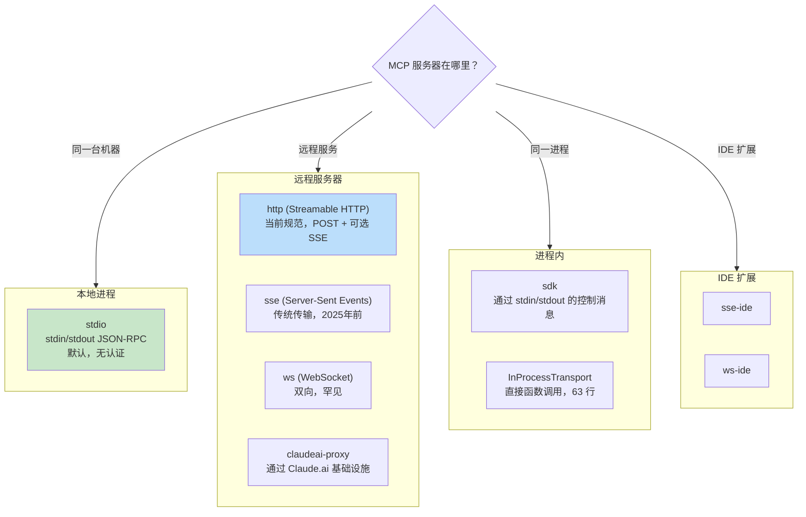
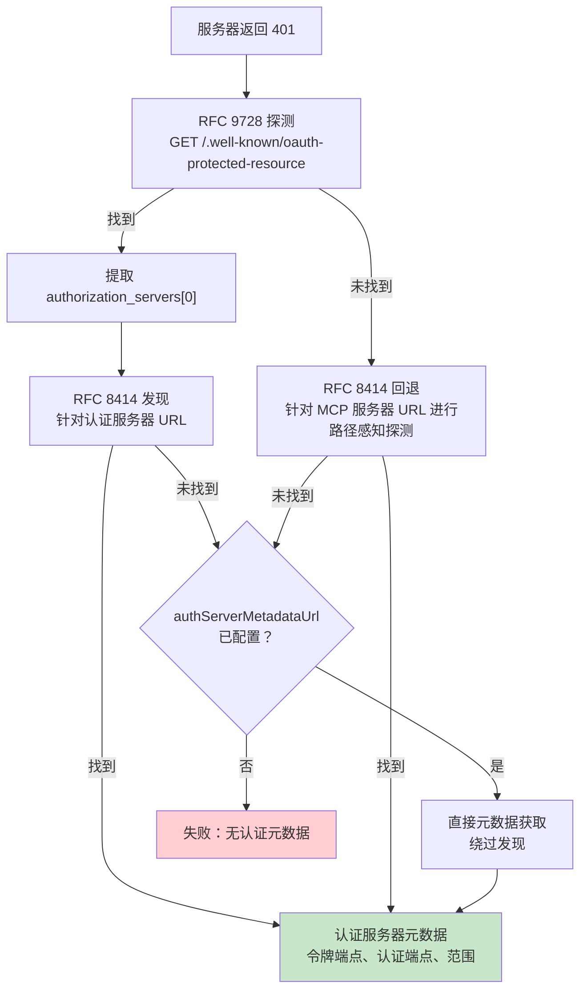

# 第15章：MCP——通用工具协议

## 为什么 MCP 的重要性超越 Claude Code

本书的其他每一章都是关于 Claude Code 的内部机制。这一章不同。模型上下文协议是一个开放规范，任何代理都可以实现，而 Claude Code 的 MCP 子系统是目前存在的最完整的生产客户端之一。如果你正在构建一个需要调用外部工具的代理——任何代理，任何语言，任何模型——本章的模式都可以直接迁移。

核心命题很简单：MCP 定义了一个用于代理（客户端）和工具提供者（服务器）之间工具发现和调用的 JSON-RPC 2.0 协议。客户端发送 `tools/list` 来发现服务器提供什么，然后发送 `tools/call` 来执行。服务器用名称、描述和其输入的 JSON Schema 来描述每个工具。这就是整个契约。其他一切——传输选择、认证、配置加载、工具名称规范化——都是将干净规范转化为能在现实世界生存的东西的实现工作。

Claude Code 的 MCP 实现跨越四个核心文件：`types.ts`、`client.ts`、`auth.ts` 和 `InProcessTransport.ts`。它们一起支持八种传输类型、七种配置范围、跨两个 RFC 的 OAuth 发现，以及一个工具包装层，使 MCP 工具与内置工具无法区分——与第6章涵盖的相同 `Tool` 接口。本章将逐层讲解。

---

## 八种传输类型

任何 MCP 集成的第一个设计决策是客户端如何与服务器通信。Claude Code 支持八种传输配置：



三个设计选择值得注意。首先，`stdio` 是默认的——当 `type` 被省略时，系统假设本地子进程。这与最早的 MCP 配置向后兼容。其次，fetch 包装器堆叠：超时包装在步进检测之外，在基础 fetch 之外。每个包装器处理一个关注点。第三，`ws-ide` 分支有 Bun/Node 运行时分割——Bun 的 `WebSocket` 原生接受代理和 TLS 选项，而 Node 需要 `ws` 包。

**何时使用哪种。** 对于本地工具（文件系统、数据库、自定义脚本），使用 `stdio`——没有网络，没有认证，只有管道。对于远程服务，`http`（Streamable HTTP）是当前规范推荐。`sse` 是传统但广泛部署的。`sdk`、IDE 和 `claudeai-proxy` 类型是各自生态系统内部的。

---

## 配置加载和范围

MCP 服务器配置从七个范围加载，合并并去重：

| 范围 | 来源 | 信任级别 |
|-------|--------|-------|
| `local` | 工作目录中的 `.mcp.json` | 需要用户批准 |
| `user` | `~/.claude.json` 的 mcpServers 字段 | 用户管理 |
| `project` | 项目级配置 | 共享项目设置 |
| `enterprise` | 托管企业配置 | 由组织预批准 |
| `managed` | 插件提供的服务器 | 自动发现 |
| `claudeai` | Claude.ai 网页界面 | 通过网页预授权 |
| `dynamic` | 运行时注入（SDK） | 以编程方式添加 |

**去重是基于内容的，而不是基于名称的。** 两个名称不同但命令或 URL 相同的服务器被识别为同一服务器。`getMcpServerSignature()` 函数计算规范键：`stdio:["command","arg1"]` 用于本地服务器，`url:https://example.com/mcp` 用于远程服务器。签名与手动配置匹配的插件提供的服务器被抑制。

---

## 工具包装：从 MCP 到 Claude Code

连接成功后，客户端调用 `tools/list`。每个工具定义被转换为 Claude Code 的内部 `Tool` 接口——与内置工具使用的相同接口。包装后，模型无法区分内置工具和 MCP 工具。

包装过程有四个阶段：

**1. 名称规范化。** `normalizeNameForMCP()` 将无效字符替换为下划线。完全限定名遵循 `mcp__{serverName}__{toolName}`。

**2. 描述截断。** 上限为 2,048 个字符。OpenAPI 生成的服务器已被观察到向 `tool.description` 倾倒 15-60KB——每轮大约 15,000 个令牌用于单个工具。

**3. 模式透传。** 工具的 `inputSchema` 直接传递给 API。包装时不进行转换，不进行验证。模式错误在调用时显现，而不是注册时。

**4. 注解映射。** MCP 注解映射到行为标志：`readOnlyHint` 标记工具可安全并发执行（如第7章流式执行器所讨论的），`destructiveHint` 触发额外权限审查。这些注解来自 MCP 服务器——恶意服务器可能将破坏性工具标记为只读。这是一个被接受的信任边界，但值得理解：用户选择加入服务器，恶意服务器将破坏性工具标记为只读是真实的攻击向量。系统接受这种权衡，因为替代方案——完全忽略注解——会阻止合法服务器改善用户体验。

---

## MCP 服务器的 OAuth

远程 MCP 服务器通常需要认证。Claude Code 实现了完整的 OAuth 2.0 + PKCE 流程，具有基于 RFC 的发现、跨应用访问和错误主体规范化。

### 发现链



`authServerMetadataUrl` 逃生舱存在是因为某些 OAuth 服务器两个 RFC 都没有实现。

### 跨应用访问（XAA）

当 MCP 服务器配置有 `oauth.xaa: true` 时，系统通过身份提供者执行联合令牌交换——一次 IdP 登录解锁多个 MCP 服务器。

### 错误主体规范化

`normalizeOAuthErrorBody()` 函数处理违反规范的 OAuth 服务器。Slack 对错误响应返回 HTTP 200，错误埋在 JSON 主体中。该函数查看 2xx POST 响应主体，当主体匹配 `OAuthErrorResponseSchema` 但不匹配 `OAuthTokensSchema` 时，将响应重写为 HTTP 400。它还将 Slack 特定的错误代码（`invalid_refresh_token`、`expired_refresh_token`、`token_expired`）规范化为标准 `invalid_grant`。

---

## 进程内传输

并非每个 MCP 服务器都需要单独的进程。`InProcessTransport` 类支持在同一进程中运行 MCP 服务器和客户端：

```typescript
class InProcessTransport implements Transport {
  async send(message: JSONRPCMessage): Promise<void> {
    if (this.closed) throw new Error('Transport is closed')
    queueMicrotask(() => { this.peer?.onmessage?.(message) })
  }
  async close(): Promise<void> {
    if (this.closed) return
    this.closed = true
    this.onclose?.()
    if (this.peer && !this.peer.closed) {
      this.peer.closed = true
      this.peer.onclose?.()
    }
  }
}
```

整个文件是 63 行。两个设计决策值得关注。首先，`send()` 通过 `queueMicrotask()` 传递以防止同步请求/响应循环中的堆栈深度问题。其次，`close()` 级联到对等端，防止半开状态。Chrome MCP 服务器和 Computer Use MCP 服务器都使用这种模式。

---

## 连接管理

### 连接状态

每个 MCP 服务器连接存在于五种状态之一：`connected`、`failed`、`needs-auth`（带 15 分钟 TTL 缓存以防止 30 个服务器独立发现同一过期令牌）、`pending` 或 `disabled`。

### 会话过期检测

MCP 的 Streamable HTTP 传输使用会话 ID。当服务器重启时，请求返回 HTTP 404 和 JSON-RPC 错误代码 -32001。`isMcpSessionExpiredError()` 函数检查两个信号——注意它使用错误消息上的字符串包含来检测错误代码，这是务实但脆弱的：

```typescript
export function isMcpSessionExpiredError(error: Error): boolean {
  const httpStatus = 'code' in error ? (error as any).code : undefined
  if (httpStatus !== 404) return false
  return error.message.includes('"code":-32001') ||
    error.message.includes('"code": -32001')
}
```

检测时，连接缓存清除，调用重试一次。

### 批量连接

本地服务器每批 3 个连接（生成进程可能耗尽文件描述符），远程服务器每批 20 个。React 上下文提供者 `MCPConnectionManager.tsx` 管理生命周期，将当前连接与新配置进行差异比较。

---

## Claude.ai 代理传输

`claudeai-proxy` 传输说明了一个常见的代理集成模式：通过中介连接。Claude.ai 订阅者通过网页界面配置 MCP "连接器"，CLI 通过 Claude.ai 的基础设施路由，该基础设施处理供应商端的 OAuth。

`createClaudeAiProxyFetch()` 函数在请求时捕获 `sentToken`，401 后不再重新读取。在来自多个连接器的并发 401 下，另一个连接器的重试可能已经刷新了令牌。该函数还检查刷新处理程序返回 false 时的并发刷新——另一个连接器赢得锁文件竞争的"ELOCKED 争用"情况。

---

## 超时架构

MCP 超时是分层的，每个针对不同的故障模式：

| 层 | 持续时间 | 防止 |
|-------|----------|------------------|
| 连接 | 30s | 无法访问或启动缓慢的服务器 |
| 每次请求 | 60s（每次请求新鲜） | 过期超时信号错误 |
| 工具调用 | ~27.8 小时 | 合法的长操作 |
| 认证 | 每次 OAuth 请求 30s | 无法访问的 OAuth 服务器 |

每次请求超时值得强调。早期实现创建单个 `AbortSignal.timeout(60000)` 在连接时。空闲 60 秒后，下一个请求会立即中止——信号已经过期。修复：`wrapFetchWithTimeout()` 为每个请求创建新的超时信号。它还规范化 `Accept` 头作为针对运行时和代理丢弃它的最后一步防御。

---

## 应用：将 MCP 集成到你自己的代理中

**从 stdio 开始，稍后添加复杂性。** `StdioClientTransport` 处理一切：生成、管道、终止。一行配置，一个传输类，你就有了 MCP 工具。

**规范化名称并截断描述。** 名称必须匹配 `^[a-zA-Z0-9_-]{1,64}$`。用 `mcp__{serverName}__` 前缀以避免冲突。将描述限制在 2,048 个字符——否则 OpenAPI 生成的服务器会浪费上下文令牌。

**延迟处理认证。** 直到服务器返回 401 才尝试 OAuth。大多数 stdio 服务器不需要认证。

**对你控制的服务器使用进程内传输。** `createLinkedTransportPair()` 消除你控制的服务器的子进程开销。

**尊重工具注解并清理输出。** `readOnlyHint` 启用并发执行。针对恶意 Unicode（双向覆盖、零宽连接符）清理响应，这些可能误导模型。

MCP 协议故意最小化——两个 JSON-RPC 方法。这两个方法和生产部署之间的一切都是工程：八种传输、七种配置范围、两个 OAuth RFC 和超时分层。Claude Code 的实现展示了大规模下的工程实践。

下一章研究代理超越 localhost 时会发生什么：让 Claude Code 在云端容器中运行、接受来自网页浏览器的指令、以及通过凭证注入代理隧道 API 流量的远程执行协议。
