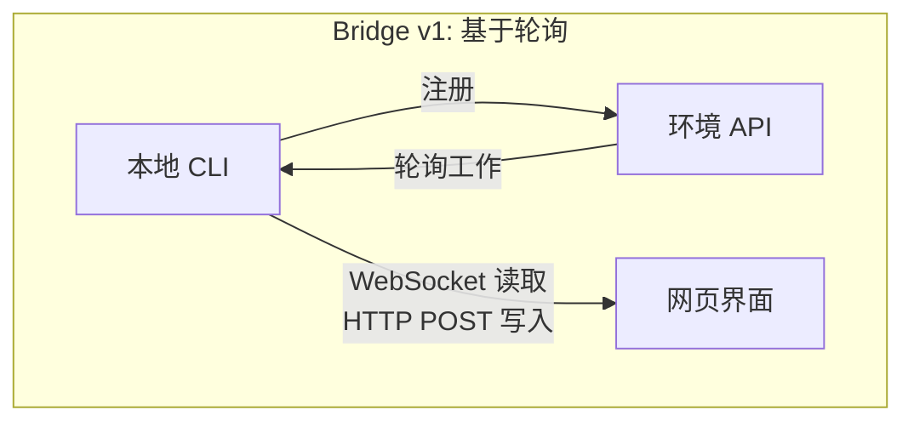
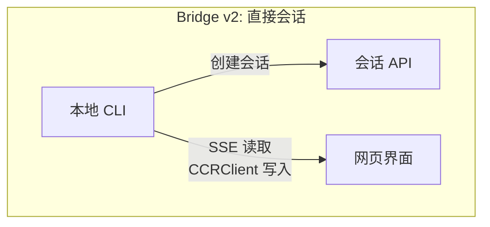
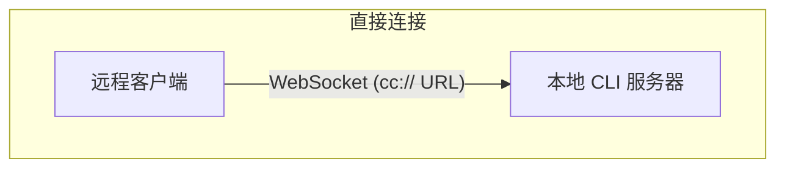
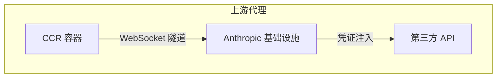

# 第16章：远程控制与云端执行

## 代理超越本地主机

到目前为止的每一章都假设 Claude Code 运行在代码所在的同一台机器上。终端是本地的。文件系统是本地的。模型响应流回拥有键盘和工作目录的进程。

当你想从浏览器控制 Claude Code、在云端容器内运行它，或将其作为 LAN 上的服务暴露时，这个假设就失效了。代理需要一种方式从网页浏览器、移动应用或自动化流水线接收指令——将权限提示转发给不在终端前的人，并将其 API 流量隧道通过可能注入凭证或代表代理终止 TLS 的基础设施。

Claude Code 用四个系统解决这个问题，每个针对不同的拓扑：

<div class="diagram-grid">









</div>

这些系统共享一个共同的设计理念：读取和写入是不对称的，重新连接是自动的，故障优雅降级。

---

## Bridge v1：轮询、分发、生成

v1 bridge 是基于环境的远程控制系统。当开发者运行 `claude remote-control` 时，CLI 向环境 API 注册，轮询工作，并为每个会话生成一个子进程。

注册前，一系列飞行前检查运行：运行时功能标志、OAuth 令牌验证、组织策略检查、死令牌检测（三次连续使用相同过期令牌失败后跨进程退避），以及主动令牌刷新，消除了约 9% 否则会首次尝试失败的注册。

注册后，bridge 进入长轮询循环。工作项以会话形式到达（带有包含会话令牌、API 基础 URL、MCP 配置和环境变量的 `secret` 字段）或健康检查。bridge 将"无工作"日志消息限制为每 100 次空轮询一次。

每个会话生成一个通过 stdin/stdout 上的 NDJSON 通信的子 Claude Code 进程。权限请求通过 bridge 传输流向网页界面，用户在那里批准或拒绝。往返必须在约 10-14 秒内完成。

---

## Bridge v2：直接会话与 SSE

v2 bridge 消除了整个环境 API 层——没有注册、没有轮询、没有确认、没有心跳、没有注销。动机：v1 需要服务器在分发工作前知道机器的能力。V2 将生命周期压缩为三个步骤：

1. **创建会话**：`POST /v1/code/sessions` 带 OAuth 凭证。
2. **连接 bridge**：`POST /v1/code/sessions/{id}/bridge`。返回 `worker_jwt`、`api_base_url` 和 `worker_epoch`。每次 `/bridge` 调用都会递增 epoch——它就是注册。
3. **打开传输**：SSE 用于读取，`CCRClient` 用于写入。

传输抽象（`ReplBridgeTransport`）在通用接口后统一 v1 和 v2，因此消息处理不需要知道它在跟哪一代通信。

当 SSE 连接因 401 断开时，传输用来自新 `/bridge` 调用的新鲜凭证重建，同时保留序列号游标——没有消息丢失。写入路径使用每个实例的 `getAuthToken` 闭包而不是进程范围的环境变量，防止 JWT 跨并发会话泄漏。

### FlushGate

一个微妙的排序问题：bridge 需要在接受来自网页界面的实时写入时发送对话历史。如果实时写入在刷新 POST 期间到达，消息可能乱序传递。`FlushGate` 在刷新 POST 期间将实时写入排队，并在完成时按顺序排出。

### 令牌刷新与 Epoch 管理

v2 bridge 在过期前主动刷新 worker JWT。新的 epoch 告诉服务器这是具有新鲜凭证的同一 worker。Epoch 不匹配（409 响应）被积极处理：两个连接关闭，异常展开调用者，防止脑裂场景。

---

## 消息路由与回声去重

两代 bridge 共享 `handleIngressMessage()` 作为中央路由器：

1. 解析 JSON，规范化控制消息键。
2. 将 `control_response` 路由到权限处理器，`control_request` 路由到请求处理器。
3. 针对 `recentPostedUUIDs`（回声去重）和 `recentInboundUUIDs`（重新传递去重）检查 UUID。
4. 转发验证后的用户消息。

### BoundedUUIDSet：O(1) 查找，O(容量) 内存

bridge 有回声问题——消息可能在读取流上回声回来，或在传输切换期间被传递两次。`BoundedUUIDSet` 是一个由循环缓冲区支持的 FIFO 有界集合：

```typescript
class BoundedUUIDSet {
  private buffer: string[]
  private set: Set<string>
  private head = 0

  add(uuid: string): void {
    if (this.set.size >= this.capacity) {
      this.set.delete(this.buffer[this.head])
    }
    this.buffer[this.head] = uuid
    this.set.add(uuid)
    this.head = (this.head + 1) % this.capacity
  }

  has(uuid: string): boolean { return this.set.has(uuid) }
}
```

两个实例并行运行，每个容量为 2000。通过 Set 实现 O(1) 查找，通过循环缓冲区驱逐实现 O(容量) 内存，没有定时器或 TTL。未知的控制请求子类型得到错误响应，而不是沉默——防止服务器等待永远不会来的响应。

---

## 不对称设计：持久读取，HTTP POST 写入

CCR 协议使用不对称传输：读取流经持久连接（WebSocket 或 SSE），写入通过 HTTP POST。这反映了通信模式的基本不对称。

读取是高频率、低延迟、服务器发起的——令牌流期间每秒数百条小消息。持久连接是唯一合理的选择。写入是低频率、客户端发起的，需要确认——每分钟消息，不是每秒。HTTP POST 提供可靠传递、通过 UUID 的幂等性，以及与负载均衡器的自然集成。

试图在单个 WebSocket 上统一它们会产生耦合：如果 WebSocket 在写入期间断开，你需要重试逻辑，并必须区分"未发送"与"已发送但确认丢失"。分离的通道让每个可以独立优化。

---

## 远程会话管理

`SessionsWebSocket` 管理 CCR WebSocket 连接的客户端。其重新连接策略区分故障类型：

| 故障 | 策略 |
|---------|----------|
| 4003（未授权） | 立即停止，不重试 |
| 4001（会话未找到） | 最多 3 次重试，线性退避（压缩期间的瞬态） |
| 其他瞬态 | 指数退避，最多 5 次尝试 |

`isSessionsMessage()` 类型守卫接受任何带有字符串 `type` 字段的对象——故意宽松。硬编码的允许列表会在客户端更新前静默丢弃新消息类型。

---

## 直接连接：本地服务器

直接连接是最简单的拓扑：Claude Code 作为服务器运行，客户端通过 WebSocket 连接。没有云中介，没有 OAuth 令牌。

会话有五种状态：`starting`、`running`、`detached`、`stopping`、`stopped`。元数据持久化到 `~/.claude/server-sessions.json` 以在服务器重启后恢复。`cc://` URL 方案为本地连接提供清晰的寻址。

---

## 上游代理：容器中的凭证注入

上游代理在 CCR 容器内运行，解决一个特定问题：在代理可能执行不受信任命令的容器中，将组织凭证注入出站 HTTPS 流量。

设置序列经过仔细排序：

1. 从 `/run/ccr/session_token` 读取会话令牌。
2. 通过 Bun FFI 设置 `prctl(PR_SET_DUMPABLE, 0)`——阻止同 UID 对进程堆的 ptrace。没有此功能，提示注入的 `gdb -p $PPID` 可能从内存中抓取令牌。
3. 下载上游代理 CA 证书并与系统 CA 包连接。
4. 在临时端口上启动本地 CONNECT 到 WebSocket 中继。
5. 取消链接令牌文件——令牌现在只存在于堆上。
6. 为所有子进程导出环境变量。

每一步都故障开放：错误禁用代理而不是终止会话。正确的权衡——失败的代理意味着某些集成无法工作，但核心功能仍然可用。

### Protobuf 手动编码

通过隧道的字节被包装在 `UpstreamProxyChunk` protobuf 消息中。模式很简单——`message UpstreamProxyChunk { bytes data = 1; }`——Claude Code 用十行手动编码而不是引入完整的 protobuf 运行时：

```typescript
export function encodeChunk(data: Uint8Array): Uint8Array {
  const varint: number[] = []
  let n = data.length
  while (n > 0x7f) { varint.push((n & 0x7f) | 0x80); n >>>= 7 }
  varint.push(n)
  const out = new Uint8Array(1 + varint.length + data.length)
  out[0] = 0x0a  // 字段 1，线类型 2
  out.set(varint, 1)
  out.set(data, 1 + varint.length)
  return out
}
```

十行替代完整的 protobuf 运行时。单字段消息不值得依赖——位操作的维护负担远低于供应链风险。

---

## 应用：设计远程代理执行

**分离读取和写入通道。** 当读取是高频率流而写入是低频率 RPC 时，统一它们会产生不必要的耦合。让每个通道独立故障和恢复。

**限制你的去重内存。** BoundedUUIDSet 模式提供固定内存去重。任何至少一次传递系统都需要有界的去重缓冲区，而不是无界的 Set。

**使重新连接策略与故障信号成比例。** 永久故障不应重试。瞬态故障应带退避重试。模糊故障应带低上限重试。

**在对抗性环境中将秘密保持在堆上。** 从文件读取令牌、禁用 ptrace、取消链接文件消除了文件系统和内存检查攻击向量。

**对辅助系统故障开放。** 上游代理故障开放，因为它提供增强功能（凭证注入），而非核心功能（模型推理）。

远程执行系统编码了一个更深层次的原则：代理的核心循环（第5章）应该对指令来自哪里以及结果去向哪里保持不可知。bridge、直接连接和上游代理是传输层。它们之上的消息处理、工具执行和权限流无论用户是坐在终端前还是在 WebSocket 另一端都是相同的。

下一章研究另一个运营关注点：性能——Claude Code 如何在启动、渲染、搜索和 API 成本方面充分利用每一毫秒和令牌。
