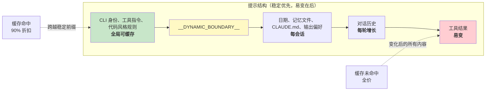

# 第17章：性能——每一毫秒和令牌都重要

## 高级工程师的战术手册

代理系统中的性能优化不是一个问题。它是五个：

1. **启动延迟**——从按键到第一个有用输出的时间。用户会放弃感觉启动慢的工具。
2. **令牌效率**——有用内容与开销消耗的上下文窗口比例。上下文窗口是最受限制的资源。
3. **API 成本**——每轮的美元金额。提示缓存可以减少 90%，但前提是系统在轮次间保持缓存稳定性。
4. **渲染吞吐量**——流式输出期间的每秒帧数。第13章涵盖了渲染架构；本章涵盖保持其快速的性能测量和优化。
5. **搜索速度**——在每次按键时在 270,000 路径代码库中查找文件的时间。

Claude Code 用从明显（记忆化）到微妙（用于模糊搜索预过滤的 26 位位图）的技术攻击所有五个。关于方法论的一个说明：这些不是理论优化。Claude Code 附带 50 多个启动分析检查点，对 100% 的内部用户和 0.5% 的外部用户进行采样。下面的每个优化都是由该仪器的数据驱动的，而不是直觉。

---

## 在启动时节省毫秒

### 模块级 I/O 并行

入口点 `main.tsx` 故意违反"模块范围无副作用"：

```typescript
profileCheckpoint('main_tsx_entry');
startMdmRawRead();       // 触发 plutil/reg-query 子进程
startKeychainPrefetch();  // 并行触发两个 macOS 钥匙串读取
```

两个 macOS 钥匙串条目否则将花费约 65ms 的顺序同步生成。通过在模块级别将它们作为即发即弃的 promise 启动，它们在约 135ms 的模块加载期间并行执行，在此期间 CPU 否则会空闲。

### API 预连接

`apiPreconnect.ts` 在初始化期间向 Anthropic API 触发 `HEAD` 请求，将 TCP+TLS 握手（100-200ms）与设置工作重叠。在交互模式下，重叠是无界的——连接在用户输入时预热。请求在 `applyExtraCACertsFromConfig()` 和 `configureGlobalAgents()` 之后触发，因此预热的连接使用正确的传输配置。

### 快速路径分发和延迟导入

CLI 入口点包含专门子命令的早期返回路径——`claude mcp` 从不加载 React REPL，`claude daemon` 从不加载工具系统。重型模块仅在需要时通过动态 `import()` 加载：OpenTelemetry（~400KB + ~700KB gRPC）、事件日志记录、错误对话框、上游代理。`LazySchema` 将 Zod 模式构造延迟到第一次验证，将成本推到启动之后。

---

## 在上下文窗口中节省令牌

### 槽位预留：8K 默认，64K 升级

最有影响力的单一优化：

默认输出槽位预留为 8,000 个令牌，截断时升级到 64,000。API 为模型的响应预留 `max_output_tokens` 的容量。默认 SDK 值为 32K-64K，但生产数据显示 p99 输出长度为 4,911 个令牌。默认值过度预留 8-16 倍，每轮浪费 24,000-59,000 个令牌。Claude Code 限制为 8K，在罕见的截断（<1% 的请求）时以 64K 重试。对于 200K 窗口，这是可用上下文的 12-28% 改进——免费的。

### 工具结果预算

| 限制 | 值 | 目的 |
|-------|-------|-------|
| 每工具字符数 | 50,000 | 超过时结果持久化到磁盘 |
| 每工具令牌数 | 100,000 | ~400KB 文本上限 |
| 每消息聚合 | 200,000 字符 | 防止 N 个并行工具在一轮中吹掉预算 |

每消息聚合是关键见解。没有它，"读取 src/ 中的所有文件"可能产生 10 个并行读取，每个返回 40K 字符。

### 上下文窗口大小

默认的 200K 令牌窗口可通过模型名称上的 `[1m]` 后缀或实验处理扩展到 1M。当使用接近限制时，4 层压缩系统逐步总结旧内容。令牌计数以 API 的实际 `usage` 字段为锚点，而不是客户端估计——考虑提示缓存信用、思考令牌和服务器端转换。

---

## 在 API 调用上节省资金

### 提示缓存架构



Anthropic 的提示缓存在精确前缀匹配上操作。如果前缀中间单个令牌变化，之后的一切都是缓存未命中。Claude Code 构建整个提示，使稳定部分在前，易变部分在后。

当 `shouldUseGlobalCacheScope()` 返回 true 时，动态边界前的系统提示条目获得 `scope: 'global'`——运行相同 Claude Code 版本的两个用户共享前缀缓存。存在 MCP 工具时禁用全局范围，因为 MCP 模式是每用户。

### 粘性锁存字段

五个布尔字段使用"粘性开启"模式——一旦为 true，它们在整个会话中保持为 true：

| 锁存字段 | 它防止什么 |
|-------------|-----------------|
| `promptCache1hEligible` | 会话中期的超额翻转改变缓存 TTL |
| `afkModeHeaderLatched` | Shift+Tab 切换破坏缓存 |
| `fastModeHeaderLatched` | 冷却进入/退出双重破坏缓存 |
| `cacheEditingHeaderLatched` | 会话中期的配置切换破坏缓存 |
| `thinkingClearLatched` | 缓存未命中确认后翻转思考模式 |

每个对应一个如果在会话中期改变会破坏约 50,000-70,000 个令牌缓存提示的头或参数。锁存牺牲会话中期切换以保留缓存。

### 记忆化会话日期

```typescript
const getSessionStartDate = memoize(getLocalISODate)
```

没有此功能，日期会在午夜改变，破坏整个缓存前缀。过期日期是表面上的；缓存破坏会重新处理整个对话。

### 节记忆化

系统提示节使用两级缓存。大多数内容使用 `systemPromptSection(name, compute)`，缓存直到 `/clear` 或 `/compact`。核选项 `DANGEROUS_uncachedSystemPromptSection(name, compute, reason)` 每轮重新计算——命名约定强制开发者记录 WHY 缓存破坏是必要的。

---

## 在渲染中节省 CPU

第13章深入涵盖了渲染架构——打包的类型化数组、基于池的内部化、双缓冲和单元格级差异比较。这里我们关注保持其快速的性能测量和自适应行为。

终端渲染器通过 `throttle(deferredRender, FRAME_INTERVAL_MS)` 限制在 60fps。当终端失去焦点时，间隔加倍到 30fps。滚动排出帧以四分之一间隔运行以实现最大滚动速度。这种自适应限制确保渲染从不消耗比必要更多的 CPU。

React 编译器（`react/compiler-runtime`）在整个代码库中自动记忆化组件渲染。手动的 `useMemo` 和 `useCallback` 容易出错；编译器通过构造就能正确。预分配的冻结对象（`Object.freeze()`）消除了常见渲染路径值分配——在备用屏幕模式下每帧节省一次分配，在数千帧中累积。

关于完整渲染管道详情——`CharPool`/`StylePool`/`HyperlinkPool` 内部化系统、位块传输优化、损坏矩形跟踪、OffscreenFreeze 组件——参见第13章。

---

## 在搜索中节省内存和时间

模糊文件搜索在每次按键时运行，搜索 270,000+ 路径。三个优化层将其保持在几毫秒以下。

### 位图预过滤器

每个索引路径获得一个包含哪些小写字母的 26 位位图：

```typescript
// 伪代码——说明 26 位位图概念
function buildCharBitmap(filepath: string): number {
  let mask = 0
  for (const ch of filepath.toLowerCase()) {
    const code = ch.charCodeAt(0)
    if (code >= 97 && code <= 122) mask |= 1 << (code - 97)
  }
  return mask  // 每个位表示 a-z 的存在
}
```

搜索时：`if ((charBits[i] & needleBitmap) !== needleBitmap) continue`。任何缺少查询字母的路径立即失败——一次整数比较，没有字符串操作。拒绝率：~10% 用于"test"等宽泛查询，90%+ 用于带有稀有字母的查询。成本：每路径 4 字节，270,000 路径约 1MB。

### 分数边界拒绝和融合的 indexOf 扫描

通过位图的路径在昂贵的边界/驼峰式评分前面临分数上限检查。如果最佳情况分数无法击败当前 top-K 阈值，则跳过该路径。

实际匹配使用 `String.indexOf()` 融合位置查找与间隙/连续奖励计算，它在 JSC（Bun）和 V8（Node）中都是 SIMD 加速的。引擎优化的搜索明显比手动字符循环快。

### 带部分可查询性的异步索引

对于大型代码库，`loadFromFileListAsync()` 每约 4ms 工作（基于时间，不是基于计数——适应机器速度）让出事件循环。它返回两个 promise：`queryable`（在第一块上解析，启用即时部分结果）和 `done`（完整索引完成）。用户可以在文件列表可用后 5-10ms 内开始搜索。

让出检查使用 `(i & 0xff) === 0xff`——一个无分支的模 256 来摊销 `performance.now()` 的成本。

---

## 记忆相关性副查询

一个优化位于令牌效率和 API 成本的交叉点。如第11章所述，记忆系统使用轻量级 Sonnet 模型调用——不是主 Opus 模型——来选择包含哪些记忆文件。成本（快速模型上 256 个最大输出令牌）与不包括不相关记忆文件所节省的令牌相比微不足道。单个不相关的 2,000 令牌记忆在浪费上下文方面的成本高于副查询在 API 调用方面的成本。

---

## 推测性工具执行

`StreamingToolExecutor` 在完整响应完成前，随着工具流进入就开始执行。只读工具（Glob、Grep、Read）可以并行执行；写入工具需要独占访问。`partitionToolCalls()` 函数将连续的安全工具分组到批次：[Read, Read, Grep, Edit, Read, Read] 变成三个批次——[Read, Read, Grep] 并发，[Edit] 串行，[Read, Read] 并发。

结果始终以原始工具顺序产生，以实现确定性模型推理。当 Bash 工具出错时，兄弟中止控制器终止并行子进程，防止资源浪费。

---

## 流式传输和原始 API

Claude Code 使用原始流式 API 而不是 SDK 的 `BetaMessageStream` 助手。助手在每个 `input_json_delta` 上调用 `partialParse()`——工具输入长度的 O(n^2)。Claude Code 累积原始字符串并在块完成时解析一次。

流式监视器（`CLAUDE_STREAM_IDLE_TIMEOUT_MS`，默认 90 秒）如果没有块到达则中止并重试，在代理失败时回退到非流式 `messages.create()`。

---

## 应用：代理系统的性能

**审计你的上下文窗口预算。** 你的 `max_output_tokens` 预留与实际 p99 输出长度之间的差距是浪费的上下文。设置一个紧凑的默认值，在截断时升级。

**为缓存稳定性设计。** 提示中的每个字段都是稳定或易变的。将稳定放在前，易变放在后。将会话中期对稳定前缀的任何更改视为有美元成本的错误。

**并行化启动 I/O。** 模块加载是 CPU 绑定的。钥匙串读取和网络握手是 I/O 绑定的。在导入前启动 I/O。

**对搜索使用位图预过滤器。** 在昂贵评分前拒绝 10-90% 候选者的廉价预过滤器是每条目 4 字节的显著胜利。

**在重要的地方测量。** Claude Code 有 50 多个启动检查点，内部采样 100%，外部采样 0.5%。没有测量的性能工作是猜测。

---

最后的观察：这些优化中的大多数在算法上并不复杂。位图预过滤器、循环缓冲区、记忆化、内部化——这些是 CS 基础。复杂性在于知道在哪里应用它们。启动分析器告诉你毫秒在哪里。API 使用字段告诉你令牌在哪里。缓存命中率告诉你资金在哪里。测量第一，优化第二，始终如此。
